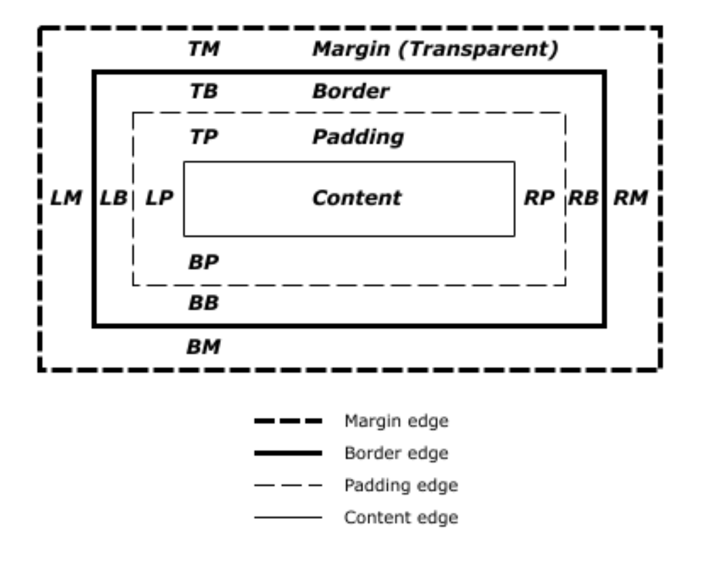

# 1. 박스모델 알아보기
* boxmodel
  
  * width(cotent)
  * height(cotent)
  * border
    * border-style
      * solid
      * dashed - 파선
      * dotted - 점선
      * double - 두줄
      * inset
      * outset
      * ridge
      * groove
    * border-color
    * border-width
    * 방향
      * top
      * right
      * bottom
      * left
  * padding
    * value의 개수
      * 1개면 모든 방향
      * 2개면 상하, 좌우
      * 3개면 첫번째는 상, 두번째는 좌우, 세번째는 하
      * 4개면 상, 우, 하, 좌 순서로 적용
    * top
    * right
    * bottom
    * left
  * margin
    * top
    * right
    * bottom
    * left
    * 마진 겹침 현상
      * 겹친부분에서 큰값이 출력된다.
* box-sizing
  * border-box - 내가 지정한 width 내부에 padding과 border가 들어간다.(IE9 이상)
* display
  * block
  * inline - margin은 좌우만 적용. padding은 다 적용되지만 겹쳐진다.
  * inline-block - inline과 block의 성질을 다 갖는다.

# 2. 배경 스타일 알아보기
* background - 대쉬(-)가 있는 것과 없는 css background property가 같이 있을 때, 스타일은 background보다 나중에 써야한다.
  * shorthand
  ```csss
  background: color || image || repeat || attachment || position
  ```
* background-color - 배경색이며, padding 영역까지 적용된다.
* background-image - 배경이미지
* background-repeat
  * repeat(default)
  * no-repeat
  * repeat-x
  * repeat-y
* background-position - 배경영역의 왼쪽 최상단을 (0,0)으로 한다. 값이 두개면 (x, y)라고 생각하면 된다. x값이 +면 오른쪽 방향, -면 왼쪽 방향이다. y값은 +면 아래쪽 방향, -면 위쪽 방향이다.
  * top(0)
  * right(100%)
  * bottom(100%)
  * left(0)
  * center
* background-attachment
  * fixed - background를 고정 시킴.
* background-size
  * auto - 자동으로 맞춘다.
  * cover - 자동으로 영역에 맞춰준다.
* background-clip
  * cotent-box - content영역만 background를 clipping한다.
* background-origin
  * cotent-box - background의 시작위치를 바꾼다.