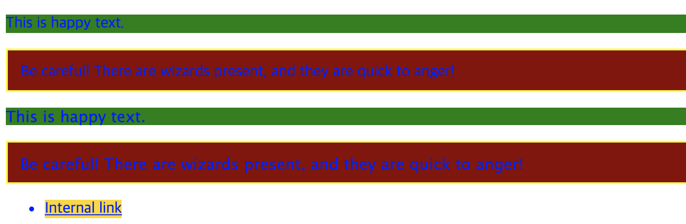
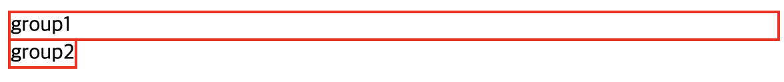
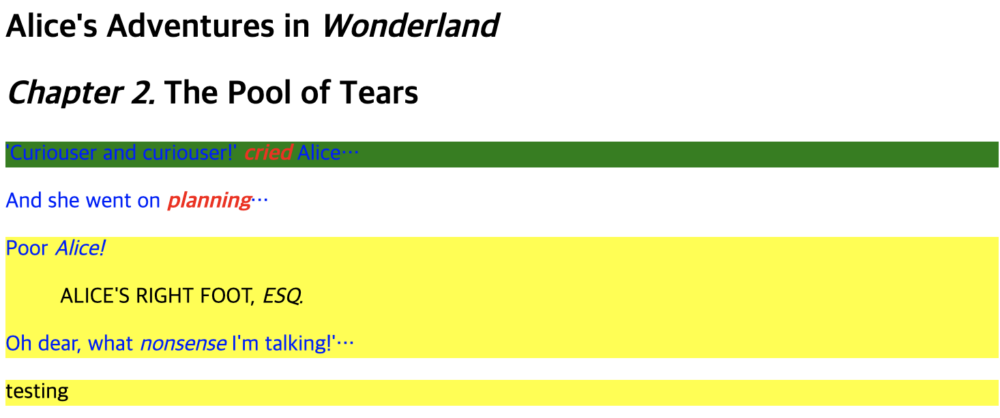
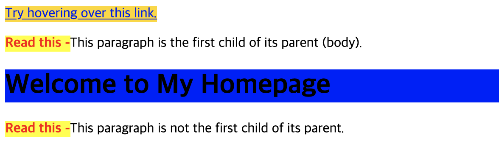

# Selector

### 1. selector란? - 스타일을 적용하고자하는 HTML element를 선택하는것.

- 선언 방법

```css
selector {
  property: value;
}
```

```css
h1 {
  font-size: 12px;
  color: red;
}
```

### 2. selecotr의 종류 및 사용법

1. basic

- universal (\*)
- tag (div,span,...)
- id (#name)
- class (.name)
- attribute (input[type='text'],..)
- example

```html
<p>This is happy text.</p>
<div class="warning">
  Be careful! There are wizards present, and they are quick to anger!
</div>

<div id="customized">
  <p>This is happy text.</p>

  <div class="warning">
    Be careful! There are wizards present, and they are quick to anger!
  </div>
</div>
<ul>
  <li><a href="#internal">Internal link</a></li>
</ul>
```

```css
* {
  color: blue;
}

p {
  background-color: green;
}

div.warning {
  width: 100%;
  border: 2px solid yellow;
  background-color: darkred;
  padding: 0.8em 0.8em 0.6em;
}

#customized {
  font: 16px Lucida Grande, Arial, Helvetica, sans-serif;
}

<ul>
  <li><a href="#internal">Internal link</a></li>
</ul>
```



2. grouping

- grouping (A, B)
- example

```html
<div>group1</div>
<span>group2</span>
```

```css
span,
div {
  border: red 2px solid;
}
```



3. combinator

- adjacent sibling(A + B)
- general sibling(A ~ B)
- child(A > B)
- descendant(A B)

  - example

  ```html
  <article class="copy">
    <h1>Alice's Adventures in <em>Wonderland</em></h1>
    <h2><em>Chapter 2.</em> The Pool of Tears</h2>
    <p>'Curiouser and curiouser!' <em>cried</em> Alice…</p>
    <p>And she went on <em>planning</em>…</p>
    <div>
      <p>Poor <em>Alice!</em></p>
      <blockquote>ALICE'S RIGHT FOOT, <em>ESQ.</em></blockquote>
      <p>Oh dear, what <em>nonsense</em> I'm talking!'…</p>
    </div>
    <div>
      testing
    </div>
  </article>
  ```

  ```css
  h2 + p {
    background-color: green;
  }

  h1 ~ div {
    background-color: yellow;
  }

  article.copy > p > em {
    color: red;
    font-weight: bold;
  }

  .copy p {
    color: blue;
  }
  ```

  

4. pseudo

- class(:link, :hover, :first-child, ...)
- element(::before, ::after, ...)

* example

```html
<a href="#">Try hovering over this link.</a>
<p>This paragraph is the first child of its parent (body).</p>
<div>
  <h1>Welcome to My Homepage</h1>
</div>
<p>This paragraph is not the first child of its parent.</p>
```

```css
a {
  background-color: powderblue;
  transition: background-color 0.5s;
}

a:hover {
  background-color: gold;
}

h1:first-child {
  background-color: blue;
}

p::before {
  content: "Read this -";
  background-color: yellow;
  color: red;
  font-weight: bold;
}
```



### 3. Cascading

1. 인라인 스타일
2. !important

- example - 인라인 스타일만 아니면 우선순위로 적용된다. 그러므로 h1의 color는 blue가 적용된다.

```css
h1 {
  color: red;
}

h1 {
  color: blue !important;
}
```

3. 구체성 - id를 100, class를 10, html을 1로 계산

- example - 첫번째 규칙값이 102이므로 b는 color가 red가 적용된다.

```css
/* 102 */
#copy p b {
  color: red;
}
/* 1 */
b {
  color: blue;
}
```

4. 순서 - 마지막에 선언된것이 적용된다.
