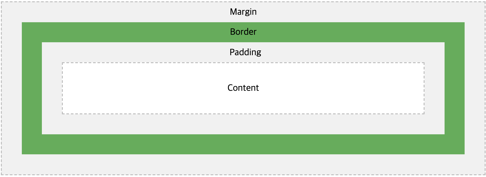
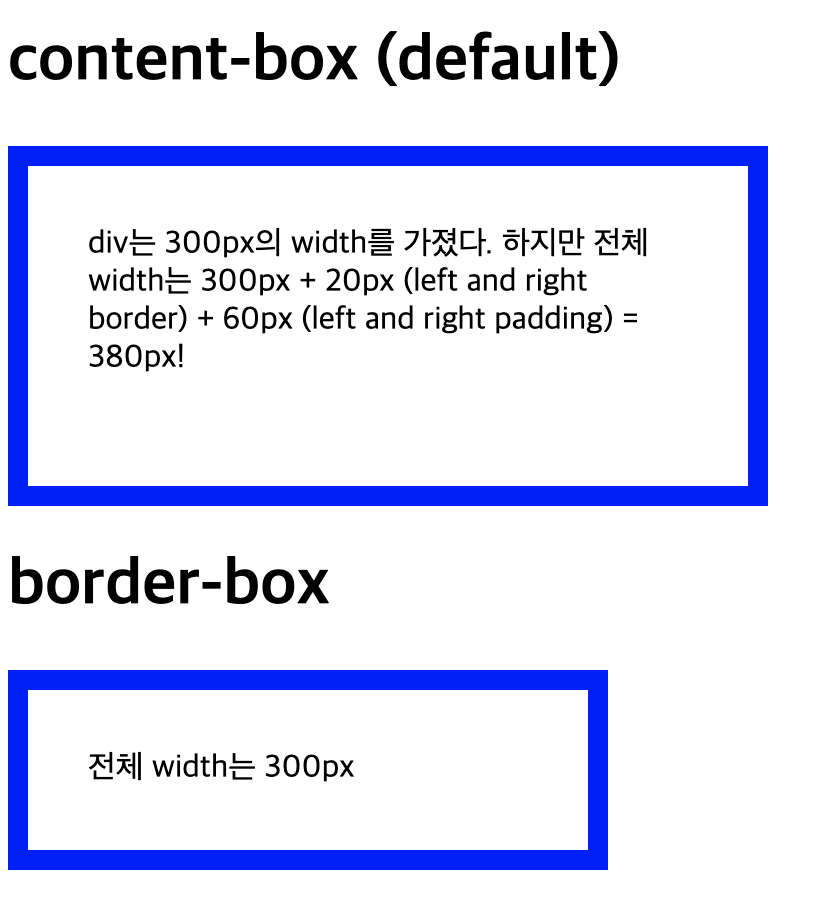

# BoxModel



### Box Model의 4 요소

1. Contents - 텍스트나 이미지가 들어있는 박스의 실질적인 내용 부분
2. Border - Contents와 Padding 주변을 감싸는 테두리
3. Padding - Contents와 Border 사이의 간격
4. Margin - Border 바깥에 있는 간격. 이웃하는 요소 사이의 간격

- example

```html
<body>
  <div class="box">
    <div class="inside-box"></div>
  </div>
</body>
```

```css
body {
  padding: 0;
  margin: 0;
  background-color: green;
  height: 100%;
}
.box {
  background-color: yellow;
  width: 50%;
  height: 50%;
  padding: 20px 10px 5px 2px;
  margin: 20px 10px 5px 2px; /* top | bottom | left | right */
}
.inside-box {
  background-color: blue;
  width: 50%;
  height: 50%;
  border: 5px dashed red;
```


### width, height

- block요소에서 설정 가능
- width와 height는 contents부분만 대상으로함

### box-sizing

1. content-box - width와 height 대상영역은 **contents**이다.
2. border-box - width와 height 대상영역은 **margin을 제외한 나머지부분**이다.

- example

```html
<h1>content-box (default)</h1>
<div id="example1">
  div는 300px의 width를 가졌다. 하지만 전체 width는 300px + 20px (left and right
  border) + 60px (left and right padding) = 380px!
</div>

<h1>border-box</h1>
<div id="example2">전체 width는 300px</div>
```

```css
#example1 {
  box-sizing: content-box;
  width: 300px;
  height: 100px;
  padding: 30px;
  border: 10px solid blue;
}

#example2 {
  box-sizing: border-box;
  width: 300px;
  height: 100px;
  padding: 30px;
  border: 10px solid blue;
}
```


