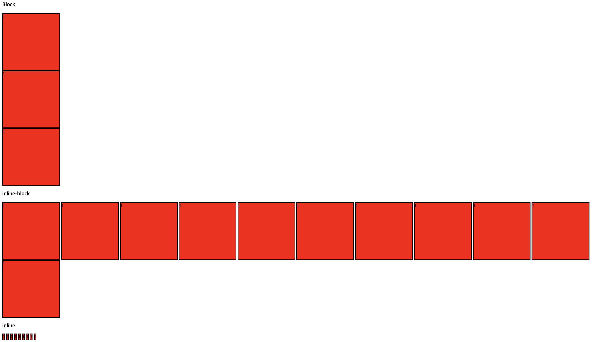
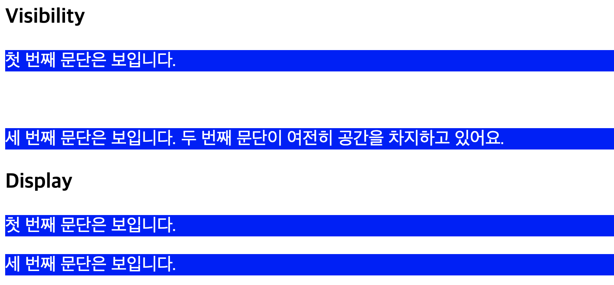
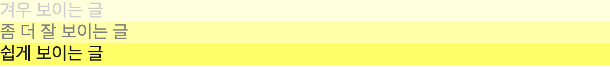

# Display

- layout을 잡을 때 많이 사용한다.

* property

1. block - 옆에 다른 element가 위치하는것을 허용하지 않고, width와 height가 존재한다. ([block tag](https://developer.mozilla.org/ko/docs/Web/HTML/Block-level_elements) - div, p, table, form, ul, li, ol, h1 ~ h6 등등)
2. inline - text처럼 생각하면 된다. box는 사라지고, width와 height를 줄 수 없다.([inline tag](https://developer.mozilla.org/ko/docs/Web/HTML/Inline_elements) - a, span, img, button, input, select 등등)
3. inline-block - block안에 element가 붙어서 존재한다. block안에 box가 다 채워지면, 밑에 줄로 box들이 넘어간다. width와 height가 존재한다.
4. none - 차지하던 모든 영역이 사라진다.

- example

```html
<h3>Block</h3>
<span class="block">1</span>
<span class="block">1</span>
<span class="block">1</span>

<h3>inline-block</h3>
<span class="inline_block">1</span>
<span class="inline_block">1</span>
<span class="inline_block">1</span>
<span class="inline_block">1</span>
<span class="inline_block">1</span>
<span class="inline_block">1</span>
<span class="inline_block">1</span>
<span class="inline_block">1</span>
<span class="inline_block">1</span>
<span class="inline_block">1</span>
<span class="inline_block">1</span>

<h3>inline</h3>
<span class="inline">1</span>
<span class="inline">1</span>
<span class="inline">1</span>
<span class="inline">1</span>
<span class="inline">1</span>
<span class="inline">1</span>
<span class="inline">1</span>
<span class="inline">1</span>
<span class="inline">1</span>
```

```css
.block {
  background-color: red;
  width: 200px;
  height: 200px;
  border: 2px solid black;
  display: block;
}

.inline_block {
  background-color: red;
  width: 200px;
  height: 200px;
  border: 2px solid black;
  display: inline-block;
}

.inline {
  background-color: red;
  width: 200px;
  height: 200px;
  border: 2px solid black;
  display: inline;
```



# Visibility

- element의 렌더링 여부를 결정

* property

1. visible - element를 보이게 한다.
2. hidden- element를 숨기지만 영역을 차지한다.
3. collapse - table 내부에서만 사용되며, row나 column을 display:none처럼 element를 숨기고, 차지하던 공간을 제거한다.

- **display: none과 visibility: hidden의 차이**
- 차지하던 공간이 그대로 있는지, 없는지로 나뉜다. none은 차지하던 공간이 사라지지만, hidden은 사라지지않는다.

- example

```html
<h3>Visibility</h3>
<p class="visible">첫 번째 문단은 보입니다.</p>
<p class="not-visible">두 번째 문단은 보이지 않습니다.</p>
<p class="visible">
  세 번째 문단은 보입니다. 두 번째 문단이 여전히 공간을 차지하고 있어요.
</p>

<h3>Display</h3>
<p class="visible">첫 번째 문단은 보입니다.</p>
<p class="none">두 번째 문단은 보이지않고 영역도 사라집니다.</p>
<p class="visible">
  세 번째 문단은 보입니다.
</p>
```

```css
.visible {
  visibility: visible;
}

.not-visible {
  visibility: hidden;
}

.none {
  display: none;
}
```



# Opacity

- 투명도이다. 0.0 ~ 1.0 사이의 값을 사용 할 수 있고, 0으로 갈수록 투명해지고, 1로 갈수록 불투명해진다. 지정했을 때, 모든 자식요소에도 투명도가 상속된다. 지정한 요소에만 투명도를 갖게 하고싶으면 rgba를 이용하면 된다.

* example

```html
<div class="light">겨우 보이는 글</div>
<div class="medium">좀 더 잘 보이는 글</div>
<div class="heavy">쉽게 보이는 글</div>
```

```css
div {
  background-color: yellow;
}
.light {
  opacity: 0.2;
}
.medium {
  opacity: 0.5;
}
.heavy {
  opacity: 0.9;
}
```


