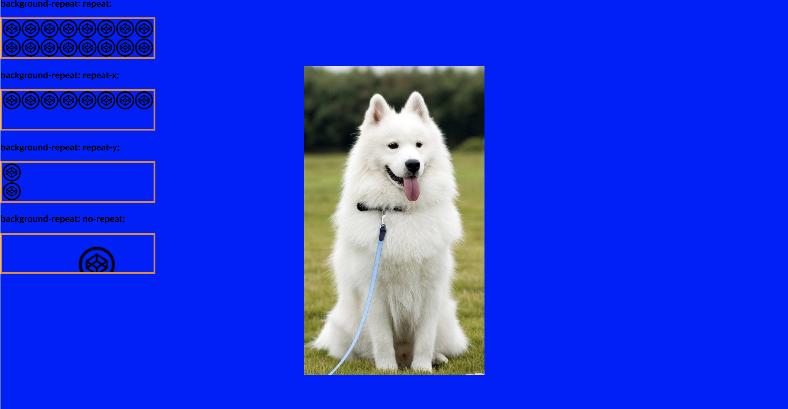
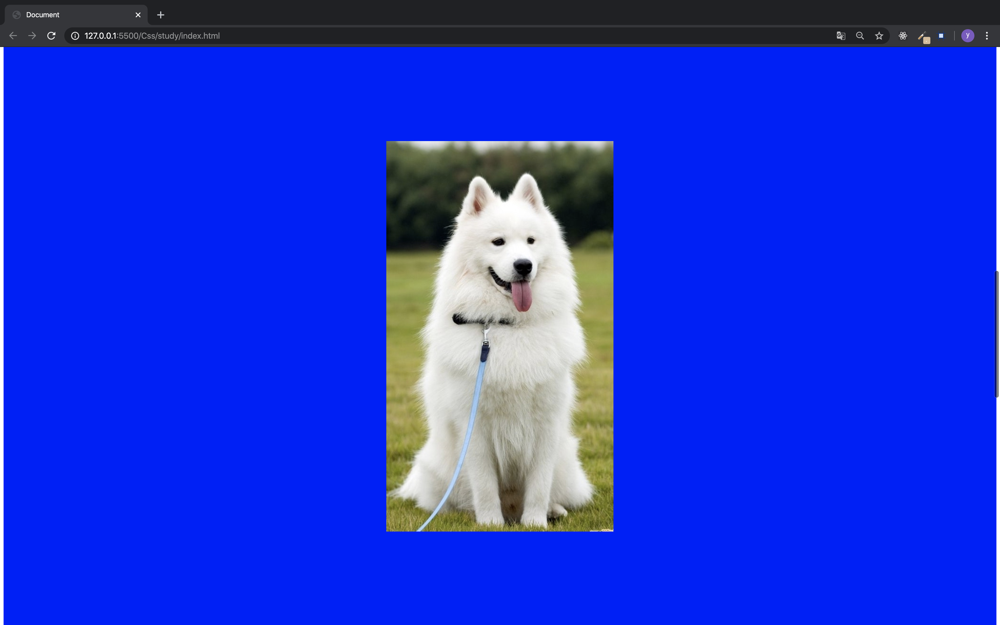

# Background

- element의 style을 지정하는 것이다. background는 color나 이미지등으로 채울 수 있다.

1. background-image - 이미지를 배경으로 설정

   - url(상대경로 || 절대경로)
   - url에서 경로를 쓸 때, ''나 ""로 감싸주거나 아예 안써도 된다.

2. background-repeat - 배경이미지의 반복을 설정
3. background-size - 배경 이미지의 사이즈 지정
   - px, %등 단위로 지정 할 수 있다.
   - cover - 이미지 크기 비율을 유지한 상태에서, 이미지가 들어있는 element의 width 또는 height(width와 height중 큰 값)에 이미지를 맞춘다. 이미지가 전부 보이지 않을 수 있다.
   - contain - 이미지 크기 비율을 유지한 상태에서, 원하는 영역에 전체 이미지가 들어가도록 가장 작은 크기로 이미지 스케일을 조정한다.
4. background-attachment - 배경 스크롤시 고정 역할. 고정하기 위해서 fixed를 많이 사용한다.
5. background-position - 이미지의 좌표를 설정. 브라우저에서 왼쪽 최상단을 (0, 0)으로 보면 된다.
6. background-color - 배경에 색상을 설정
7. background-clip - 배경을 border에 맞출지 content영역 내에 둘지 결정한다.

   - border-box
   - padding-box
   - content-box

8. background - 위의 몇몇 property를 한번에 선언하기위한 단축 속성이다.

```
background: color || image || repeat || attachment || position
```

- example

```html
<div class="container">
  <h2>background-repeat: repeat;</h2>
  <div class="image" id="repeat"></div>

  <h2>background-repeat: repeat-x;</h2>
  <div class="image" id="repeat-x"></div>

  <h2>background-repeat: repeat-y;</h2>
  <div class="image" id="repeat-y"></div>

  <h2>background-repeat: no-repeat;</h2>
  <div class="image size position" id="no-repeat"></div>
</div>
```

```css
.container {
  height: 40000px;
  background: blue url(https://www.womennews.co.kr/news/photo/first/201801/img_78112_1.jpg)
    no-repeat fixed center;
}

.image {
  width: 400px;
  height: 100px;
  border: 5px solid #e18728;
  margin-bottom: 2em;
  background-image: url(https://s3-us-west-2.amazonaws.com/s.cdpn.io/652/codepen.png);
}

.size {
  background-size: contain;
}

.position {
  background-position: 200px 30px;
}

#repeat {
  background-repeat: repeat;
}

#repeat-x {
  background-repeat: repeat-x;
}

#repeat-y {
  background-repeat: repeat-y;
}

#no-repeat {
  background-repeat: no-repeat;
}
```

- 결과
  

- background-attachment: fixed 확인(스크롤이 생겨도 background-image가 고정된걸 볼 수 있다.)
  
