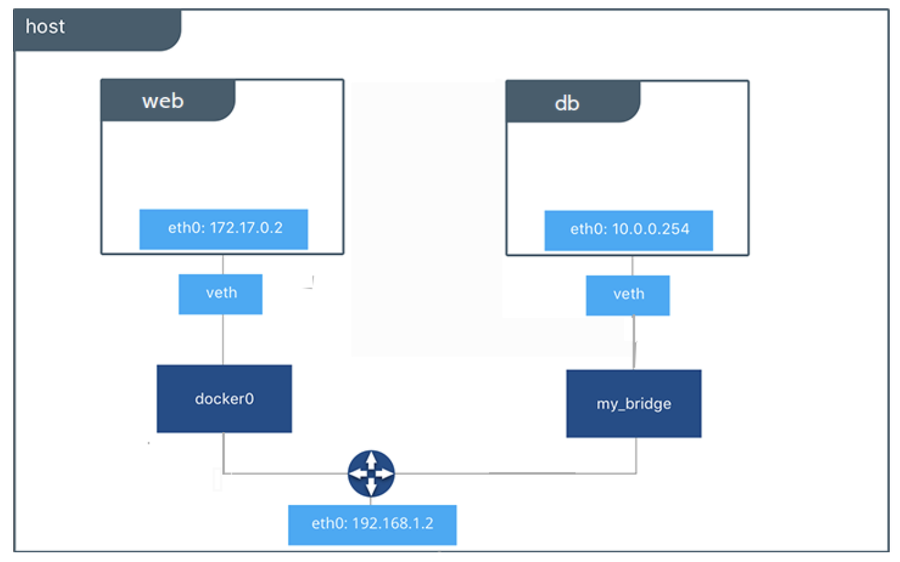

## 9. 컨테이너간 통신(네트워크)
### 9.1 컨테이너는 어떻게 통신하나요 ?
* Container Network Model

* docker0
  * virtual ethernet bridge: 172.17.0.0/16
  * L2 통신기반
  * container 생성 시 veth 인터페이스 생성(sandbox)
  * 모든 컨테이너는 외부 통신을 docker0 통해 진행
  * container running 시 172.17.X.Y로 IP 주소 할당
  
### 9.2 컨테이너는 포트를 외부로 노출하는 방법
* 포트포워딩(port-forwarding)
  * container port를 외부로 노추시켜 외부 연결 허용
  * iptables rule을 통한 포트 노출
    * `-p hostPort:containerPort`
    * `-p containerPort`
    * `-P`
    ```
    docker run -d --name web -p 80:80 nginx:latest
    iptables -t nat -L -n -v
    ``` 

### 9.3 컨테이너 네트워크를 추가할 수 있나요?
* user-defined [bridge network](https://docs.docker.com/network/bridge/) 생성
  ```
  dokcer network create --diriver bridge --subnet 192.168.100.0/24 --gateway 192.168.100.254 mynet
  docker network ls
  docker run -d --name web -p 80:80 nginx:latest
  curl localhost
  docker run -d --name appjs --net mynet --ip 192.168.100.100 -p 8080:8080 smlinux/appjs
  curl localhost:8080
  ```

### 9.4 컨테이너끼리 통신은 어떻게 하나요?
* 컨테이너를 이용한 server & client 서비스 운영
  ```
  docker run -d --name mysql -v /dbdata:/var/lib/mysql -e MYSQL_ROOT_PASSWORD=wordpress -e MYSQL_PASSWORD=wordpress mysql
  docker run -d --name wordpress -link mysql:mysql -e WORDPRESS_DB_PASSWORD=wordpress -p 80:80 wordpress
  ```

### 9.5 실습
* 컨테이너 네트워크 사용하기
  * docker0 bridge Network - ip address가 순차적으로 할당됨
    ```sh
    ip addr
    brctl show
    # ip - 172.17.0.2
    docker run --name c1 -it busybox
    docker inspect c1

    # ip - 172.17.0.3
    docker run --name c2 -it busybox
    docekr inspect c2
  
    # ip - 172.17.0.4
    docker run -d -p 80:80 --name web1 nginx
    ```

* 컨테이너 포트 외부로 노출하기
  ```sh
  docker run -d --name web1 -p 80:80 nginx:latest
  # host의 포트가 안쓰는 포트를 랜덤하게 정해줌
  docker run -d --name web2 -p 80 nginx:latest
  # 컨테이너가 expose한 것중 랜덤한 포트를 연결해줌
  docker run -d --name web3 -P nginx:latest
  ```

* user-defined network 구성하기
  ```
  dokcer network create --diriver bridge --subnet 192.168.100.0/24 --gateway 192.168.100.254 mynet
  docker network ls
  docker run -d --name web -p 80:80 nginx:latest
  curl localhost
  docker run -d --name appjs --net mynet --ip 192.168.100.100 -p 8080:8080 smlinux/appjs
  curl localhost:8080
  ```

* 컨테이너간 통신 wordpress, mysql 컨테이너 서비스 구축하기
  ```
  docker run -d --name mysql -v /dbdata:/var/lib/mysql -e MYSQL_ROOT_PASSWORD=wordpress -e MYSQL_PASSWORD=wordpress mysql:5.7
  docker run -d --name wordpress -link mysql:mysql -e WORDPRESS_DB_PASSWORD=wordpress -p 80:80 wordpress:4
  ```
