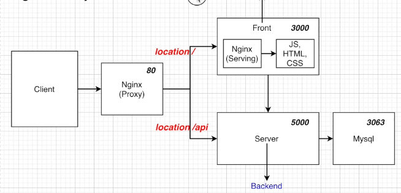
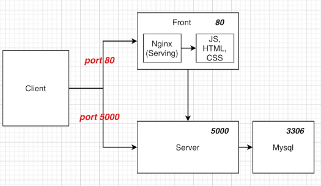
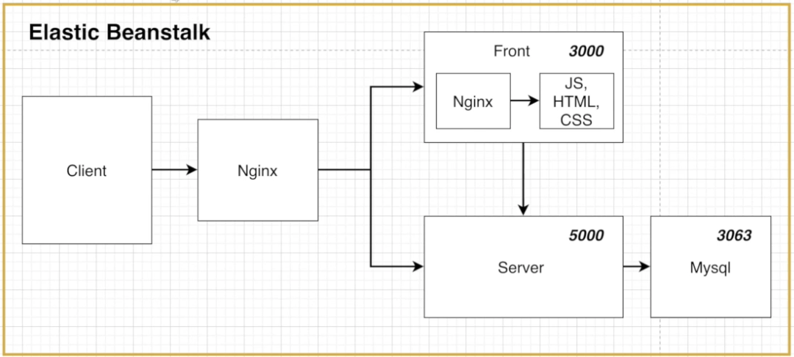
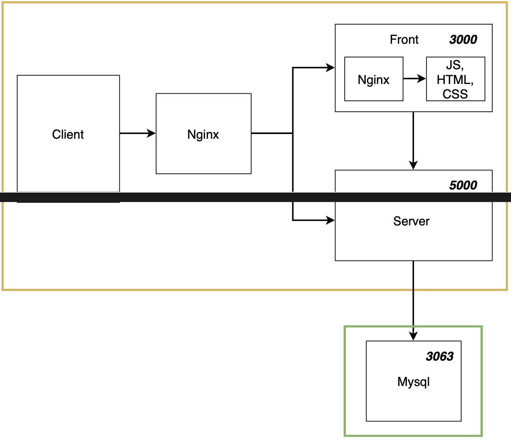
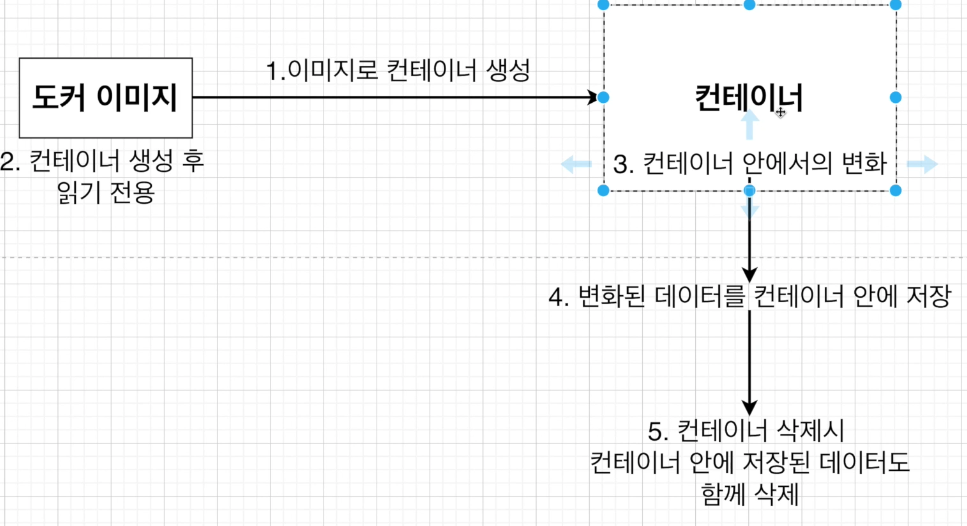
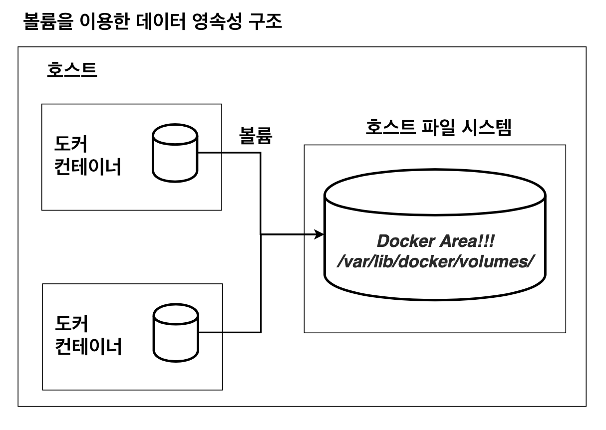

## 1. 섹션 설명
* 개발환경에서 리액트 & 노드 & 데이터베이스 개발
* 풀스택 어플리케이션(multi-container)
```
└── browser(http://localhost:3000)
       └── nginx
           ├── react
           └── node
                └── mysql 
```
  * 클라이언트에서 아무 글이나 입력을 하면 리액트를 통해서 노드로 전달된 이후에 Mysql 데이터 베이스에 저장한 후 그 저장된 것을 화면에 보여주는 앱을 구현. 컨테이너를 삭제했다가 다시 생성하여도 DB에 저장된 데이터는 남아있게 함.

* 설계방법
  1. Nginx의 Proxy를 이용한 설계
    
    * 장점 - request를 보낼 때, url부분을 host 이름이 바뀌어도 변경시켜주지 않아도 된다. 포트가 바뀌어도 변경을 안해주어도 된다.
    * 단점 - nginx 설정, 전체 설계가 다소 복잡

  2. Nginx는 정적파일을 제공만 해주는 설계
    
    * 장점 - 설계가 간단하여 구현하는게 더 쉽다.
    * 단점 - hostname이나 포트 변경이 있을 때, request url도 변경시켜주어야 한다.

## 2. Node JS 구성하기
1. pacakge.json 구성
2. server.js
3. db.js

## 3. React JS 구성하기
* CRA로 frontend 폴더 생성
* input과 button 추가
* style 추가
* event handler 추가

## 4. 리액트 앱을 위한 도커 파일 만들기
* 개발환경을 위한 도커파일 작성 - 빌드되지않은 파일로 실행되고, 개발서버가 따로 있다.
```
//Dockerfile.dev
FROM node:alpine

WORKDIR /app

COPY package.json ./

RUN npm install

COPY ./ ./

CMD ["npm", "run", "start"]
```

* 운영환경을 위한 도커파일 - 빌드파일을 생성 후, 빌드파일을 이용하고, 개발서버는 nginx로 대체 되었다.
```
// Dockerfile
FROM node:alpine as builder

WORKDIR /app

COPY ./package.json ./

RUN npm install

COPY . .

RUN npm run build 

FROM nginx

EXPOSE 3000

COPY ./nginx/default.conf /etc/nginx/conf.d/default.conf // /etc/..로 시작하는 주소는 컨테이너 안에 있는 nginx 설정파일의 경로

COPY --from=builder /app/build /usr/share/nginx/html
```

* Nginx의 Proxy를 이용한 설계에서 클라이언트 내부의 Nginx 설정
  * nginx/default.conf
  ```
  server {
    listen 3000; => nginx서버가 listen하는 포트
  }

  location / {
    
    root /usr/share/nginx/html; => HTML파일이 위치할 루트 설정

    index index.html indexhtm; => 사이트의 index 페이지로 할 파일명 설정

    try_files $uri $uri/ /index.html; => React Router를 사용해서 페이지간 이동을 할 때 이 부분이 필요(SPA이기 때문에 라우팅을 위하여 대안책으로 index.html을 제공)
  }
  ```

## 5. 노드 앱을 위한 도커 파일 만들기
* 개발환경용 도커파일 - Dockerfile.dev
```
FROM node:apline

WORKDIR /app

COPY package.json ./

RUN npm install

COPY . .

CMD ["npm", "run", "dev"] // nodemon을 실행하기 위해서 dev를 사용
```

* 운영환경용 도커파일 - Dockerfile
```
FROM node:apline

WORKDIR /app

COPY package.json ./

RUN npm install

COPY . .

CMD ["npm", "run", "start"]
```

## 6. DB에 관해서
* 개발환경과 운영환경에서 각각의 DB 구성
  * 개발 환경 - 도커 환경 이용
    
  * 운영 환경 - AWS RDS 서비스 이용
    

* 나누는 이유 - DB작업은 중요한 데이터들을 보관하고 이용하는 부분이기에 안정적인 AWS RDS를 이용하여 DB를 구성하는것이 실무에서 더 보편적으로 쓰인다.

## 7. MYSQL을 위한 도커 파일 만들기
* Mysql과 Nodejs를 연결하기 위해서 도커이미지를 이용해서 mysql를 설치
* frontend와 backend과 동일레벨에 mysql 폴더 생성
  * Dockerfile
  ```
  FROM mysql:5.7
  ```

* Mysql을 시작할 때, Database와 Table이 필요하기 때문에 이것들을 만들 장소를 구현 - `mysql/sqls/initialize.sql `
```sql
DROP DATABASE IF EXISTS myapp;

CREATE DATABASE myapp;
USE myapp;

CREATE TABLE lists (
  id INTEGER AUTO_INCREMENT,
  value TEXT,
  PRIMARY KEY (id)
)
```

* 한글 저장이 깨지기 않게하기위해 설정 추가(utf8로 인코딩) - `mysql/my.conf`
```
[mysqld]
character-set-server=utf8

[mysql]
default-character-set=utf8

[client]
default-character-set=utf8
```
  * 설정 후, mysql status를 보면 Server, Db, Client의 characterset이 latine1에서 utf8로 변경된 것을 볼 수 있다

## 8. NGINX를 위한 도커 파일 만들기
* nginx의 용도
  
  1. Proxy
  2. Static 파일을 제공

* location에 따라 요청을 보냄
  * / - reactjs
  * /api - nodejs

* root에 `nginx/default.conf`
```
upstream frontend {
  server frontend:3000 // 3000번 포트에서 프론트엔드가 돌아가고 있다는 것을 명시
}

upstream backend {
  server backend:5000 // 5000번 포트에서 백엔드가 돌아가고 있다는 것을 명시
}

server {
  listen 80; // Nginx 서버 포트를 80번으로 열어줍니다.

  location / {
    proxy_pass http://frontend // /만 있는것은 우선순위가 낮아서 /api를 먼저찾고 없다면, /로 들어오는 요청을 http://frontend로 보내줍니다
  }

  location /api {
    proxy_pass http://backend // /api로 들어오는 요청을 http://backend로 보내줍니다 
  }
}

location /sockjs-node {
  proxy_pass http://frontend;
  proxy_http_version 1.1;
  proxy_set_header Upgrade $http_upgrade;
  proxy_set_header Connection "Upgrade"
} // 개발환경에서 발생하는 웹소켓 에러를 없애주기 위한 설정
```

* `nginx/Dockerfile`
```
FROM nginx
COPY ./default.conf /etc/nginx/conf.d/default.conf // 작성된 conf 파일을 컨테이너에서 실행될 Nginx에도 적용될 수 있게 COPY
```

## 9. Docker Compose 파일 작성하기
* 컨테이너들을 연결시켜 주기 위하여 Docker Compose를 작성(`root/docker-compose.yml`)
```yml
version: "3"
services:
  frontend:
    build:
      dockerfile: Dockerfile.dev
      context: ./frontend // 개발환경을 위한 도커파일의 위치를 알려줌
    volumes:
      - /app/node_modules
      - ./frontend:/app // 코드를 수정 후 다시 이미지를 빌드하지 않고, 수정된 코드가 반영되도록 volume 이용
    stdin_open: true // react app 종료할 때 나오는 버그를 잡아줌
  nginx:
    restart: always // 재시작 정책 on-failure는 에러코드와 함께 컨테이너가 멈추었을 때 재시작, unless-stopped 개발자가 멈추려고 할때 빼고는 항상 재시작
    build:
      dockerfile: Dockerfile.dev
      context: ./nginx
    ports:
      - "3000:80"
  backend:
    build:
      dockerfile: Dockerfile.dev
      context: ./backend
    container_name: app_backend
    volumes:
      - /app/node_modules
      - ./backend:/app
  mysql:
    build: ./mysql
    restart: unless-stopped
    container_name: app_mysql
    ports:
      - "3306:3306"
    volumes:
      - ./mysql/mysql_data:/var/lib/mysql
      - ./mysql/sqls/:/docker-entrypoint-initdb.d/
    environment:
      MYSQL_ROOT_PASSWORD: 디비 설정 비번
      MYSQL_DATABASE: myapp
```

* 명령어 실행으로 확인
```
docker-compose up
```

## 10. Docker Volume을 이용한 데이터 베이스 데이터 유지하기
* `docker-compose.yml에서 volumes의 역할`
  * 컨테이너를 지우면 컨테이너에 저장된 데이터들이 지워지는 구조
    
  * 데이터 베이스의 저장된 자료를 컨테이너를 지우더라도 자료가 지워지지 않을 수 있게 해주기 위한 볼륨
    
    * 호스트 파일 시스템에 저장되고 도커에 의해서만 통제가 되는 도커 Area에 저장이 되므로 컨테이너를 삭제해도 변화된 데이터는 사라지지 않는다.