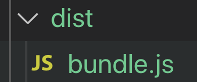
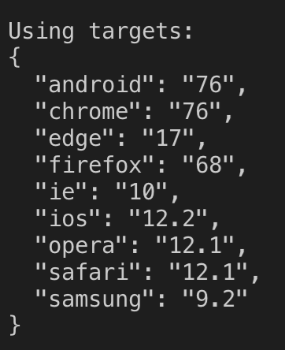
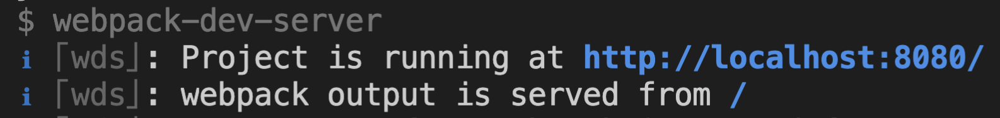

## 1. 미니 프로젝트 소개


* 코드 스쿼드 블로그
  * button 
  * 클릭하면 블로그들을 표시
  * 블로그들을 클릭시 블로그로 이동하기

* 찜하기 
  * 클릭하면, 내 찜 목록에 제목들이 목록형태로 나열되도록 하기. 
  * 다시 누르면 찜취소.

## 2. nodeJS 기반 환경구성과 webpack

### 간단한 개념
* webpack - 모든 의존관계를 파악해서 bundle.js로 만들어서 배포하기 쉽게 만들어 준다. css파일을 import해서 쓸수 있게 해준다.
  * loader - babel같은 것을 불러서 쓰기 쉽게 해준다.
  * plugin - 코드의 공백을 줄이거나, 검사 등등 bundle파일들을 대상으로 어떠한 작업을 추가적으로 수행해준다.

* babel - ES6를 지원하는 브라우저가 없는 것도 있기 때문에, ES6코드를 ES5코드로 트랜스파일링 해준다.

### Project
* package.json 생성
```bash
cd [project folder]
npm init
```

* webpack
  * 설치
  ```bash
  npm install webpack webpack-cli --save-dev
  ```

  * package.json에 실행 명령어 추가
  ```bash
  {
    ...,
    "scripts": {
      ...,
      "build": "webpack --mode development"
    }
  }
  ```

  * webpack 설정 
    * entry - 빌드할때 바라볼곳
    * output - webpack으로 빌드된 파일의 결과물
    * project root 폴더에 webpack.config.js 파일 생성 후, 아래코드 입력
    ```javascript
    const path = require('path')

    module.exports = {
      entry: './src/index.js', 
      output: {
        filename: 'bundle.js',
        path: path.resolve(__dirname, 'dist')
      },
      module: {
        rules: [{

        }]
      }
    }
    ```

    * project root 폴더에 index.html과 src폴더를 만들고, src폴더 안에 index.js파일을 만들기.
      * index.js
      ```javascript
      console.log('start project')
      ```

      * index.html
      ```html
      <!DOCTYPE html>
      <html lang="en">
      <head>
        <meta charset="UTF-8">
        <meta name="viewport" content="width=device-width, initial-scale=1.0">
        <meta http-equiv="X-UA-Compatible" content="ie=edge">
        <title>hello inflearn es6</title>
      </head>
      <body>
        <h1>hello codesquad</h1>
        <script src='./dist/bundle.js'></script>
      </body>
      </html>
      ```
  
  * webpack 실행해보기
  ```bash
  cd [project folder]
  npm run build
  ```

  * 실행결과 - dist폴더에 bundle.js가 생김 
  
  

## 3. babel preset 설정

### babel
* babel - 최근 브라우저에 맞게 transpiling 해주는 것.
* 브라우저의 ES6지원상황은 계속 변한다.
* babel을 쓰기 위해서는 webpack 설정이 필요하다.

### Project
* webpack 설정
  1. babel-loader와 @babel/core, @babel/preset-env 설치
  ```bash
  npm install bable-loader @babel/core @babel/preset-env --save-dev
  ```
 
  2. webpack.config.js에 설정 추가
  ```javascript
  const path = require('path')

  module.exports = {
    ...,
    module: {
      rules: [
        {
          test: /\.js$/,
          exclude: "/node_modules",
          use: {
            loader: 'babel-loader',
          }
        }
      ]
    }
  }
  ```

  3. project root폴더에서 .babelrc 파일 생성후 코드 추가
  ```javascript
  {
    "presets": ["@babel/preset-env"]
  }
  ```

  4. debug를 하려면 ? .bablerc 파일에 코드 추가
  ```javascript
  {
    "presets": [
      [
        "@babel/preset-env",
        {
          "targets": {
            "browsers": ["last 2 versions"]
          },
          "debug": true
        }
      ]
    ]
  }
  ```

  - yarn build 후
  

## 4. webpack-dev-server와 html 구성
* local에서 서버를 띄우는 방법 ? 여러가지 방법이 있지만 webpack에서 제공해주는 것이 있다.
* webpack-dev-server는 js파일 변경사항만 적용해준다.
* webpack은 모듈로더를 기본지원 한다.

### Project
* [webpack-dev-server](https://github.com/webpack/webpack-dev-server)
  * 설치
  ```bash
  npm install webpack-dev-server --save-dev
  ```

  * package.json 명령어 추가
  ```bash
  {
    ...,
    "scripts": {
      ...,
      "dev": "webpack-dev-server"
    }
  }
  ```

  * webpack.config.js 설정 추가 - output에 pubpublicPath 추가
  ```javascript
  const path = require('path')

  module.exports = {
    output: {
    ...,
    publicPath: '/dist'
  },
    ...,
  }
  ```

  * 실행 방법 - 터미널에서 명령어 실행.
  ```bash
  npm run dev
  ```
  
  
  표시된대로 localhost:8080으로 접속하면, 우리가 만든 index.html을 볼 수 있다. js파일을 변경하면 변경사항이 새로고침을 안해도 적용이 된다.