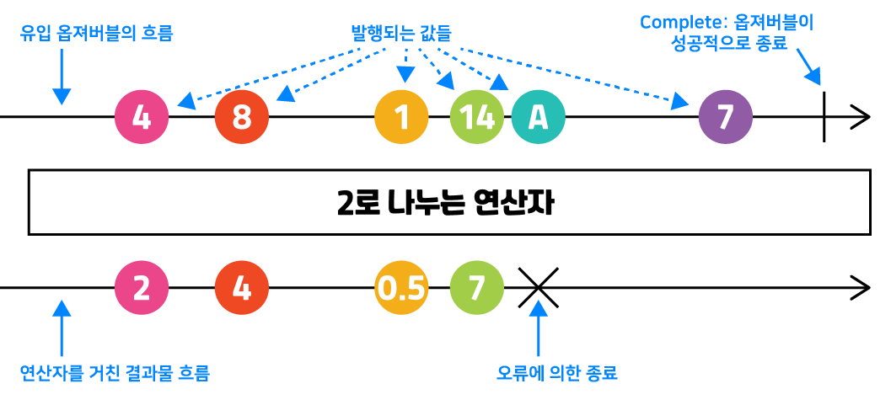

## 1. Observable(스트림 생성기) 만들기
### 1.1 배열된 스트림 - 가장 단순한 형태. 시간을 구애받지 않음
```js
import * as rxjs from 'rxjs'
const { of, from, range, generate } = rxjs

const obs1$ = of(1, 2, 3, 4, 5)
const obs2$ = from([6, 7, 8, 9, 10])
const obs3$ = range(11, 5)
const obs4$ = generate(15, x => x < 30, x => x + 2)

obs1$.subscribe(item => console.log(`of: ${item}`)) // of 1, ..., of 5
obs2$.subscribe(item => console.log(`from: ${item}`)) // from 6, ..., from 10 
obs3$.subscribe(item => console.log(`range: ${item}`)) // 11, ..., 15
obs4$.subscribe(item => console.log(`of: ${item}`)) // js의 for문과 비슷
```

### 1.2 시간에 의한 스트림
```js
const { interval, timer } = rxjs

const obs1$ = interval(1000)
const obs2$ = timer(3000)

obs1$.subscribe(item => console.log(`interval: ${item}`)) // interval 1, interval 2,  ...
obs2$.subscribe(item => console.log(`timer: ${item}`)) // 3초 후 timer 0
```

### 1.3 이벤트에 의한 스트림
```js
const { fromEvent } = rxjs

const obs1$ = fromEvent(document, 'click')
const obs2$ = fromEvent(document.getElementById('myInput'), 'keypress')

obs1$.subscribe(item => console.log(item) // 클릭할 때 마다 출력
obs2$.subscribe(item => console.log(item)) // 키보드를 입력할 때마다 출력
```

### 1.4 Ajax를 통한 스트림
```js
const { ajax } = rxjs.ajax

const obs$ = ajax(`http://127.0.0.1:3000/people/1`)
obs$.subscribe(result => console.log(result.response))
```

### 1.5 직접 만드는 스트림
```js
const { Observable } = rxjs

const obs$ = new Observable(subscriber => {
  // next 함수 - 발행되는 값으로 subscribe의 콜백 함수를 실행
  subscriber.next(1)
  subscriber.next(2)
  subscriber.next(3)

  // 값을 다 발행한 뒤에는 compelte를 실행하여 메모리 해제 
  subscriber.complete()
})

obs$.subscribe(item => console.log(item))
```

### 1.6 Observable은 게으르다(lazy)
* 누군가 구독을 해야 발행을 시작
* 각 구독자에게 따로 발행
```js
const { of, interval, fromEvent } = rxjs

const obs1$ = of('a', 'b', 'c')
const obs2$ = interval(1000)
const obs3$ = fromEvent(document, 'click')

setTimeout(_ => {
  console.log('of 구독 시작')
  obs1$.subscribe(item => console.log(item))
}, 5000)
setTimeout(_ => {
  console.log('interval 구독 시작')
  obs2$.subscribe(item => console.log(item))
}, 10000)
setTimeout(_ => {
  console.log('fromEvent 구독 시작')
  obs3$.subscribe(_ => console.log('click!'))
}, 15000)
setTimeout(_ => {
  console.log('interval 구독 시작 2')
  obs2$.subscribe(item => console.log(item))
}, 20000)
```

## 2. Observer(구독자)에게 발행물 구독시키기
### 2.1 구독자 만들기
```js
const { from } = rxjs
// 옵저버블을 표현할 때 끝에 $을 붙이는게 reactiveX 프로그래밍을 하는사람들 사이의 많이 쓰이는 컨벤션
const observable$ = from([1, 2, 3, 4, 5])

// 구독자 생성 - next, error 또는 next만 있어도 된다.
const observer = {
  // 구독자가 하는 일 들, stream의 값을들 하나하나 처리
  next: console.log,
  error: err => console.error('발행중 오류', err),
  // 값을 다 발행한 뒤에는 complete를 실행하여 메모리 해제
  complete: () => console.log('발행물 완결'),
}

// 구독시키기
// 방법 1
observable.subscribe(observer)

// 방법 2 - 순서는 지켜야 한다.
observable$.subscribe(
  console.log,
  err => console.error('발행중 오류', err),
  _ => console.log('발행물 완결')
)
```

### 2.2 Error와 Complete 살펴보기
* Error - 발행중 오류가 나면 next, complete가 실행되지 않는다.
```js
const { Observable } = rxjs

const obs$ = new Observable(subscriber => {
  subscriber.next(1)
  subscriber.next(2)
  subscriber.next(3)
  (null)[0]
  subscriber.next(4)
})

obs$.subscribe(
  console.log,
  err => console.error('발행중 오류', err),
  _ => console.log('발행물 완결')
)
```

* Complete - 중간에 complete가 선언되면 더이상 실행되지 않는다. complete를 실행해줘야 메모리가 낭비 되지 않는다
```js
const { Observable } = rxjs

const obs$ = new Observable(subscriber => {
  subscriber.next(1)
  subscriber.next(2)
  subscriber.next(3)
  subscriber.complete()
  subscriber.next(4)
})

obs$.subscribe(
  console.log,
  err => console.error('발행중 오류', err),
  _ => console.log('발행물 완결')
)
```

* 구독 해제하기 - 하나의 옵저버블에 여러 구독자가 있을 때, 특정 구독자를 해제할 때 사용한다
```js
const { interval } = rxjs

const obs$ = interval(1000)
const subscription = obs$.subscribe(console.log)
// 특정 구독자 해제
setTimeout(_ => subscription.unsubscribe(), 5500)
// 다시 시작
setTimeout(_ => obs$.subscribe(console.log), 7500)
```

## 3. Operator 사용해보기
### 3.1 Creation operator
* Observable을 생성하는 연산자들
  * of, from, range, fromEvent, timeout, interval, ...
* rxjs에서 로드

### 3.2 Pipable operator
* Observable의 데이터를 **pure function**(부작용을 일으키지 않는 함수. 현존하는 데이터를 수정하지 않음)으로 가공
* rxjs.operators에서 로드(map, filter, ...)
* pipe 함수에 하나 이상 넣어 연결
* pipe에는 **하나 이상**의 operator들이 쉼표로 구분되어 들어갈 수 있음
* [참고영상](https://www.youtube.com/watch?v=jVG5jvOzu9Y)
  ```js
  const { range } = rxjs

  const { filter, map } = rxjs.operators
  const observable$ = range(1, 10)

  const observer = {
    next: x => console.log(x + ' 발행'),
    error: err => console.error('발행중 오류', err),
    complete: () => console.log('발행물 완결'),
  }

  observable$.pipe(
    // 순수 함수
    filter(x => x % 2 === 0),
    map(x => x * x)
  ).subscribe(observer)
  ```

* 시간, 이벤트에 의한 발행물에 적용
  ```js
  // 시간
  const { interval } = rxjs

  const { tap, filter, map } = rxjs.operators
  const observable$ = interval(1000) 

  // ... observer 정의

  observable$.pipe(
    // tap - 파이프를 거칠 때 원하는 동작을 미리 한번 실행하는 함수
    tap(console.log),
    filter(x => x % 2 === 0),
    map(x => x * x)
  ).subscribe(observer)

  // 이벤트
  const { fromEvent } = rxjs

  const { map } = rxjs.operators
  const observable$ = fromEvent(document, 'click') 

  // ... observer 정의

  observable$.pipe(
    map(e => e.x + ' ' + e.y),
  ).subscribe(observer)
  ```

### 3.3 마블 다이어그램 읽기

  * 시간의 흐름(옵저버블의 흐름)에 따라 원이 찍힘(값을 발행)

## 4. 내맘대로 발행하는 Subject
### 4.1 코드로 보는 Subject
* 값을 발행되는 시점을 특정하게 셋팅할 경우이거나 특정 프로그램의 상태를 변수 대신 저장하는 경우 사용
```js
const { Subject } = rxjs
const subject = new Subject()

subject.subscribe(console.log)

subject.next(1)
subject.next(3)
subject.next(5)
```

### 4.2 Observable과 Subject의 차이
* Observable
  * 누군가 `구독`을 해야 발행을 시작
  * 각 구독자에게 `따로` 발행
  * unicast
  * cold 발행
  * Netflix
  ```js
  const { interval } = rxjs
  const obs$ = interval(1000)

  obs$.subscribe(x => console.log('바로구독: ' + x))
  setTimeout(_ => {
      obs$.subscribe(x => console.log('3초 후 구독: ' + x))
  }, 3000)
  setTimeout(_ => {
      obs$.subscribe(x => console.log('5초 후 구독: ' + x))
  }, 5000)
  setTimeout(_ => {
      obs$.subscribe(x => console.log('10초 후 구독: ' + x))
  }, 10000)
  ```

* Subject
  * 개발자가 원하는 때에 발행
  * 모든 구독자에게 똑같이 발행
  * multicast
  * hot 발행
  * TV 채널
  ```js
  const { Subject } = rxjs
  const subject = new Subject()

  setTimeout(_ => {
      let x = 0
      setInterval (_ => {
          subject.next(x++)
      }, 2000)
  }, 5000)

  subject.subscribe(x => console.log('바로구독: ' + x))
  setTimeout(_ => {
      subject.subscribe(x => console.log('3초 후 구독: ' + x))
  }, 3000)
  setTimeout(_ => {
      subject.subscribe(x => console.log('10초 후 구독: ' + x))
  }, 10000)
  setTimeout(_ => {
      subject.subscribe(x => console.log('14초 후 구독: ' + x))
  }, 14000)
  ```

### 4.3 Subject와 결합
```js
const { interval, Subject } = rxjs

const subject = new Subject()
const obs$ = interval(1000)

obs$.subscribe(subject)
/*
위와 동일한 코드
obs$.subscribe(x => {
  subject.next(x)
})
*/

subject.subscribe(x => console.log('바로구독: ' + x))
setTimeout(_ => {
    subject.subscribe(x => console.log('3초 후 구독: ' + x))
}, 3000)
setTimeout(_ => {
    subject.subscribe(x => console.log('5초 후 구독: ' + x))
}, 5000)
setTimeout(_ => {
    subject.subscribe(x => console.log('10초 후 구독: ' + x))
}, 10000)
```

### 4.4 추가 기능이 있는 Subject
* BehaviorSubject - 마지막 값을 저장 후 추가 구독자에게 발행
```js
const { BehaviorSubject } = rxjs
const subject = new BehaviorSubject(0) // 초기값이 있음
 
subject.subscribe((x) => console.log('A: ' + x))
 
subject.next(1)
subject.next(2)
subject.next(3)
 
subject.subscribe((x) => console.log('B: ' + x))
 
subject.next(4)
subject.next(5)

const lastValue = subject.getValue() // 서브젝트가 마지막으로 발행한 값 얻기
```

* ReplaySubject - 마지막 N개 값을 저장 후 추가 구독자에게 발행
```js
const { ReplaySubject } = rxjs
const subject = new ReplaySubject(3) // 마지막 3개 값 저장
 
subject.subscribe((x) => console.log('A: ' + x))
 
subject.next(1)
subject.next(2)
subject.next(3)
subject.next(4)
subject.next(5)
 
subject.subscribe((x) => console.log('B: ' + x))
 
subject.next(6)
subject.next(7)
```

* AsyncSubject - Complete 후의 마지막 값만 모든 구독자에게 발행
```js
const { AsyncSubject } = rxjs
const subject = new AsyncSubject()
 
subject.subscribe((x) => console.log('A: ' + x))
 
subject.next(1)
subject.next(2)
subject.next(3)
 
subject.subscribe((x) => console.log('B: ' + x))
 
subject.next(4)
subject.next(5)

subject.subscribe((x) => console.log('C: ' + x))

subject.next(6)
subject.next(7)
subject.complete()
```
