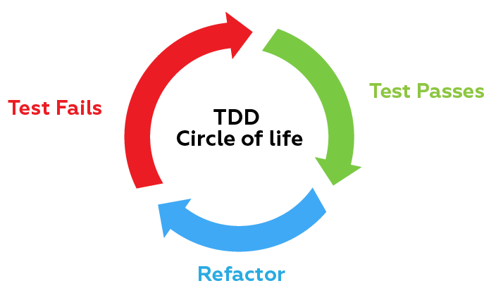

# 1. 아리송한 상황들

- 잘못된 코드를 작성하기 쉽다.

```javascript
console.log = 14;
console.log(); // TypeError
```

- 타입이 헷갈린다.

```javascript
"1" + 1 = "11";
"2" * 3 = 6;
1 + "2" + 3 * 4 = "1212";
```

- 결론
  - 컴파일러가 없으니 테스트가 최선이다.
  - TDD를 활용하자.

# 2. 몇 가지 테스트 개념들

1. 단위(Unit Test) - 특정 조건에서 어떻게 작동해야 할지 정의한 것. 인풋에 따라 결과를 내놓는다. 즉, 함수로 표현한다. 준비(arrange) - 실행(act) - 단언(assert) 패턴을 따른다.

2. 테스트 주도 개발(TDD)



- 적색(Red), 녹색(Green), 리팩터(Refactor) 소환
  - 어떤 함수의 기능을 만드려면 ?
    1. 기능을 테스트 할 수 있는 테스트 코드 작성(단위 테스트)
    2. 테스트를 실행하면 실패. 즉, Red
    3. 테스트가 통과 할 정도로 함수 기능 작성.
    4. 테스트를 실행하면 성공. 즉, Green
    5. 품질을 높이기 위해서 Blue(Refactor)
- 테스트하기 쉬운 코드
- 관심사의 분리

# 3. 설치 (테스트 프레임워크인 jasmine)

- [설치 방법](https://github.com/jasmine/jasmine#installation)

  1. [standalone(직접 다운로드)](https://github.com/jasmine/jasmine/releases) - 모든 jasmine코드를 브라우저에 올려서 실행하는 방법
  2. [npm or yarn을 이용한 설치](https://jasmine.github.io/setup/nodejs.html)
  3. [karma와 함께 설치(자동화) - 실무에서 사용되는 방법](https://medium.com/bb-tutorials-and-thoughts/javascript-how-to-set-up-a-testing-environment-with-jasmine-and-karma-58591dd39734)

- 테스트 러너(Test Runner)란 ?

  - 테스트 코드를 실행하는 녀석
  - 자동화를 하려면 테스트러너인 karma와 함께 사용 할 수 있음

- 기본적인 테스트 함수들

```javascript
describe("hello world", () => {
  it("true is true", () => {
    expect(true).toBe(true);
  });
});
```

- 테스트 꾸러미 (Test Suite)

  - describe('테스트 설명', 테스트 구현 함수) - 테스트 꾸러미를 만들 때 사용하는 함수

- 테스트 스펙 (Test Spec)

  - it('테스트 설명', 기대식을 가진 테스트 구현 함수) - 테스트 케이스를 만들 때 사용

- 기대식과 매쳐

  - expect(결과 값).toBe(기대하는 값)

- 스파이
  - spyOn(감시할 객체, 감시할 메소드)
