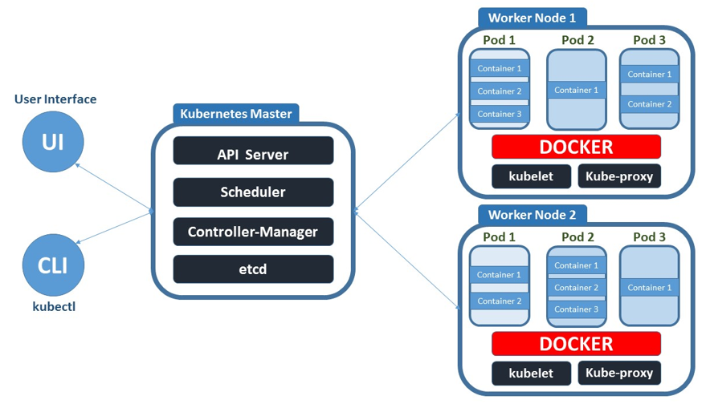

## 1. 쿠버네티스 동작원리
### 1.1 쿠버네티스에서 컨테이너 동작 Flow

1. 컨테이너 빌드 후 도커 허브에 저장(사내 또는 퍼블릭 공간)
2. 운영자는 kubectl 명령어를 통해서 컨테이너가 실행될 수 있도록 마스터(control-plane)에 요청(cli 또는 yaml)
3. 마스터에 kube-apiserver가 명령어 요청을 받아주고, 요청에 따라서 컨테이너를 어떤 작업 노드에 배치하면 좋을지 kube-apiserver에 요청
4. kube-apiserver는 어떤 노드에 배치할지 응답을 kube-apiserver에 줌
5. kube-apiserver가 응답을 받으면 배치된 노드 kubelet에 요청을 함
6. 요청을 받은 kubelet은 요청을 도커명령어로 바꿔서 도커 데몬에게 실제 컨테이너 실행요청을 하게 됨
7. 도커데몬은 정의된 도커허브에 검색 후, 있으면 받아와서 컨테이너로 실행해줌
8. 쿠버네티스는 이렇게 동작하는 컨테이너를 파드라는 단위로 관리

### 1.2 쿠버네티스 컴포넌트

* 마스터 컴포넌트 - 실제 클러스터 전체를 관리
  * [etcd](https://kubernetes.io/ko/docs/concepts/overview/components/#etcd) - key-value 타입의 저장소. 워커노드들에 대한 모든 상태정보 저장.
  * [kube-apiserver](https://kubernetes.io/ko/docs/concepts/overview/components/#kube-apiserver) - k8s API를 사용하도록 요청을 받고 요청이 유효한지 검사
  * [kube-scheduler](https://kubernetes.io/ko/docs/concepts/overview/components/#kube-scheduler) - 파드를 실행할 노드 선택
  * [kube-controller-manager](https://kubernetes.io/ko/docs/concepts/overview/components/#kube-controller-manager) - 파드를 관찰하며 개수를 보장

* 워커 노드 컴포넌트 - 쿠버네티스 실행 환경을 관리
  * [kubelet](https://kubernetes.io/ko/docs/concepts/overview/components/#kubelet) - 모든 노드에서 실행되는 k8s 에이전트. 데몬 형태로 동작
  * [kube-proxy](https://kubernetes.io/ko/docs/concepts/overview/components/#kube-proxy) - k8s의 network 동작을 관리. iptables rule을 구성
  * [컨테이너 런타임](https://kubernetes.io/ko/docs/concepts/overview/components/#%EC%BB%A8%ED%85%8C%EC%9D%B4%EB%84%88-%EB%9F%B0%ED%83%80%EC%9E%84) - 컨테이너를 실행하는 엔진. docker, containerd, runc

* 애드온 - 클러스터 안에서 필요한 기능을 실행하는 파드
  * [네트워크 애드온](https://kubernetes.io/ko/docs/concepts/cluster-administration/addons/#%EB%84%A4%ED%8A%B8%EC%9B%8C%ED%82%B9%EA%B3%BC-%EB%84%A4%ED%8A%B8%EC%9B%8C%ED%81%AC-%ED%8F%B4%EB%A6%AC%EC%8B%9C) - CNI(weave, calico, flaneld, kube-route, ...)
  * [dns 애드온](https://kubernetes.io/ko/docs/concepts/services-networking/dns-pod-service/) - coreDNS
  * [대시보드 애드온](https://kubernetes.io/ko/docs/tasks/access-application-cluster/web-ui-dashboard/)
  * [컨테이너 자원 모니터링](https://kubernetes.io/ko/docs/tasks/debug-application-cluster/resource-usage-monitoring/) - cAdvisor
  * [클러스터 로깅](https://kubernetes.io/ko/docs/concepts/cluster-administration/logging/)
    * 컨테이너 로그, k8s 운영 로그들을 수집해서 중앙화
    * ELK(ElasticSearch, Logstash, Kibana), EFK(ElasticSearch, Fluentd, Kibana), DataDog

## 2. 오브젝트와 컨트롤러
* 쿠버네티스는 `오브젝트`와 오브젝트를 관리하는 `컨트롤러`로 나눕니다.
* 오브젝트 - pod, service, volume, namespace
* 컨트롤러 - ReplicaSet, Deployment, StatefulSet, DaemonSet, Job

## 3. [namespace](https://kubernetes.io/ko/docs/concepts/overview/working-with-objects/namespaces/)
### 3.1 k8s namespace
* k8s API 종류 중 하나
* 클러스터 하나를 **여러 개의 논리적인 단위로 나눠서 사용**
* 쿠버네티스 클러스터 하나를 **여러 팀이나 사용자가 함께 공유**(진짜 클러스터는 1개지만 마치 여러개가 있는것 처럼 동작)
* **용도에 따라 실행해야 하는 앱을 구분할 때** 사용
* 장점
  * namespace에서만 동작하는 정보만 볼 수 있다.
  * 유지보수하기 편하다.

### 3.2 네임스페이스 사용하기
#### 3.2.1 생성
* cli
```
kubectl create namespace [이름]
```

* yaml
```
kubectl create namespace [이름] --dry-run -o yaml > [이름].yaml // 실제로 실행하지않고 실행 가능 여부만 확인 
kubectl create -f [이름].yaml
```

#### 3.2.2 Example - 생성
* cli
```
kubectl create namespace nginx
```

* yaml - nginx.yaml
```yaml
apiVersion: v1
kind: Pod
metadata:
  name: nginx-pod
  # namespace: 이름
spec:
  containers:
  - name: nginx-container
    image: nginx:1.14
    ports:
    - containerPort: 80
      protocol: TCP
```

```
// 기본 네임스페이스
kubectl create -f nginx.yaml
// 다른 네임스페이스
kubectl create -f nginx.yaml -n [이름]
```

#### 3.2.3 조회
```
kubectl get namespaces
```
* 생성된게 없으면 기본으로 생성된 namespace가 나온다

| NAME | STATUS | AGE |
|----|-----------|-------|
| default | Active | 91d |
| kube-node-lease | Active | 91d |
| kube-public | Active | 91d |
| kube-system | Active | 91d |

* default - 기본적으로 default 네임스페이스를 사용중(아래는 전부다 같은 명령어)
```
kubectl get pod
kubectl get pod --namespace default
kubectl get pod -n default
```

* 전체 네임스페이스 조회
```
kubectl get pods -all-namespaces
```

#### 3.2.4 삭제
```
kubectl delete namespace [이름]
kubectl delete [타입] [오브젝트 이름] -n [네임스페이스 이름]
```
* 네임스페이스를 삭제하면 하위의 pod, service 등등 모두 다 같이 지워진다.
* 삭제 할 때 주의해야한다.

#### 3.2.5 사용할 네임스페이스 switch
* 쿠버네티스 config 정보보기
```
kubectl config view
```

* 쿠버네티스 config에 등록
```
kubectl config set-context [context 이름] --cluster=[cluster 이름] --user=[user 이름] --namespace=[이름]
```

* 현재 context 조회
```
kubectl config current-context
```

* 원하는 context로 바꾸기
```
kubectl config use-context [context 이름]
```

* 네임스페이스 변경을 돕는 도구 - [kubens](https://github.com/ahmetb/kubectx)

## 4. yaml템플릿과 API
### 4.1 yaml 템플릿
* 사람이 쉽게 읽을 수 있는 데이터 직렬화 양식
* 기본 문법
  * 구조화된 데이터를 표현하기 위한 데이터 포맷
  * 파이썬처럼 들여쓰기로 데이터 계층을 표기
  * 들여쓰기를 할 때에는 탭이 아닌 스페이스바를 사용
  * 가독성이 좋아 설정 파일에 적합한 형식
  * Scalar 문법: ':'을 기준으로 key:value를 설정
  * 배열 문법: '-'문자로 여러 개를 나열
* 쿠버네티스 템플릿 기본형식
  ```yaml
  ---
  apiVersion: v1
  kind: Pod
  metadata:
  spec:
  ```
  * apiVersion - 사용하려는 쿠버네티스 API 버전을 명시
  * kind - 어떤 종류의 오브젝트 혹은 컨트롤러에 작업인지 명시
  * metadata - 메타데이터를 설정. 해당 오브젝트의 이름이나 레이블 등을 설정
  * spec - 파드가 어떤 컨테이너를 갖고 실행하며, 실행할 때 어떻게 동작해야 할지 명시

### 4.2 API 버전
* alpha -> beta -> stable
* 쿠버네티스 오브젝트 정의 시 apiVersion이 필요
* 쿠버네티스가 업데이트하는 API가 있으면 새로운 APi가 생성됨
* API 오브젝트의 종류 및 버전

| 종류 | 버전 |
|:---:|:---:|
| Deployment | apps/v1 |
| Pod | v1 |
| ReplicaSet | apps/v1 |
| ReplicationController | v1 |
| Service | v1 |
| PersistentVolume | v1 |

* API버전 확인
```
kubectl explain [오브젝트 명]
```