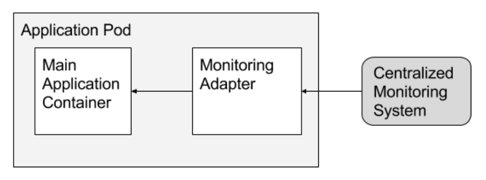
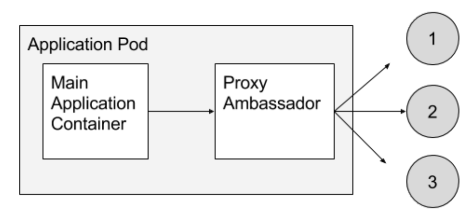

## 1. 쿠버네티스 Pod
### 1.1 Container 정리
* app.js
```js
const http = require('http')
const os = require('os')
console.log('Test server starting...')
const handler = (req, res) => {
  res.writeHead(200)
  res.end(`Container Hostname ${os.hostname()}`)
}
const www = http.createServer(handler)
www.listen(8080)
```

* Dockerfile
```dockerfile
FROM node:12
COPY app.js /app.js
ENTRYPOINT ['node', 'app.js']
```

* 컨테이너 빌드 및 푸시를 통한 허브에 저장
```
docker build -t smlinux/appjs
docker push smlinux/appjs
```

* 쿠버네티스야 appjs Pod 실행해줘 - API에서 컨테이너 동작은 불가능!!

* 컨테이너 하나 === 하나의 애플리케이션

### 1.2 [Pod의 개념](https://kubernetes.io/ko/docs/concepts/workloads/pods/)
* 컨테이너를 표현하는 k8s API의 최소 단위
* Pod에는 하나 또는 여러 개의 컨테이너가 포함될 수 있음

### 1.3 Pod 생성 및 확인
* cli - kubectl run 명령으로 생성
```
kubectl run [pod name] --image=[image name]
```

* yaml
  1. pod-nginx.yaml 생성
  ```yml
  apiVersion: v1
  kind: Pod
  metadata:
    name: webserver
  spec:
    containers:
    - name: nginx-container
      image: nginx:1.14
      imagePullPolicy: Always
      ports:
      - containerPort: 80
        protocol: TCP
  ```
  2. 실행
  ```
  kubectl create -f pod-nginx.yaml
  ```

* 현재 동작중인 Pod 확인
```
kubectl get pods
kubectl get pods -o wide
kubectl get pods -o yaml
kubectl get pods -o json

kubectl get pods webserver -o json | grep -i podip
```

* Pod에 접속해서 결과보기
```
curl [pod의 IP address]
```

### 1.4 Multi Container Pod 생성(Pod안에 여러개의 컨테이너가 있는 경우)
* 정의 - Pod 내부에 2개이상의 컨테이너가 있으면 READY 상태가 2/2, 3/3,... 등등 된다. 하지만 **이름과 ip는 동일하다.**
* pod-multi.yaml
```yml
apiVersion: v1
kind: Pod
metadata:
  name: multipod
spec:
  containers:
  - name: nginx-container
    image: nginx:1.14
    ports:
    - containerPort: 80
  - name: centos-container
    image: centos:7
    command:
    - sleep
    - "10000"
```

* 실행
```
kubectl create -f pod-multi.yaml
```

* 실행중인 컨테이너로 접속하거나 원하는 명령어 전달
```
kubectl exec [pod name] -c [container name] -it -- /bin/bash
kubectl exec multipod -c centos-container -it -- /bin/bash
// 종료
exit
```

* 로그보기 - single container라면 container name이 필요없다.
```
kubectl logs [pod name] -c [container name]
kubectl logs multipod -c nginx-container
```

* 수정
```
kubectl edit pod [pod name]
```

* 삭제
```
// 전체삭제
kubectl delete pod --all
// pod 1개 삭제
kubectl delete pod [pod name]
```

### 1.5 [Pod 동작 flow](https://kubernetes.io/ko/docs/concepts/workloads/pods/pod-lifecycle/)
1. flow
  * Pending - 스케줄링 받기 전까지의 단계
  * Running - 스케줄링을 받은 후
  * Succeeded
  * Failed

2. flow 확인 해보기
```
kubectl get pods -o wide --watch
kubectl create -f pod-nginx.yaml
kubectl delete pop webserver
```

### 1.6 Quiz
1. 현재 namespace에서 동작중인 Pod는 몇개인가 - `kubectl get pods`
2. 현재 시스템에서 동작중인 Pod 수는? - `kubectl get pods --all-namespaces`
3. 컨테이너 nginx를 실행하는 nginx-pod라는 이름의 pod를 생성하시오 - `kubectl run nginx-pod --image=nginx:1.14`
4. 앞에서 생성한 Pod의 image 정보를 확인하는 명령은 무엇인가? - `kubectl describe pod nginx-pod`
5. 앞에서 생성한 nginx-pod는 어느 node에 배치되었나?
6. 앞에서 생성항 Pod에는 몇 개의 컨테이너가 포함되어 있나? - `kubectl get pods`의 READY 상태의 숫자 확인
7. 앞에서 생성한 Pod의 현재 상태는 어떠한가? - `kubectl get pods` 또는 `kubectl describe pod nginx-pod`
8. 새 Pod의 컨테이너 상태는 어떻습니까? - **컨테이너의 상태는** `kubectl describe pod nginx-pod`
9. `kubectl get pods`명령의 출력에서 READY 열은 무엇을 의미하나? - 현재 ready중인 것 / 전체 pod 수
10. 생성한 Pod를 삭제하시오 - `kubectl delete pod nginx-pod`
11. 컨테이너 image `redis123`을 실행하는 pod `redis`를 redis.yaml을 이용해 생성하시오
  * redis.yaml 생성 및 사용하지 않는 필드 제거
  ```
  kubectl run redis --image=redis123 --dry-run -o yml > redis.yaml
  ```
12. 앞서 만든 redis pod의 image를 redis로 수정하여 동작시키시오
  * 트러블 슈팅
  ```
  kubectl describe pod redis
  ```
  * 수정 - redis라는 이미지는 없기때문에 수정
  ```
  kubectl edit pod redis
  ```

## 2. livenessProbe를 이용해 self-healing Pod 만들기(kubelet으로 컨테이너 진단하기)
### 2.1 Liveness Probe
* Pod가 계속 실행할 수 있음을 보장. 즉, 건강한 컨테이너로 서비스하는게 목적
* 사용법 - Pod의 spec에 정의
```yml
apiVersion: v1
kind: Pod
metadata:
  name: nginx-pod
spec:
  containers:
  - name: nginx-container
  image: nginx:1.14
  # self-healing 기능 추가
  livenessProbe:
    httpGet:
      path: /
      port: 80
```

### 2.2 [Liveness Probe](https://kubernetes.io/ko/docs/concepts/workloads/pods/pod-lifecycle/#%EC%BB%A8%ED%85%8C%EC%9D%B4%EB%84%88-%ED%94%84%EB%A1%9C%EB%B8%8C-probe)의 매커니즘
* 컨테이너의 건강검진 방법
  1. httpGet probe - 지정한 IP주소, port, path에 HTTP GET 요청을 보내 해당 컨테이너가 응당하는지를 확인. **반환코드가 200이 아니면 컨테이너를 다시 시작**
  ```yml
  livenessProbe:
    httpGet:
      path: /
      port: 80
  ```

  2. tcpSocket probe - 지정된 포트에 TCP 연결을 시도. **연결되지 않으면 컨테이너를 다시 시작**
  ```yml
  livenessProbe:
    tcpSocket:
      port: 22
  ```

  3. exec probe - exec 명령을 전달하고 명령의 종료코드가 **0이 아니면 컨테이너를 다시 시작**
  ```yml
  livenessProbe:
    exec:
      command:
      - ls
      - /data/file
  ```
  * 컨테이너를 재시작하기 때문에 pod의 IP Address는 바뀌지 않는다

### 2.3 Liveness Probe의 매개 변수
```yml
apiVersion: v1
kind: Pod
metadata:
  name: nginx-pod
spec:
  containers:
  - name: nginx-container
  image: nginx:1.14
  livenessProbe:
    httpGet:
      path: /
      port: 80
    initialDelaySeconds: 15
    periodSeconds: 20
    timeoutSeconds: 1
    successThreshold: 1
    failureThreshold: 3
```
* initialDelaySeconds - Pod 실행 후 delay할 시간(초)
* periodSeconds - health check 반복 실행 시간(초)
* timeoutSeconds - health check후 응답을 기다리는 시간(초)
* failureThreshold - 실패하는 제한 횟수. 제한 횟수가 되면 컨테이너가 다시 시작 된다.

### 2.4 Quiz
* 아래의 liveness-exam.yaml 파일에 self-healing 기능 추가하기
  * 동작되는 Pod내의 컨테이너에 /tmp/healthy 파일이 있는지 5초마다 확인
  * Pod 실행 후 10초 후 부터 검사
  * 성공횟수는 1번, 실패횟수는 연속 2회로 구성

* liveness-exam.yaml
```yml
apiVersion: v1
kind: Pod
metadata:
  name: liveness-exam
spec:
  containers:
  - name: busybox-container
  image: busybox
  args:
  - /bin/sh
  - -c
  - touch /tmp/healthy; sleep 30; rm -rf /tmp/healthy; sleep 600
  # 정답
  # livenessProbe:
  #   exec:
  #     command:
  #     - ls
  #     - /tmp/healthy
  #   initialDelaySeconds: 10
  #   periodSeconds: 5
  #   successThreshold: 1
  #   failureThreshold: 2
```

## 3. init container를 적용한 Pod
### 3.1 init container
* 앱 컨테이너 실행 전에 미리 동작시킬 컨테이너
* 본 Container가 실행되기 전에 사전 작업이 필요할 경우 사용
  * nodejs login 애플리케이션 - db에 접속해서 정보를 가져오는 컨테이너(init container)
  * 특정 컨테이너를 실행해야 되는데 네트워크가 정상적으로 되어야만 실행되는 애플리케이션 - 네트워크가 정상인지 확인(init container)
* [초기화 컨테이너](https://kubernetes.io/ko/docs/concepts/workloads/pods/init-containers/)가 모두 실행된 후에 앱 컨테이너를 실행

### 3.2 예제
* myservice와 mydb 두개의 initcontainer가 실행되어야 app container가 실행됨(쿠버네티스 공식문서 따라하면 됨)
```yml
apiVersion: v1
kind: Pod
metadata:
  name: myapp-pod
  labels:
    app: myapp
spec:
  containers:
  - name: myapp-container
    image: busybox:1.28
    command: ['sh', '-c', 'echo The app is running! && sleep 3600']
  initContainers:
  - name: init-myservice
    image: busybox:1.28
    command: ['sh', '-c', "until nslookup myservice.$(cat /var/run/secrets/kubernetes.io/serviceaccount/namespace).svc.cluster.local; do echo waiting for myservice; sleep 2; done"]
  - name: init-mydb
    image: busybox:1.28
    command: ['sh', '-c', "until nslookup mydb.$(cat /var/run/secrets/kubernetes.io/serviceaccount/namespace).svc.cluster.local; do echo waiting for mydb; sleep 2; done"]
```

## 4. infra container(pause) 이해하기
### 4.1 infra container
* Pod 생성시 같이 만들어지고, Pod가 제거될 때 같이 제거된다.
* IP나 hostname등 관리해주거나 생성해주는 컨테이너

### 4.2 example
```
kubectl run webserver --image=nginx --port=80
docker ps
```

## 5. static Pod(feat. kubelet daemon)
### 5.1 정의
* [static Pod](https://kubernetes.io/ko/docs/concepts/workloads/pods/#%EC%A0%95%EC%A0%81-%ED%8C%8C%EB%93%9C) - API 도움없이 kubelet 데몬에 의해 동작되는 Pod
* static Pod는 api에게 요청을 보내지 않고, 노드의 kubelet이 관리하는 static pod directory에 yaml을 저장하면 알아서 컨테이너가 데몬에 의해서 실행. yaml이 삭제되면 데몬이 컨테이너 삭제

### 5.2 static Pod 만들기
* static container
  * API 서버 없이 특정 노드에 있는 kubelet 데몬에 의해 직접 관리
  * /etc/kubernetes/manifests/ 디렉토리에 k8s yaml 파일을 저장 시 적용됨
  * static pod 디렉토리 구성
  ```
  vi /var/lib/kubelet/config.yaml
  ...
  staticPodPath: /etc/kubernetes/manifests
  ```
  * 디렉토리 수정시 kubelet 데몬 재실행
  ```
  systemctl restart kubelet
  ```

* [static Pod 만들기](https://kubernetes.io/ko/docs/tasks/configure-pod-container/static-pod/)
* cka 문제에서 많이 나옴

## 6. Pod에 Resource 할당하기(cpu/memory request, limit)
### 6.1 Resource를 할당하지 않는다면?
* 한 pod가 resource를 다 써버린다면 다른 pod가 동작하지 않는다. 그렇기 때문에 resource를 제한해주어야 한다.

### 6.2 Pod Resource 요청 및 제한
* Resource Requests - 파드를 실행하기 위한 최소 리소스 양을 요청
* Resource Limits - 파드가 사용할 수 있는 최대 리소스 양을 제한. Memory limit을 초과해서 사용되는 파드는 종료(OOM Kill)되며 다시 스케줄링 된다.
* [Pod Resource 할당](https://kubernetes.io/ko/docs/tasks/configure-pod-container/assign-memory-resource/)

### 6.3 예제
```yml
apiVersion: v1
kind: Pod
metadata:
  name: nginx-pod-resource
spec:
  containers:
  - name: nginx-container
    image: nginx
    ports:
    - containerPort: 80
      protocol: TCP
    resources:
      requests:
        cpu: 200m
        memory: 250Mi
      limits:
        cpu: 1
        memory: 500Mi
```

## 7. Pod 환경변수 설정과 실행 패턴
### 7.1 환경변수
* Pod내의 컨테이너가 실행될 때 필요로 하는 변수
* 컨테이너 제작 시 미리 정의
  * ex - nginx dockerfile
  ```dockerfile
  ENV NGIX_VERSION 1.19.2
  ENV NJS_VERSION 0.4.3
  ```
* Pod 실행 시 미리 정의된 컨테이너 환경변수를 변경할 수 있다

### 7.2 예제
* [환경변수 정의 예제](https://kubernetes.io/ko/docs/tasks/inject-data-application/define-environment-variable-container/)
* envars.yaml 생성
```yml
apiVersion: v1
kind: Pod
metadata:
  name: envar-demo
  labels:
    purpose: demonstrate-envars
spec:
  containers:
  - name: envar-demo-container
    image: gcr.io/google-samples/node-hello:1.0
    env:
    - name: DEMO_GREETING
      value: "Hello from the environment"
    - name: DEMO_FAREWELL
      value: "Such a sweet sorrow"
```

* 실행
```
kubectl exec [pod name] --env
```

## 8. Pod 구성 패턴의 종류
### 8.1 Pod 실행 패턴
* [Pod를 구성하고 실행하는 패턴](https://kubernetes.io/blog/2015/06/the-distributed-system-toolkit-patterns/)
* multi-container Pod
  1. Sidecar - 누군가 로그를 만들고, 로그를 받아서 실행해주는 파드
  
  2. Adapter - 외부 시스템 상태에 대한 모니터 정보를 Adapter가 받아서 웹서버에게 전달
  
  3. Ambassador - 유저가 접속했을 때 만들어 지는 데이터를 로드밸런서 역할로 분산시켜서 보내준다.
  

## 9. Quiz
### 9.1 Static Pod
* Create a static pod on node01 called mydb with image redis.
* Create this pod on node01 and make sure that it is recreated/restrted automatically in case of a failure
  * Use /etc/kubernetes/manifests as the Static Pod path for example
  * Kubelet Configured for Static Pods
  * Pod mydb-node01 is Up and running
* 카타코다로 사용

### 9.2 Resource assign
* Pod name: myweb, image: nginx:1.14
* CPU 200m, Memory 500Mi를 요구하고, CPU 1core, Memory 1Gi 제한 받는다
* Application 동작에 필요한 환경변수 DB=mydb를 포함한다
* namespace product에서 동작되어야 한다
