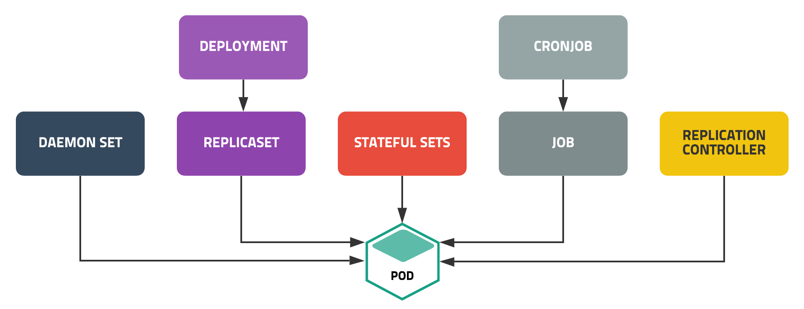

## 1. Replication Controller 란?
### 1.1 Controller란 ?
* Pod의 개수를 보장. 오케스트라의 지휘자 역할
* [공식문서 - 컨트롤러의 개념](https://kubernetes.io/ko/docs/concepts/architecture/controller/)

### 1.2 Controller의 종류


### 1.3 [Replication Controller](https://kubernetes.io/ko/docs/concepts/workloads/controllers/replicationcontroller/)
* 요구하는 Pod의 개수를 보장하며, 파드 집합의 실행을 항상 안정적으로 유지하는 것을 목표
  * 요구하는 Pod의 개수가 부족하면 template를 이용하여 Pod를 추가
  * 요구하는 Pod 수 보다 많으면 최근에 생성된 Pod를 삭제

* 기본 구성
```yml
apiVersion: v1
kind: ReplicationController
metadata:
  name: <ReplicationController 이름>
spec:
  replicas: <배포 갯수>
  selector:
    key: value
  template:
    <컨테이너 템플릿>
```
  1. selector - 현재 동작되는 Pod중 key,value를 가진 pod를 선택(template은 selector와 같은 labels로 꼭 포함되어 있어야 한다)
  2. replicas - 운영할 Pod의 개수
  3. template - 동작하는 Pod가 없거나 부족하면 만들어줄 Pod 템플릿

### 1.4 실습
* rc-nginx.yaml
```yml
apiVersion: v1
kind: ReplicationController
metadata:
  name: rc-nginx
spec:
  replicas: 3
  selector:
    app: webui
  template:
    metadata:
      name: nginx-pod
      labels:
        app: webui
    spec:
      containers:
      - name: nginx-container
        image: nginx:1.14
```

* 실행
```
kubectl create -f rc-nginx.yaml
```

* 확인
```
kubectl get replicationcontrollers
kubectl get rc
```

* 자세히 확인
```
kubectl get rc [rc 이름]
```

* 위에 3개의 nginx 컨테이너를 실행했을 때, redis 컨테이너를 만들어서 실행한다면?
  * redis.yaml 생성
  ```
  kubectl run redis --image=redis --labels=app=webui --dry-run -o yaml > redis.yaml
  ```
  
  * pod 실행
  ```
  kubectl create -f redis.yaml
  ```

  * redis는 컨트롤러가 제거한다

* 편집하기 - 명령어를 입력하면 vi 에디터가 뜸
  1. edit 명령어 이용
  ```
  kubectl edit rc [rc 이름]
  ```

  2. scale 명령어 이용
  ```
  kubectl scale rc [rc 이름] --replicas=[운영할 Pod 수]
  ```

* 롤링 업데이트 - 서비스 운영중에 중지되지 않고 비즈니스 연속성을 제공해주는 것

### 1.5 Quiz
1. 다음의 조건으로 ReplicationController를 사용하는 rc-lab.yaml을 생성하고 동작시킵니다.
  * labels(name: apche, app:main, rel:stable)를 가지는 httpd:2.2 버전의 Pod를 2개 운영합니다
    * rc name: rc-mainui
    * container: httpd:2.2
  * 현재 디렉토리에 rc-lab.yaml 파일이 생성되어야 하고, 애플리케이션 동작은 파일을 이용해 실행합니다.

* 답 - rc-lab.yaml
```yml
apiVersion: v1
metadata:
  name: rc-mainui
spec:
  replicas: 2
  selector:
    app: main
  template:
    labels:
      name: apache
      app: main
      rel: stable
    spec:
      containers:
      - image: httpd:2.2
        name: httpd
```
2. 동작되는 http:2.2 버전의 컨테이너를 3개로 확장하는 명령을 적고 실행하세요.
* 답
```
kubectl scale rc rc-mainui --replicas=3
```

## 2. ReplicaSet
### 2.1 [ReplicaSet](https://kubernetes.io/ko/docs/concepts/workloads/controllers/replicaset/)이란?
* Pod의 개수 보장
* ReplicationController와 같은 역할을 하는 컨트롤러
* ReplicationController보다 풍부한 selector
* Rolling Update를 사용할 수 없다
```yml
...
selector:
  matchLabels:
    component: redis
  matchExpressions:
    - { key: tier, operator: In, values: [cache] }
    - { key: environment, operator: NotIn, values: [dev] }
```
* matchExpressions 연산자
  * In: key와 values를 지정하여 key, value가 일치하는 Pod만 연결
  * NotIn: key는 일치하고 value는 일치하지 않는 Pod에 연결
  * Exists: key에 맞는 label의 Pod를 연결
  * DoesNotExist: key와 다른 label의 Pod를 연결

### 2.2 실습
* rs-nginx.yaml
```yml
apiVersion: apps/v1
kind: ReplicaSet
metadata:
  name: rs-nginx
spec:
  replicas: 3
  selector:
    matchLabels:
      app: webui
    template:
      metadata:
        name: nginx-pod
        labels:
          app: webui
      spec:
        containers:
        - name: nginx-container
          image: nginx:1.14
```

* Pod는 냅두고 컨트롤러만 삭제하고 싶을 때 `--cascade=false` 옵션을 이용
```
kubectl delete rs [rs-name] --cascade=false
```

### 2.3 Quiz
1. 다음의 조건으로 ReplicaSet을 사용하는 rc-lab.yaml을 생성하고 동작시킵니다.
  * labels(name: apche, app:main, rel:stable)를 가지는 httpd:2.2 버전의 Pod를 2개 운영합니다
    * rc name: rc-mainui
    * container: httpd:2.2
  * 현재 디렉토리에 rc-lab.yaml 파일이 생성되어야 하고, 애플리케이션 동작은 파일을 이용해 실행합니다.

* 답 - rc-lab.yaml
```yml
apiVersion: apps/v1
metadata:
  name: rs-mainui
spec:
  replicas: 2
  selector:
    matchLabels:
      app: main
  template:
    labels:
      name: apache
      app: main
      rel: stable
    spec:
      containers:
      - image: httpd:2.2
        name: httpd
```
2. 동작되는 http:2.2 버전의 컨테이너를 1개로 축소하는 명령을 적고 실행하세요.
* 답
```
kubectl scale rc rc-mainui --replicas=1
```

## 3. Deployment
### 3.1 [Deployment](https://kubernetes.io/ko/docs/concepts/workloads/controllers/deployment/)란?
* 상태가 없는 앱을 배포할 때 사용하는 가장 기본적인 컨트롤러
* ReplicaSet을 컨트롤해서 Pod수를 조절
* Rolling Update
  * Pod 인스턴스를 점진적으로 새로운 것으로 업데이트하여 디플로이먼트의 업데이트가 서비스 중단 없이 이루어질 수 있도록 해준다
  * 새로운 버전업의 Pod가 1개씩 Running이 될 때, 기존 버전의 Pod가 1개씩 제거된다.
  * rolling update 명령어
  ```
  kubectl set image deployment [deploy name] [container name]=[new version image]
  ```

* Rolling Back
```
kubectl rollout history deployment [deploy name]
kubectl rollout undo deployment [deploy name]
```

### 3.2 실습
* deploy-nginx.yaml
```yml
apiVersion: apps/v1
kind: Deployment
metadata:
  name: app-deploy
spec:
  replicas: 3
  selector:
    matchLabels:
      app: webui
  template:
    metadata:
      name: nginx-pod
      labels:
        app: webui
    spec:
      containers:
      - name: web
        image: nginx:1.14
        ports:
        - containerPort: 80
```
* `spec.selector.matchLabels`의 하위 필드는 `.metadta.labels`의 하위 필드와 같은 설정을 해야 한다
* deploy 실행 - 업데이트과정을 history로 기록하기 위해서 --record 옵션 추가
```
kubectl create -f deploy-nginx.yaml --record
```

* 이전 업데이트 기록 출력
```
kubectl rollout history deployment [delopy name]
```

* rolling update
```
kubectl set image deploy app-deploy web=nginx:1.15 --record
```

* 업데이트 일시 정지
```
kubectl rollout pause deployemnt [deploy name]
```

* 일시정지한 업데이트 재시작
```
kubectl rollout resume deployemnt [deploy name]
```

* 업데이트 롤백 (history 기준 한 단계전, --to-revision 옵션을 붙이면 원하는 단계로 이동)
```
kubectl rollout undo deployment [deploy name]
```

* deployment 재시작
```
kubectl rollout restart deployemnt [deploy name]
```

* deployment 상태확인
```
kubectl rollout status
```

* yaml의 `metadata.annotaions`와 `template.spec.containers.image`의 버전을 변경하고 apply 시키면 rolling update 된다.

### 3.3 Quiz
1. 다음의 조건으로 Deployment를 사용하는 dep-lab.yaml 파일을 생성하고 apply 명령으로 동작시킵니다
  * labels(name: apache, app: main, rel: stable)를 가지는 httpd:2.2 버전의 Pod를 2개 히스토리를 기록하며 운영합니다
  * annotations(kubernets.io/change-cause: version 2.2)를 추가로 설정합니다
  * deployment name: dep-mainui
  * container: httpd:2.2
* 답
  * dep-lab.yaml 내용
  ```yml
  apiVersion: apps/v1
  kind: Deployment
  metadata:
    name: dep-mainui
    annotations:
      kubernetes.io/change-cause: version 2.2
  spec:
    progressDeadlineSeconds: 600
    revisionHistoryLimit: 10
    strategy:
      rollingUpdate:
        maxSurge: 25%
        maxUnavilable: 25%
      type: RollingUpdate
    replicas: 2
    selector:
      matchLabels:
        app: main
    template:
      metadata:
        labels:
          name: apache
          app: main
          rel: stable
      spec:
        containers:
        - name: web
          image: httpd:2.2
          ports:
          - containerPort: 80
  ```
  * 실행
  ```
  kubectl apply -f dep-lab.yaml
  ```

2. 동작되는 dep-lab.yaml의 이미지를 http:2.4 버전으로 rolling update 합니다.(단, apply 명령을 통해 rolling update 진행합니다)
* 답 - 1번의 dep-lab.yaml 파일에서 annotation 과 image version 만 2.4 로 바꿔주면 됩니다.

3. 현재의 dep-mainui 히스토리를 확인하고 rollback 시킵니다
* 답
  1. 히스토리확인 - `kubectl rollout history deployment dep-mainui`
  2. rollback - `kubectl rollout undo deployment dep-mainui`

4. 현재 동작중인 Pod의 httpd 이미지 버전은 어떻게 되는지 확인합니다
* 답
```
kubectl describe pod [Pod id] - o wide
```

## 4. DaemonSet
### 4.1 [DaemonSet](https://kubernetes.io/ko/docs/concepts/workloads/controllers/daemonset/)이란?
* 전체 노드에서 특정 Pod가 한 개씩 실행되도록 보장(**노드당 1개의 Pod 보장**)
* 로그 수집기, 모니터링 에이전트와 같은 프로그램 실행 시 적용

### 4.2 실습
* daemonset-exam.yaml
```yml
apiVersion: apps/v1
kind: DaemonSet
metadata:
  name: daemonset-nginx
spec:
  selector:
    matchLabels:
      app: webui
  template:
    metadata:
      name: nginx-pod
      labels:
        app: webui
    spec:
      containers:
      - name: nginx-container
        image: nginx:1.14
```

* master 노드에서 현재 보유한 token 출력
```
kubeadm token list
```

* master 노드에서 토큰 발급
```
kubeadm token create --tth [시간]
```

* node 초기화
```
kubectl reset
```

* rolling update - 컨테이너 이미지 이름만 변경해서 저장
```
kubectl edit daemonset [daemonset]
```

## 5. StatefulSet
### 5.1 [StatefulSet](https://kubernetes.io/ko/docs/concepts/workloads/controllers/statefulset/)이란?
* Pod의 상태를 유지해주는 컨트롤러
  * Pod 이름
  * Pod의 볼륨(스토리지)
* StatefulSet 아닐 때, Pod를 삭제한다면 다음에 실행되는 Pod의 이름이 보장되지 않는다

### 5.2 실습
* sf-nginx.yaml
```yml
apiVersion: apps/v1
kind: StatefulSet
metadata:
  name: sf-nginx
spec:
  podMangementPolicy: Paralle # 파드를 순서 없이 병렬로 실행하거나 종료하는 옵션
  replicas: 3
  serviceName: sf-nginx-service
  selector:
    matchLabels:
      app: webui
  template:
    metadata:
      name: nginx-pod
      labels:
        app: webui
    spec:
      containers:
      - name: nginx-container
        image: nginx:1.14
```

## 6. Job
### 6.1 [Job](https://kubernetes.io/ko/docs/concepts/workloads/controllers/job/)이란 ?
* 실행된 후 종료해야하는 성격의 작업을 실행시킬 때 사용하는 컨트롤러
* 쿠버네티스는 Pod를 running중인 상태로 유지
* Batch 처리하는 Pod는 작업이 완료되면 종료됨
* Batch 처리에 적합한 컨트롤러로 Pod의 성공적인 완료를 보장
  * 비정상 종료 시 다시 실행
  * 정상 종료 시 완료

### 6.2 실습
* job-example.yaml
```yml
appVersion: batch/v1
kind: Job
metadata:
  name: cenots-job
spec:
  completions: 5
  parallelism: 2
  activeDeadlineSeconds: 15 
  template:
    spec:
      containers:
      - name: centos-container
        image: centos:7
        command: ['bash']
        args:
        - "-c"
        - "echo 'Hello World'l sleep 50; echo 'Bye'"
      restartPolicy: Never
```
  * completions - 실행해야 할 job의 수가 몇 개인지 지정
  * parallelism - 병렬성. 동시 running되는 Pod 수
  * activeDeadlineSeconds: 지정 시간 내에 Job을 완료
  * template.spec.restartPolicy
    * Never - Pod를 재시작
    * OnFailure - 컨테이너를 backoffLimit(default는 6) 횟수까지 재시작

* job 종료
```
kubectl delete job [job name]
```

## 7. CronJob
### 7.1 [CronJob](https://kubernetes.io/ko/docs/concepts/workloads/controllers/cron-jobs/)이란?
* 사용자가 원하는시간에 Job 실행 예약 지원
* Job 컨트롤러로 실행할 애플리케이션 Pod를 주기적으로 반복해서 실행
* Cronjob Schedule: "0 3 1 * *"(분 시 일 월 요일)
  * Minuties(0 ~ 59)
  * Hours(0 ~ 23)
  * Day of the month (1 ~ 31)
  * Month(1 ~ 12)
  * Day of the week(0 ~ 6)

### 7.2 실습
* cronjob-example.yaml
```yml
appVersion: batch/v1 # 쿠버네티스 1.21에서 stable
kind: CronJob
metadata:
  name: cronjob-exam
spec:
  schedule: "*/1 * * * *"
  startingDeadlineSeconds: 500
  concurrencyPolicy: Forbid
  jobTemplate:
    spec:
      template:
        spec:
          containers:
          - name: hello
            image: bushbox
            args:
            - /bin/sh
            - -c
            - echo Hello; sleep 10; echo Bye
          restartPolicy: Never
```
  * concurrencyPolicy
    * Allow - 작업이 running중인 것이 여러개 있어도 괜찮다
    * Forbid - running중인 작업은 1번에 1개씩만 동작 가능
  * startingDeadlineSeconds - 해당 job을 시간동안 실행하지 못하면 종료
