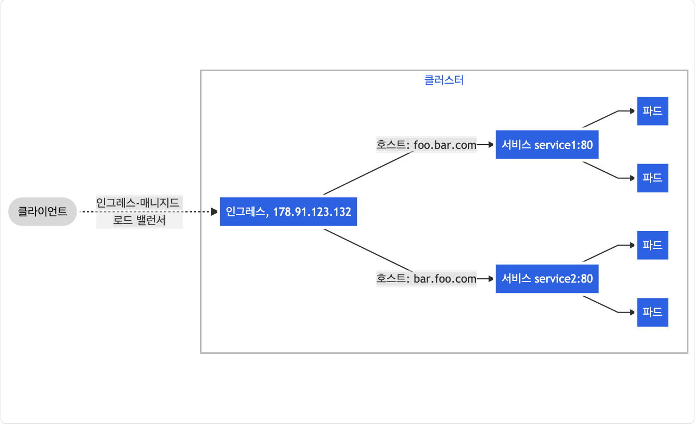

## 1. 인그레스
### 1.1 [인그레스](https://kubernetes.io/ko/docs/concepts/services-networking/ingress/)란?
* 클러스터 외부에서 안으로 접근하는 요청들을 어떻게 처리할지 정의해둔 규칙모음
* HTTP나 HTTPS를 통해 클러스터 내부의 서비스를 외부로 노출
* 기능
  * Service에 외부 URL을 제공
  * 트래픽을 로드밸런싱
  * SSL 인증서 처리
  * Virtual hosting을 지정

## 1.2 인그레스 동작방식

* 인그레스 컨트롤러가 외부사용자와 쿠버네티스 내부 서비스를 연결해준다

## 1.3. [인그레스 컨트롤러](https://kubernetes.io/ko/docs/concepts/services-networking/ingress-controllers/) 설치
* 실습은 public 클라우드가 아니기 때문에 카타코다에서 실습하며 [nginx-controller](https://github.com/kubernetes/ingress-nginx/blob/master/README.md#readme)를 이용
* 물리장비에서는 [Bare-metal](https://kubernetes.github.io/ingress-nginx/deploy/#bare-metal)을 사용

* deploy 다운
```
wget https://raw.githubusercontent.com/kubernetes/ingress-nginx/controller-v0.47.0/deploy/static/provider/baremetal/deploy.yaml
``` 

* 실행
```
kubectl create -f deploy.yaml
```

* 잘동작하는지 확인
```
kubectl get pod -n ingress-nginx
kubectl get svc -n ingress-nginx
```

## 2. 인그레스를 이용한 웹서비스 운영 실습
### 2.1 namespace 치환
* Default namespace 치환 - marvel-home.yaml, pay.yaml
```
kubectl config view
kubectl config set-context ingress-admin@kubernetes --cluster=kubernetes --user=kubernetes-admin --namepsace=ingress-nginx
kubectl config use-context ingress-admin@kubernetes
kubectl config current-context
kubectl get all
```

* 웹서비스 동작
```
kubectl apply -f marvel-home.yaml -f pay.yaml
kubectl get deployments.apps,replicationcontroller
kubectl get svc
```

* 인그레스 동작
  * ingress.yaml
  ```yml
  apiVersion: extensions/v1beta1
  kind: Ingress
  metadata:
    name: marvel-ingress
  spec:
    rules:
    - http:
        paths:
        - path: /
          backend:
            serviceName: marvel-service
            servicePort: 80
        - path: /pay
          backend:
            serviceName: pay-service
            servicePort: 80
  ```

  * 실행
  ```
  kubectl apply -f ingress.yaml
  kubectl get ingress
  kubectl get svg ingress-nginx-controller
  ```