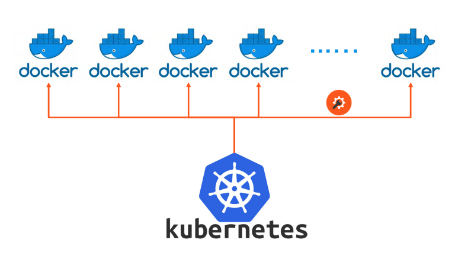

## 1. 쿠버네티스(Kubernetes)란

- 쿠버네티스가 하는 일
  

  - 컨테이너들을 관리해줌

- 도커가 뭔가요?
  

  - 가상환경에 비해서 컨테이너 환경에서 좀 더 많은 애플리케이션들을 동작 가능

- 쿠버네티스를 배우기 위해 도커를 먼저 알아야 하나요?

  - 이미 만들어져있는 것을 이용하면 되기 때문에 현재는 아니다. 나중에 배워도 된다.

- 쿠버네티스는 누가 만들었고 관리하나요?

  - 구글의 Borg 시스템에서 시작 - > 구글이 CNCF에 기부(CNCF가 관리)

- 쿠버네티스 배포 종류
  - 관리형 쿠버네티스 - 사용자가 많이 관리하지 않아도 되는 것들(AWS, GCP, Azure..)
  - 설치형 쿠버네티스(RANCHER, RED HAT OPENSHIFT, ...)
  - 구성형 쿠버네티스 - 네이티브 쿠버네티스 배포(**Kubeadm**, kops, kubespray, krib, ...)

## 2. 코드로 쉽게 구성하는 쿠버네티스 랩 환경

- 웹에서 제공하는 쿠버네티스 환경

  - [플레이 쿠버네티스](https://labs.play-with-k8s.com/) - 4시간 시간제한. 직접 구성해야하며, 세션이 날라가면 처음부터 다시 해야 한다.
  - [쿠버네티스 플레이그라운드](https://www.katacoda.com/courses/kubernetes/playground) - 시나리오가 있다. 노드 수가 너무 제한적이다.

- 코드로 설치하는 방법

  - VAGRANT라는 도구를 이용하여 Virtual box로 만든 가상환경에 코드를 보내줌
  - Virtual box 가상환경 각각의 쿠버네티스 컨테이너를 올릴 수 있다
  - 장점은 모든 환경에서 쿠버네티스 환경을 쓸 수 있다
  - [베이그런트(Vagrant) 설치](https://www.vagrantup.com/)
    ```
    vargrant --version
    ```
  - [버추얼박스(VirtualBox) 설치](https://www.virtualbox.org/wiki/Downloads)
  - [코드 다운](https://github.com/sysnet4admin/_Lecture_k8s_starter.kit.git) - vargrant를 설치한 hashcorp 폴더에 받는 것이 제일 좋다

- 쿠버네티스 설치 확인 - cluster 4개로 구성되어 있는 환경이 설치 됨

  ```
  cd ch1/1.2/k8s-min-5GiB
  vagrant up
  ```

- virtual box

  - 가상머신 종료 명령어 추가 - 파일 -> 환경설정 -> 입력 -> 호스트 키 조합 = ctrl + alt

- 가상머신 더블클릭
  - root/vargrant
  - kubectl get nodes

## 3. 쿠버네티스 랩을 쉽게 접근하기 위한 터미널 구성

- Supper Putty - Putty에 접근하는 용도
- Putty - 각 노드의 세션 정보를 저장하고 세션에 접속 할 수 있도록 해주는 터미널
- [Puttiy 설치](https://www.chiark.greenend.org.uk/~sgtatham/putty/latest.html)
- [Super Putty 설치](https://github.com/jimradford/superputty/releases)
- mac은 [Terminus](https://docs.termius.com/termius-handbook/importing-data)를 사용(접속 정보를 저장하는 기능이 있기 때문). iterm을 사용해도 됨. 설치는 앱스토어에서 설치
