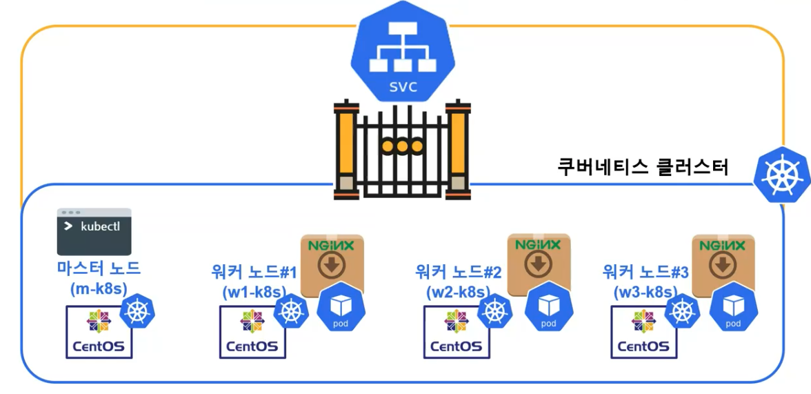

## 1. 배포를 통해 확인하는 파드(Pod)
* 애플리케이션(NGINX) 배포
  * 마스터노드에서 워커 노드에 NGINX 애플리케이션을 설치하도록 명령어를 전달

* Pod란?
  * 애플리케이션을 배포하는 쿠버네티스의 단위
  * 하나의 일을 하기위해 묶여진 컨테이너의 집합

* 실습
```
kubectl run nginx --image=nginx
kubectl get pod -o wide
curl <IP>
```

## 2. 파드를 외부에서도 접속하게 하는 서비스(Service)
* 배포한 파드가 외부에서 접근 안되는 것을 확인
  * 강의에서 외부는 우리가 사용하고 있는 노트북이며, curl로 호출하면 응답이 없다.
  ```
  curl <IP>
  ```

* 서비스

  * NodePort를 통해 접속하여 Pod가 위치한 곳을 찾아감

* 실습
```
kubectl expose pod nginx --type=NodePort --port=80
kubectl get service
kubectl get nodes -o wide
```

* 브라우저에서 주소에 `<IP>:<port>` 입력하면 확인 가능
* `curl <IP>:<port>`로도 확인가능
