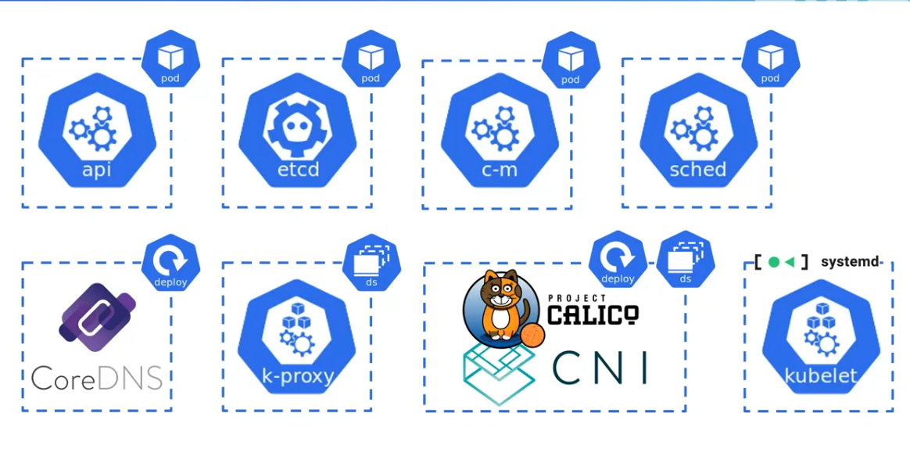
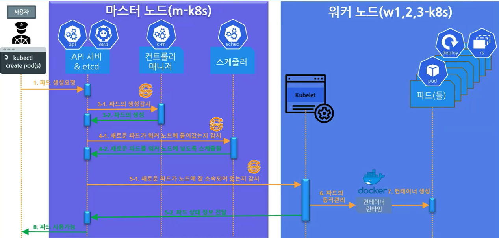
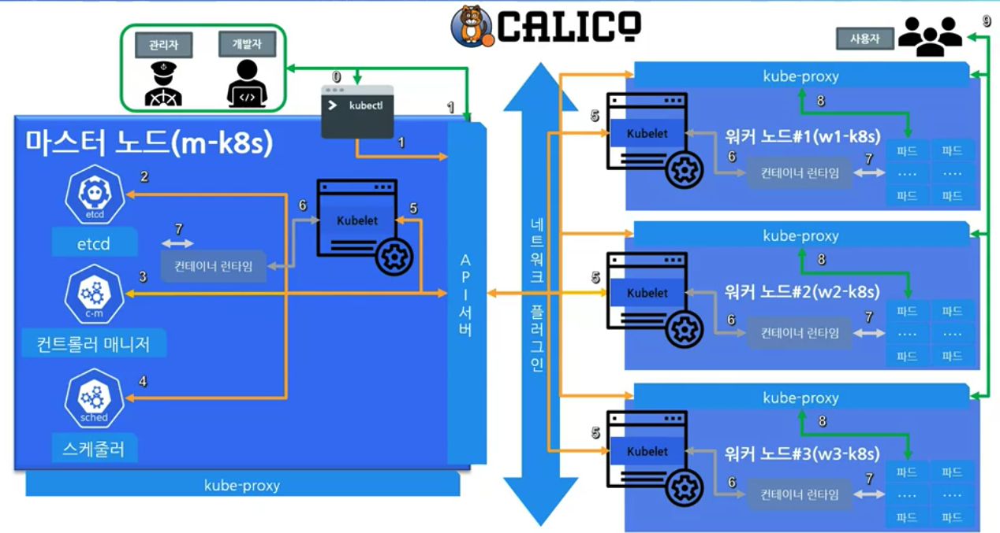

## 1. 쿠버네티스 구성 요소 확인(+EKS,AKS,GKE 관리형 쿠버네티스)
* 쿠버네티스를 이루는 것들
  
  

* 구역을 나누는 네임스페이스
  * default
  * kube-system
  * metallb-system

* 실습
  * `kubectl get pods -n <namespace>`
    ```
    kubectl get pods -n kube-system
    ```

* EKS, AKS, GKE
  * 기본설정으로 클러스터 생성 후 배포
  * 클라우드쉘에 접속하여 배포된 nodes, pods 확인

## 2. 쿠버네티스의 기본 철학
* 마이크로서비스 아키텍쳐(MSA, Microservices Architecture)
  * 각자 하는일을 열심히해서 열심히 넘겨주는 것
  * 반대개념은 모놀리식 아키텍처(monolithic architecture)

* 파드가 배포되는 과정
  
  

* 선언적인 시스템
  * 추구하는 상태와 현재 상태를 맞추려고 함

## 3. 실제 쿠버네티스의 파드 배포 흐름

