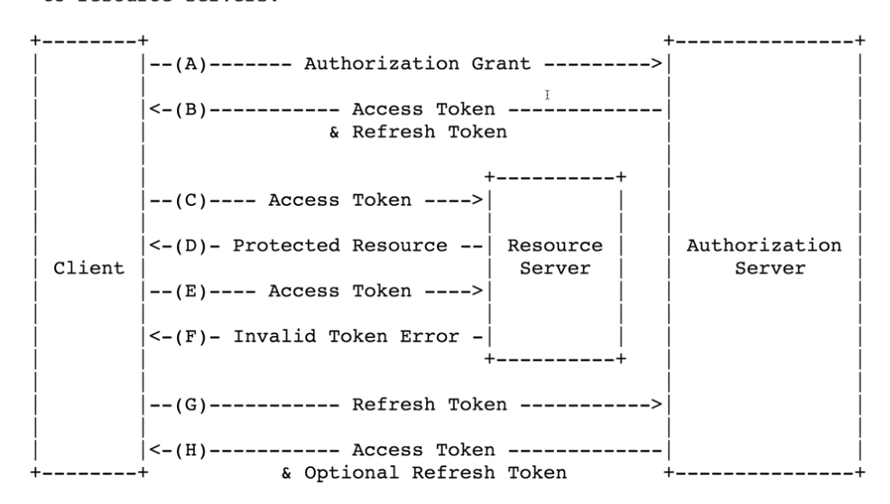

## 1. 역할
* 서비스의 형태 - `Resource Owner` => `Client` => `Resource Server`
  * Resource Owner - 유저
  * Client - 서비스
  * Resource Server - 데이터를 가진 서버
  * Authorization Server - 인증을 전담하는 서버

## 2. 등록
* Register - Client가 Resource Server를 이용하기 위해서 승인을 사전에 받는 것
* 공통으로 받는 요소
```
Client ID - 우리가 만들고 있는 앱을 식별하는 식별자
Client Secret - 식별자에 대한 비밀번호
Authorized redirect URIs - Resource Server 권한을 부여하는 과정에서 Authorized Code를 전달해주는 주소
```
* 사용할 홈페이지에 등록(구글, 페이스북 등등..)

## 3. Resource Owner의 승인
* 등록을 하면 Resource Server와 Client가 공통으로 받는 요소(Client Id, Client Secret)를 알게 된다.
* Resource Server의 기능이 여러개여도 Client가 필요한 최소한의 기능만 인증을 받는 것이 좋다.
* `Resource Owner` => `Client` => `Client에서 Resource Server Link 제공` => `로그인여부 확인` => `로그인이 성공하면 ClientId 값 및 Redirect_Url이 같은지 확인` => `Resource Owner에게 기능 허용메세지 전송` => `허용하면 Resource Server가 userId에 따라 scope 생성`

## 4. Resource Server의 승인
* `Resource Server가 Authorization code를 Resource Owner에게 전송` => `Resource Owner는 Authorization code를 가지고 Client로 이동` => `Client는 Authorization code 확보` => `Authorization code및 다른 정보들을 가지고 Resource Server에 액세스 토큰 요청`

## 5. 액세스 토큰 발급
* `Resource Server는 Authorization code를 제거 후, 액세스 토큰 발급` => `Client는 액세스 토큰 저장`

## 6. API 호출
* `Client` < = > `Resource Server`
* API 호출 테스트
```
curl -H "Authorization: Bearer <access_token>" <api url>
```

## 7. refresh token

* 액세스 토큰은 수명이 있기 때문에, 액세스 토큰을 재발급 받기 위해 사용하는 방법이 refresh token
