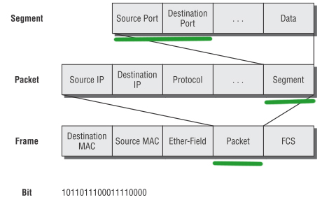

# 1. 네트워크란 무엇인가?

## 네트워크 정의
* 노드(네트워크에 속한 컴퓨터 또는 통신 장비)들이 데이터를 공유할 수 있게하는 디지털 전기통신망.
* 분산되어 있는 컴퓨터를 통신망으로 연결한 것

## 인터넷 정의
* 문서, 그림 영상과 같은 여러가지 데이터를 공유하도록 구성된 전세계를 연결하는 가장 큰 네트워크
* 인터넷은 결국 통신망중 하나일뿐.. 네트워크보다는 작은개념

## 네트워크의 분류
* 크기에 따른 분류 - LAR과 WAN만 알면 됨
  * LAN(Local Area Network) - 가까운 지역을 묶은 네트워크(ex. 스타크래프트 udp). 같은 네트워크 대역
  * WAN(Wide Area Network) - 멀리 있는 지역을 한데 묶은 네트워크. LAN과 LAN을 다시 하나로 묶은 것
  * MAN
  * VLAN, CAN, PAN 기타등등

* 연결 형태에 따른 분류 - Star형과 Mesh형만 알면 됨
  * Star 형
    * 중앙 장비에 모든 노드가 연결됨(ex. 집 공유기)
    * 단점 - 공유기가 고장나면 네트워크 통신이 안되는 것. 멀리 연결할 수록 통신이 제대로 안됨. 그리고 비쌈.
  * Mesh 형
    * 여러 노드들이 서로 그물처럼 연결됨
    * 멀리 떨어진 대역을 연결할 때 쓰는 방식
  * Tree 형 - 마치 나무의 가지처럼 계층 구조로 연결됨
  * 링형, 버스형, 혼합형 등등..
  * 실제 인터넷은 여러 형태를 혼합한 형태(LAN과 WAN의 혼합형태)

* 데이터를 주고 받는 방식
  * 유니캐스트 - 특정 대상이랑만 1:1로 통신
  * 멀티캐스트 - 특정 다수와 1:N으로 통신
  * 브로드캐스트 - 네트워크에 있는 모든 대상과 통신
  
* 프로토콜
  * 데이터를 지정해서 통신하고 싶을 때, 컴퓨터가 망을 찾아가는 방식
  * 노드와 노드가 통신할 때 **어떤 노드**가 **어떤 노드**에게 **어떤 데이터**를 **어떻게** 보내는지 작성하기 위한 양식
    * 가까운 곳과 연락할 때 - Ethernet 프로토콜(MAC 주소)
    * 멀리 있는 곳과 연락할 때 - ICMP, IPv4, ARP(IP주소)
    * 여러가지 프로그램으로 연락할 때 - TCP,UDP(포트번호)

* 여러 프로토콜들로 캡슐화 된 패킷
  * Ethernet | IPv4 | TCP | 데이터

* 실습
```
traceroute google.com
```

# 2. 네트워크의 기준! 네트워크 모델

## 네트워크 계층 모델
* TCP/IP 모델 - 인터넷에서 컴퓨터들이 서로 정보를 주고받는데 쓰이는 통신 규약(프로토콜)의 모음
* OSI 7계층 - ISO에서 표준으로 지정한 모델. 데이터를 주고 받을 때 데이터 자체의흐름을 각 구간별로 나눠 놓은 것
* TCP/IP vs OSI 7계층


| | TCP/IP | OSI |
|-|:----- | :---- |
| 공통점 | 계층적 네트워크 모델, 계층간 역할 정의|
|차이점  | 4계층 | 7계층 |
| | 프로토콜 기반 | 역할 기반 |
| | 데이터 전송기술 특화 | 통신 전반에 대한 표준 |

## 네트워크를 통해 전달되는 데이터, 패킷
* 패킷이란? - 네트워크 상에서 전달되는 데이터. 데이터의 형식화된 블록. 사용자 데이터는 페이로드라고도 부름. 여러번 포장된 택배 상자.
* 형태 - | 헤더 | 페이로드 | 푸터(잘 안씀) |
* 캡슐을 이용한 통신과정
  
  * 캡슐화(encapsulation) - 패킷을 만드는 과정. 높은 계층 -> 낮은계층
  * 디캡슐화(decapsulation) - 패킷을 받았을 때 데이터를 확인하는 과정. 낮은계층 -> 높은계층

* 계층별 패킷의 이름 PDU(protocol data unit)


| 계층 | PDU |
|:---:|:---:|
| Application layer | Data |
| Transport layer | Segement |
| Network layer | Packet |
| Data Link layer | Frame |
| Physical | Bit |