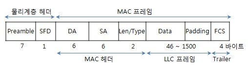

# 3. 가까이 있는 컴퓨터끼리는 이렇게 데이터를 주고받는다

## 2계층에서 하는일
* 2계층은 **하나의 네트워크 대역**이며, **같은 네트워크(LAN) 상**에 존재하는 여러 장비들 중에서 **어떤 장비**가 **어떤 장비**에게 보내는 데이터를 전달
* 데이터의 오류제어, 흐름제어 수행
* 다른 네트워크와 통신할 때는 **3계층**이 도와주어야 함

## 2계층에서 사용하는 주소
* MAC 주소(물리적인 주소)
  * NIC(Network Interface Card)에 부여된 고유 식별 값
  * 16진수로 표현하며, - 또는 :로 구분되며 총 12개로 되어있다.
  * MAC 주소 앞의 6개는 OUI - 제조사 식별 ID
  * MAC 주소 뒤의 6개는 고유번호 - 제조사에서 부여한 고유번호
  * MAC 주소 확인법
  ```
  // window
  ipconfig /all

  // mac osx
  ifconfig en1 | awk '/ether/{print $2}'
  ```
## 2계층 프로토콜(중요)
* Ethernet 프로토콜 - LAN에서 통신할 때 사용하는 프로토콜
  * 구조(Ethernet ||)
  
  * 목적지 주소(DA) - 데이터를 전달받을 상대방 시스템의 MAC주소(6바이트)
  * 출발지 주소(SA) - 데이터를 전달하는 시스템의 MAC 주소(6바이트)
  * 상위 프로토콜 타입(Len/Type) - IPv4(0x0800), ARP(0x0806) (2바이트)
  * 대부분 IEEE 802.3 규약으로 표준화 되었다.
