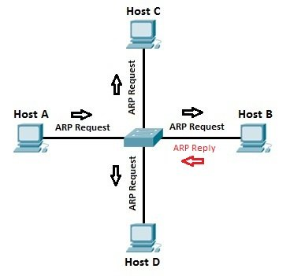

# 5. 통신하기 전 반드시 필요한 ARP 프로토콜

## 1. ARP 프로토콜
* ARP(Address Resolution Protocol)가 하는 일
  * 같은 네트워크 대역에서 통신을 하기 위해 필요한 MAC주소를 IP주소를 이용해서 알아오는 프로토콜
  * IP주소는 알고 MAC 주소는 모르더라도 ARP를 통해 통신이 가능

* ARP 프로토콜의 구조
  
  * 총 28바이트
  * Hardware Type - 보통 이더넷이며, 0x0001로 설정된다.
  * Protocl Type - IP일 경우 0x0800으로 설정
  * Hardware Length - 이더넷일 경우 06으로 설정
  * Protocol Length - 이더넷일 경우 04로 설정
  * Op(Operation)code - 000X
    * ARP Request일 경우 1
    * ARP Response일 경우 2
  * Sender Hardware Address - 물리 주소(MAC 주소)
  * Sender Ip Address - IP 주소

## 2. ARP 프로토콜의 통신 과정
* IP주소로 MAC주소를 알아오는 과정

  
  * 2계층인 이더넷 프로토콜을 브로드캐스트로 전부다 보낸다.
  * 2계층을 받은 곳들에서 ARP 프로토콜을 분석하여, IP주소가 일치하지않는 곳은 패킷을 버리고, 일치하는 곳은 응답프로토콜을 만들어서 보내준다.
  * 응답에서 MAC주소를 보내준다.

## 3. ARP 테이블
* 나와 통신했던 컴퓨터들
  * 통신 했던 컴퓨터들의 주소는 ARP 테이블에 남는다.

* ARP 테이블 확인
```
arp -a
```