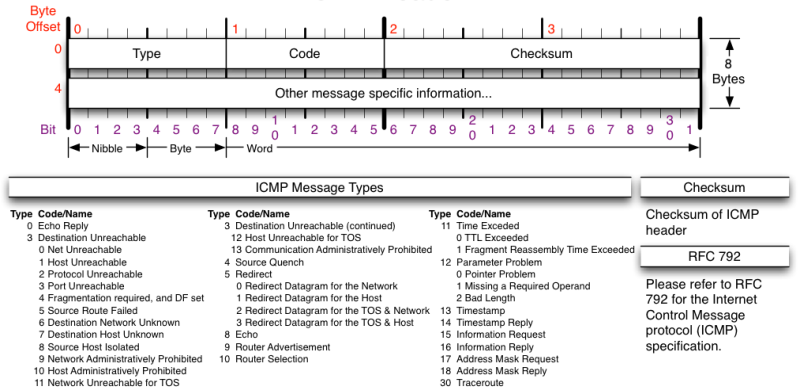
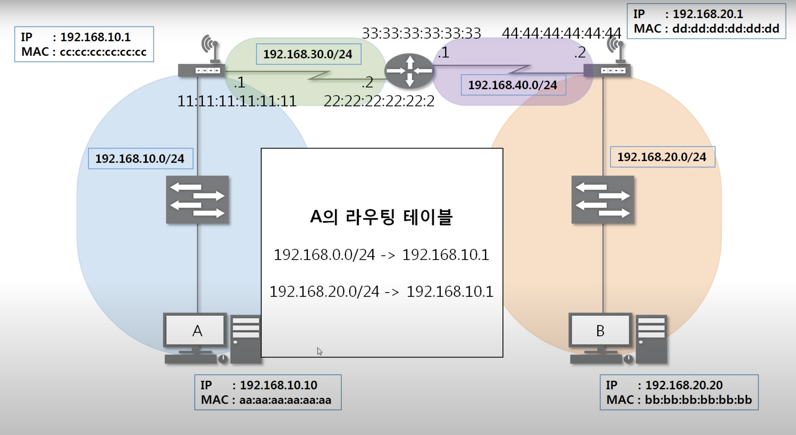
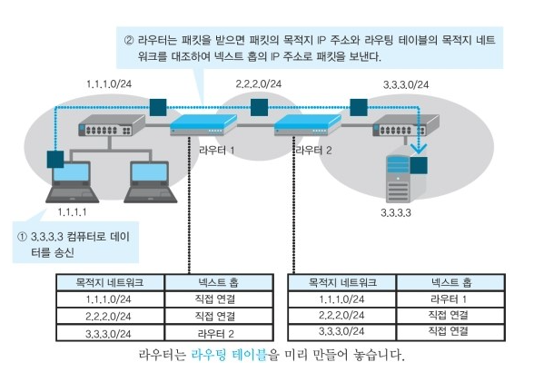
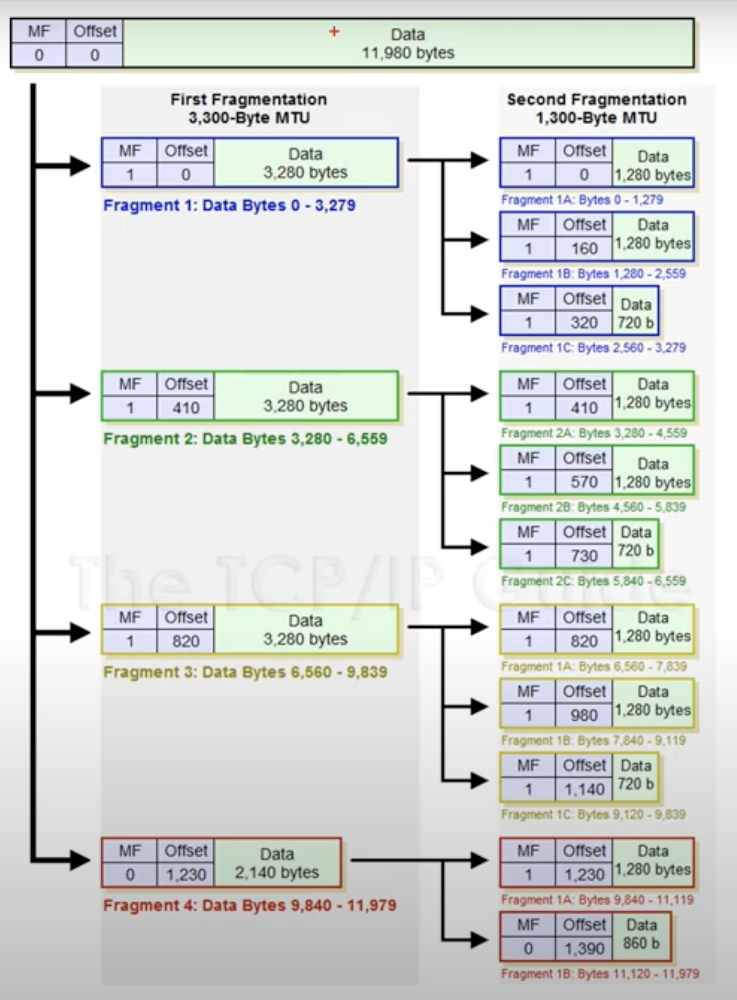
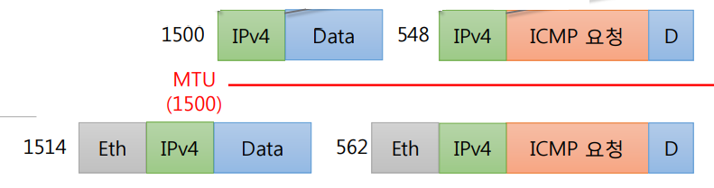

# 6. 멀리 있는 컴퓨터 끼리는 이렇게 데이터를 주고 받는다

## 1. IPv4 프로토콜
* IPv4가 하는 일
  * 네트워크 상에서 데이터를 교환하기 위한 프로토콜
  * **데이터가 정확하게 전달 될 것을 보장하지 않는다.** 중복되거나 순서를 잘못 전달할 가능성도 있다.
  * 데이터의 정확하고 순차적인 전달은 상위 프로토콜인 TCP에서 보장.

* IPv4 구조
  

  |     구성      |     특징     |
  |:-------------:|-------------|
  | Version | IP 프로토콜 버전. 무조건 4 |
  |Header Length(IHL) |IPv4의 헤더의 최소길이는 20이므로 4비트로 표현하기 위하여 4로 나누어서 사용. 보통 5|
  |Type of Service(TOS)| 현재 사용하지 않음. 0으로 비워둠.|
  |Total Length| 헤더 + 페이로드를 합친(IP header +  tcp(udp) + data) 전체의 길이|
  |Fragment Identifier|데이터가 잘게 쪼개졌을 때, 조각을 다시 결합하기위한 식별자|
  |Fragmentation Flag|첫번째는 항상 0, D도 잘안씀(데이터 조각화 가능여부). M(원래 데이터의 쪼개진 조각이 더 있는지 판단)|
  |Fragmentation Offset|쪼개진 데이터들을 복구하기 위한 위치(데이터의 순서가 있기 때문)|
  |Time To Live(TTL)|데이터를 전달할 수 없는 것으로 판단되어 소멸되기 이전에 데이터가 이동할 수 있는 단계의 수|
  |Protocol|상위 프로토콜 타입을 알려줌|
  |Header Checksum|헤더의 오류가 있는지 없는지 확인|
  |Source Ip Address| 출발지 IP 주소 |
  |Destination IP Address| 목적지 IP 주소 |
  |IP Option|기능 추가를 위해 사용|

  * 보통 20바이트
  * Identification | IP Flags | Fragment Offset - 하나의 세트. 큰 데이터들은 잘게잘게 쪼개보내기 때문에 쪼개진 값들을 알아보게 해주는 값들.
  * Protocol
    * ICMP - 1
    * IGMP - 2
    * TCP - 6
    * UDP - 17

## 2. ICMP 프로토콜
* ICMP가 하는 일
  * ICMP(Internet Control Message Protocol, 인터넷 제어 메시지 프로토콜)
  * 네트워크 컴퓨터 위에서 돌아가는 운영체제에서 **오류 메세지**를 전송받는 데 주로 쓰임.
  * 프로토콜 구조의 Type과 Code를 통해 오류 메세지를 전송 받음.
  * 통신 상태를 확인하기 위한 프로토콜

* ICMP 프로토콜 구조
  
  * Type - 대분류(0,8 기본, 3,11 무엇인가 잘못되었을 때, 5 보안)
    * 0 - Echo Reply, 응답
    * 8 - Echo, 요청
    * 3 - Destination Unreachable, 데이터가 목적지까지 도착 못한 경우
    * 11 - Time Exceeded, 응답을 못받는 경우. 보통 상대방 방화벽때문..
    * 5 - Redirect, 불필요한 우회전송이 발생하는 경우. 요즘은 잘 안쓴다.
  
  * Code - 소분류. Type별로 세부적인 값들


## 3. 라우팅 테이블
* 라우팅 테이블 - 패킷을 어디로 보내야 하는지 설정되어 있는 테이블
* 라우팅 테이블 확인
```
netstat -r
```

## 4. 다른 네트워크와 통신 과정


* A - 라우팅 테이블 확인, B의 네트워크 대역이 있어야만 통신 가능
* 프로토콜 생성 - Ether | IPv4 | ICMP(Type 8, 요청)
  * ICMP 작성
  * IPv4 작성
  * Ehter 작성 - 가까운 곳 끼리 통신 하므로, MAC주소 잘 이해합시다.

* 다른네트워크대역으로 넘어갈 때, 프로토콜의 목적지 주소를 확인 후, 라우팅 테이블 확인. 이더넷 프로토콜은 계속 작성된다.

## 5. IPv4의 조각화
* 조각화
  * 큰 패킷들은 적은 MTU(Maximum Transmission Unit)를 갖는 링크를 통하여 전송되려면 **여러 개의 작은 패킷으로 쪼개어/조각화 되어 전송**되어야 한다
  * 조각화되면 최종 목적지에 도달할 때까지 재조립되지 않는 것이 일반적
  * IPv4에서는 중간 라우터에서도 IP 조각화 가능
  * IPv6에서는 IP 단편화가 발신지에서만 가능
  * 재조립은 항상 최종 수신지에서만 가능

* 조각화 과정

* MTU가 1500일 때, 2000바이트를 보내려면 ?
  
  * 1500바이트에서 IP header 값 20바이트를 뺀 후, 계산하면 1480바이트, 520바이트
  * ICMP 요청 헤더는 마지막 쪼개어진 데이터 앞에 8바이트로 붙음. 1480바이트, 528바이트
  * 조각화 후 IPv4헤더를 다시 붙임. 1500바이트, 548바이트
  * 인캡슐레이션 과정에 따라 2계층 이더넷 헤더 14바이트가 추가. 1514바이트, 562바이트
