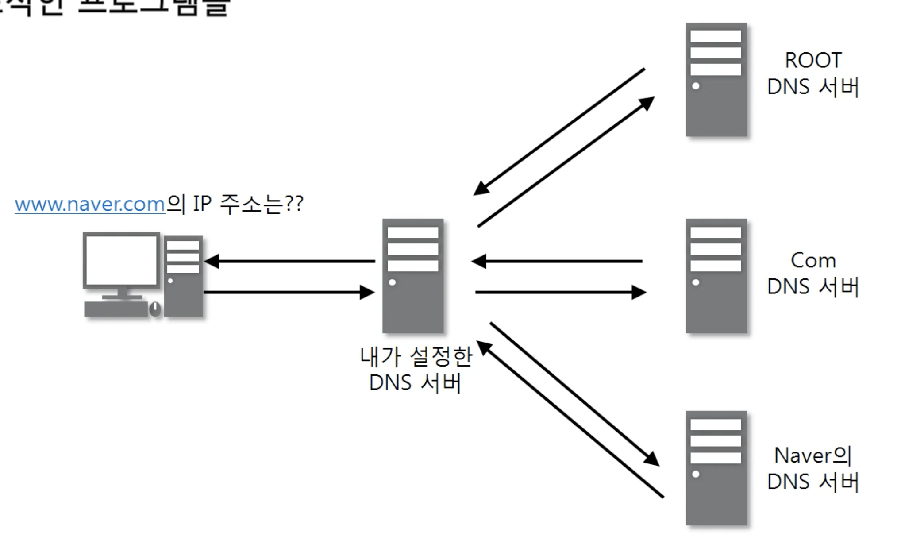

# 7. 컴퓨터의 프로그램 끼리는 이렇게 데이터를 주고 받는다

## 1. 4계층 프로토콜
* 4계층에서 하는 일
  * 전송계층은 송신자의 **프로세스**와 수신자의 **프로세스를 연결하는 통신 서비스**를 제공한다
  * 연결 지향 데이터 스트림 지원, 신뢰성, 흐름 제어, 그리고 다중화 같은 편리한 서비스를 제공
  * 연결 지향 전송 방식을 사용하는 전송제어 프로토콜(TCP)
  * 단순한 전송에 사용되는 사용자 데이터 프로그램 프로토콜(UDP)

* 4계층 프로토콜의 종류
  * TCP
    * 안전한 연결을 지향(연결지향형)
    * 연결을 한다음 데이터를 보내며, 데이터를 잘 받았는지 확인한다(신뢰성 있는 통신 가능)
    * 비연결 지향형에 비해 속도가 떨어진다

  * UDP
    * 안전한 연결을 지향하지 않는다(비연결지향형)
    * 연결지향형보다 속도는 빠르지만 신뢰성이 떨어진다

## 2. 포트 번호
* 포트번호의 특징
  * 특정 프로세스와 특정 프로세스가 통신을 하기 위해 사용
  * **하나의 포트는 하나의 프로세스만 사용 가능**
  * 하나의 프로세스가 여러 개의 포트를 사용하는 것은 가능
  * 포트 번호는 일반적으로 정해져 있지만 **무조건 지켜야 하는 것은 아니다**

* Well-Known 포트

  | 서비스 이름 | 포트 번호 |
  |:--------:|:-------:|
  |   FTP    |  20, 21 |
  |   SSH    |    22   |
  |  TELNET  |    23   |
  |   DNS    |    53   |
  |   DHCP   |  67, 68 |
  |   TFTP   |    69   |
  |   HTTP   |    80   |
  |   HTTPS  |   443   |
  * 전 세계적으로 유명하다
  * 0 ~ 1023 사이의 포트를 사용

* Registered 포트

  | 서비스 이름 | 포트 번호 |
  |:--------:|:-------:|
  |오라클 DB 서버|  1521  |
  | MySQL 서버 |  3306  |
  |MS 원격 데스크탑| 3389 |
  * 어느정도 주요한 서비스들이 등록되어 있는 포트
  * 1024 ~ 49151 

* Dynamic 포트

  | 시작 포트 번호 | 마지막 포트 번호 |
  |:-----------:|:------------:|
  |    49152    |     65535    |
  * 일반 사용자들이 사용

## 3. 프로그램의 연결 정보
* 어떤 프로세스와 어떤 프로세스가 연결되어 있는지 확인
  * 활성 연결 테이블
  ```
  // window
  netstat -ano
  // linux
  netstat -an -p tcp
  ```

# 8. 비연결지향형 UDP 프로토콜

## 1. UDP 프로토콜
* UDP가 하는일
  * UDP - User Datagram Protocol | Universal Datagram Protocol
  * **전송 방식은 단순**해서 **신뢰성이 낮고**, 데이터그램 도착 순서가 바뀌거나, 중복되거나, 심지어는 통보 없이 누락시키기도 한다
  * **오류의 검사와 수정이 필요없는** 프로그램에서 수행할 것으로 가정

* UDP 프로토콜의 구조
  
  * 출발지 포트 - UDP 프로토콜을 만드는 송신자의 포트번호
  * 목적지 포트 0 UDP 프로토콜을 받는 수신자의 포트번호
  * 길이 - UDP 헤더와 데이터를 포함한 전체 길이를 바이트 단위로 표시
  * 체크썸 - 데이터가 전송 중에 손상되지 않았는지 확인할 수 있는 값

## 2. UDP 프로토콜을 사용하는 프로그램
* UDP 프로토콜을 사용하는 대표적인 프로그램
  * DNS 서버 - 도메인을 물으면 IP를 알려주는 것
  
  * tftp 서버 - UDP로 파일전송하는 프로그램
  * RIP 프로토콜 - 라우팅 정보를 공유하는 프로토콜
