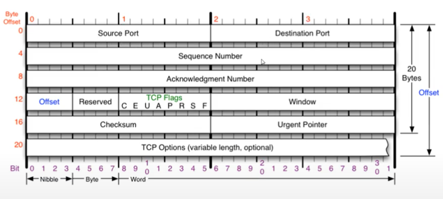
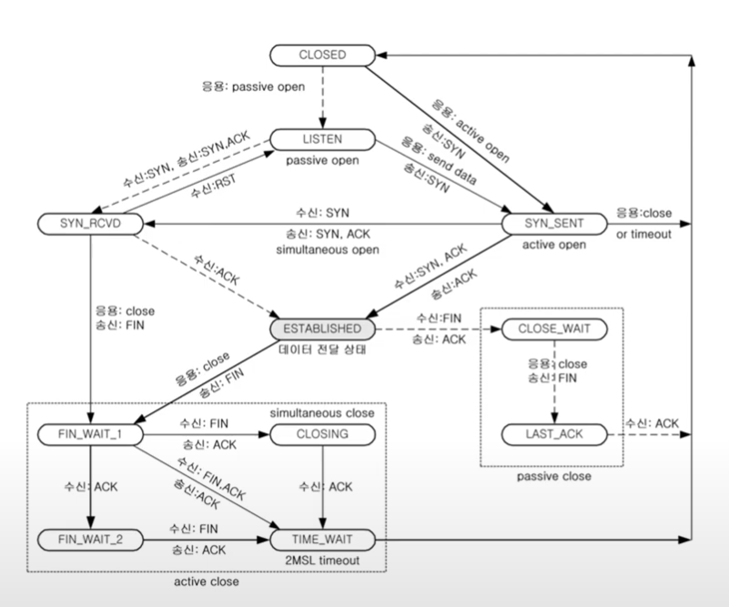
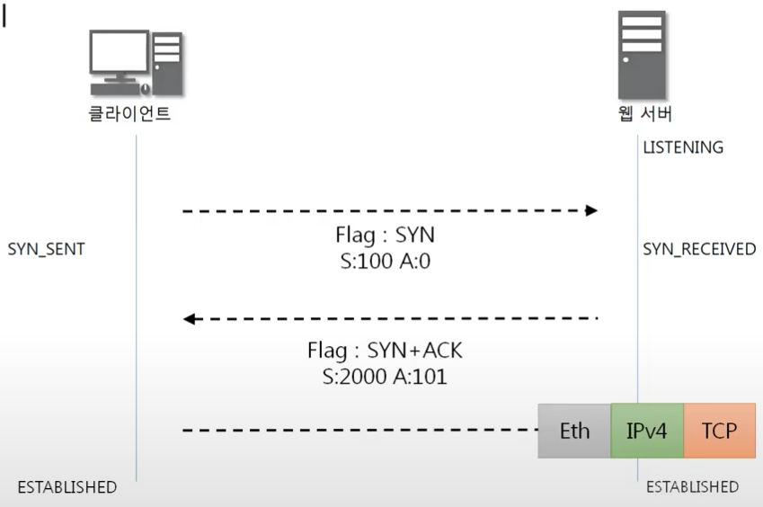
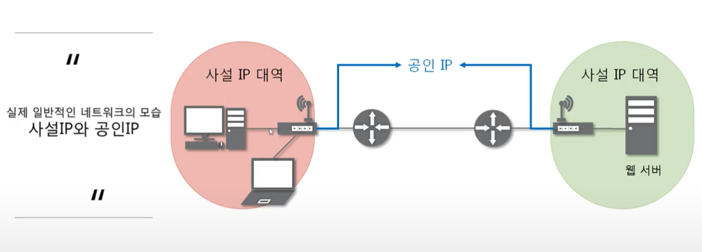

# 9. 연결지향형 TCP 프로토콜

## 1. TCP 프로토콜
* TCP가 하는일
  * 전송 제어 프로토콜(Transmission Control Protocol, TCP)은 인터넷에 연결된 컴퓨터에서 실행되는 프로그램 간에 통신을 **안정적으로, 순서대로, 에러없이** 교환할 수 있게 한다
  * 안정성이 필요하지 않을 때, UDP 사용
  * TCP는 UDP보다 안전하지만 느리다

* TCP 프로토콜의 구조

* Source Port - 출발지 포트
* Destination Port - 목적지 포트
* Offset - header의 길이. 이것 또한 4로 나눠서 함.

## 2. TCP 플래그
* TCP Flags - TCP는 연결상태를 계속 상대방에서 물어보기 때문에 나타내는 값. `C E U A P R S F`가 있으며, `U A P R S F`만 알고 있으면 된다.
  * U(Urgent) - 긴급 bit, 우선순위가 높은 데이터를 포함한 패킷. Urgent Pointer(어디부터 우선순위 데이터 값인이 알려주는 offset)와 세트.
  * A(Acknowledgment) - 승인 bit, 승인의 뜻을 포함한 패킷
  * P(Push) - 밀어넣기 bit, TCP 버퍼가 일정한 크기만큼 쌓여야 패킷을 추가 전송하는데, 이것을 생략하고 계속 데이터를 전송함.
  * R(Reset) - 초기화 bit, 데이터를 주고받는데 문제가 생기면, 연결을 초기화하겠다는 패킷.
  * **S(Sync)** - 동기화 bit. 상대방과 연결할 때 무조건 사용하는 flag.
  * F(Fin) - 종료 bit. 연결을 종료할 때 사용하는 패킷.

## 3. TCP를 이용한 통신과정
* 연결 수립 과정
```
    클라이언트             서버
        |                 |
        |                 |
        |                 |   Listening
        |                 |
SYN_SENT|-------SYN------>|
  (1)   |    S:100 A:0    | SYN_RECEIVED 
        |<---SYN + ACK----|   (2)
        |   S:2000 A:101  |
        |-------ACK------>|    ESTABLISHED   
        |   S:101 A:2001  |    (3)
        |                 |   
        |                 |

*tip : 네트워크 보안에서 SYN Flooding, 포트스캔(TCP Connect Scan, Half Scan), TCP Session Hijacking 과 관련이 있음

(1) Seq번호 : 처음 패킷을 보낼 때는 랜덤한 값
    Ack번호 : 처음 패킷을 보낼 때의 Ack번호는 0
(2) Seq번호 : 두번째부터는 받은 ACK 번호
    Ack번호 : 두번째부터는 받은 Seq번호 + 1
(3) Seq번호 : 받은 Ack번호
    Ack번호 : 받은 Seq번호 + 1
```
  * TCP를 이용한 데이터 통신을 할 때 프로세스와 프로세스를 연결하기 위해 **가장 먼저 수행되는 과정**
  * 3Way Handshake
    1. 클라이언트가 서버에게 요청 패킷을 보냄
    2. 서버가 클라이언트의 요청을 받아들이는 패킷을 보냄
    3. 클라이언트는 이를 최종적으로 수락하는 패킷을 보냄

  * 연결 수립 이후, 클라이언트가 다시 요청한다. 연결 수립 이후 클라이언트가 아닌 다른 것이 서버에 요청하여 통신하는 것을 TCP Session Hijacking이라 한다.

* 데이터 송수신 과정
```
        클라이언트                      서버
                |                       |
   ESTABLISHED  |                       |  ESTABLISHED 
                |                       |
                |                       |
        (1)     |---Request Data(100)-->|
                |      S:101 A:2001     |
                |                       |
                |<--Response Data(500)--|   (2)
                |      S:2001 A:201     |
                |                       |
        (3)     |---------ACK---------->|
                |      S:201 A:2501     |
                |                       |

(1) '~~웹툰이 보고싶어요' 라고 요청하는 데이터 크기가 100바이트일 때
    Seq번호 : 보낸 쪽에서 또 보낼 때는 이전에 보냈던 Seq 번호 그대로 다시 전송
    Ack번호 : 보낸 쪽에서 또 보낼 때는 이전에 보냈던 Ack 번호 그대로 다시 전송
(2) 요청한 웹툰의 그림1.png 데이터 크기 500바이트
    Seq번호 : 받은 Ack 번호
    Ack번호 : 받은 Seq 번호 + 받은 데이터 크기
(3) Seq번호 : 받은 Ack번호
    Ack번호 : 받은 Seq 번호 + 받은 데이터 크기
```
  * TCP를 이용한 데이터 통신을 할 때 단순히 TCP 패킷만을 캡슐화해서 통신하는 것이 아닌 페이로드를 포함한 패킷을 주고 받을 때의 일정한 규칙
    1. 보낸 쪽에서 또 보낼 때는 SEQ번호와 ACK번호가 그대로다
    2. 받는 쪽에서 SEQ번호는 받은 ACK번호가 된다.
    3. 받는 쪽에서 ACK번호는 받은 SEQ번호 + 데이터의 크기

## 4. TCP 상태전이도
* TCP 연결 상태의 변화

  * 실선 - 클라이언트 상태변화
  * 점선 - 서버의 상태변화
  * 중요한 상태
    * LISTEN - 서버쪽에서 포트 번호를 사용하는 상태. 클라이언트의 요청을 계속 듣고 있는 상태.
    * ESTABLISHED - 연결이 수립이 된 상태. 3way handshake가 끝난 상태.
  * 3Way handshake 과정에서의 상태변화
  

* TCP 연결 종료 과정
```
        클라이언트                      서버
                |                       |
   ESTABLISHED  |                       |  ESTABLISHED 
                |                       |
  FIN_WAIT 1    |-----------FIN-------->|
     (1)        |      S:201 A:2501     |
                |                       |  CLOSE_WAIT  
                |<----------ACK---------|   (2)
                |      S:2501 A:202     | 
  FIN_WAIT 2    |                       |
                |<----------FIN---------|  LAST_ACK    
  TIME_WAIT     |      S:2501 A:202     |   (3)
                |                       |
     (1)        |-----------ACK-------->|
                |      S:202 A:2502     |
    CLOSED      |                       |  CLOSED
                |                       |

(1) Seq 번호 : 보낸 쪽에서 또 보낼 때는 그대로
    Ack 번호 : 보낸 쪽에서 또 보낼 때는 그대로 
(2) Seq 번호 : 받은 Ack 번호
    Ack 번호 : 받은 Seq 번호 + 1
    Ack번호 : 받은 Seq 번호 + 받은 데이터 크기
(3) Seq 번호 : 보낸 쪽에서 또 보낼 때는 그대로
    Ack 번호 : 보낸 쪽에서 또 보낼 때는 그대로 
(4) Seq 번호 : 받은 Ack 번호
    Ack 번호 : 받은 Seq 번호 + 1
```

# 10. NAT와 포트 포워딩

## 1. NAT
* NAT(Network Address Translation) 란?
  
  * IP 패킷의 TCP/UDP 포트 숫자와 소스 및 목적지의 IP 주소 등을 재기록하면서 라우터를 통해 네트워크 트래픽을 주고 받는 기술
  * 특정 IP주소에 특정 포트번호로 가는 패킷을 다른 IP주소에 다른 포트번호로 바꿔주는 기술
  * 패킷 변화가 생기기 때문에 IP나 TCP/uDP의 체크섬도 다시 계산되어 재기록해야 한다
  * 사용이유
    * 사설 네트워크에 속한 여러 개의 호스트가 하나의 공인 IP 주소를 사용하여 인터넷에 접속하기 위함
    * 공유기는 이러한 기술을 이용하여 내부 네트워크에 있는 여러 대의 PC들에게는 사설 IP를 할당하고 해당 PC가 통신하려고 할 때 공인 IP로 변경해서 외부 네트워크와 통신하게 하는 역할을 수행한다.

## 2. 포트포워딩
* 포트포워딩
  * 포트 포워딩 또는 포트 맵핑(port mapping)은 패킷이 라우터나 방화벽과 같은 네트워크 장비를 가로지르는 동안 **특정 IP 주소와 포트 번호의 통신 요청을 특정 다른 IP와 포트 번호로 넘겨주는** 네트워크 주소 변환(NAT)의 응용
  * 게이트웨이(외부망)의 반대쪽에 위치한 사설네트워크에 상주하는 호스트에 대한 서비스를 생성하기 위해 흔히 사용
  * 패킷의 요청이 내부에서 외부로 나갔다가 응답이 들어오는 것은 가능하지만 애초에 외부에서의 요청 패킷이 직접 사설 네트워크 대역으로 들어오는 것은 불가능하기 때문에 사용하는 것이 포트포워딩
