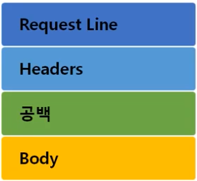
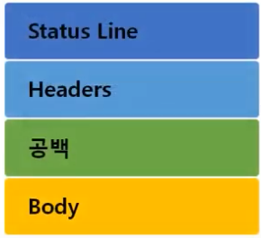

# 11. www(웹)를 이용할 때는 이렇게 데이터를 주고받는다

## 1. HTTP 프로토콜
* 웹을 만드는 기술들 - 다향한 기술들이 사용된다.
  1. 필수
    * HTTP(HTTPS => SSL/TLS)
    * HTML
    * CSS
    * Javascript
    * ASP/ASP.NET
    * JSP
    * PHP
    * DB
  
  2. 선택
    * Python
    * Spring
    * Jquery
    * Ajax

* HTTP 프로토콜의 특징
  * HyperText Transfer Protocol
  * www에서 쓰이는 핵심 프로토ㅗㄹ로 문서의 전송을 위해 쓰이며, 모든 웹 애플리케이션에서 사용 되고 있다.
  * Request / Response(요청/응답) 동작에 기반하여 서비스 제공
  
* HTTP 프로토콜의 통신과정
  * HTTP 1.0
  ```
      클라이언트                서버
          |                   | 80
  ESTABLISHED     |   3Way-Handshake  | ESTABLISHED   
          |                   |
          |---HTTP Request--->|
          |<---HTTP Response--|
          |        종료       |       
          |                   | 
  ESTABLISHED     |   3Way-Handshake    ESTABLISHED   
          |                   |
          |---HTTP Request--->|
          |<---HTTP Response--|
          |        종료        |       
          |                   | 
  ESTABLISHED     |   3Way-Handshake  | ESTABLISHED   
          |                   |
          |---HTTP Request--->|
          |<---HTTP Response--|
          |        종료        |       
  ```
  * 연결 수립, 동작, 연결 해제의 단순함이 특징 - 하나의 URL은 하나의 TCP 연결
  * HTML 문서를 전송 받은 뒤 연결을 끊고 다시 연결하여 데이터를 전송한다
  * 단순 동작이 반복되기 때문에 통신 부하 문제 발생

  * HTTP 1.1
  ```
      클라이언트                서버
          |                   | 80
  ESTABLISHED     |   3Way-Handshake  | ESTABLISHED   
          |                   |
          |---HTTP Request--->|
          |<---HTTP Response--|
          |---HTTP Request--->|
          |<---HTTP Response--|
          |---HTTP Request--->|
          |<---HTTP Response--|
          |        종료        |       

  ```
  * HTTP 1.0과 호환가능
  * Multiple Request 처리가 가능하여 Client의 Request가 많을 경우 연속적인 응답 제공 => Pipeline 방식의 Request / Response 진행
  * HTTP 1.0과는 달리 서버가 갖는 하나의 IP 줏와 다수의 웹사이트 연결 가능
  * 빠른 속도와 Internet Protocol 설계에 최적화 될 수 있도록 Cache 사용
  * 데이터를 압축해서 전달이 가능하도록 하여 전달하는 데이터 양 감소

## 2. HTTP 요청 프로토콜
* 프로토콜의 구조

  
  * Request Line - `[요청 타입]  [공백]  [요청 URI]  [공백]  HTTP/1.1`
  * Header(옵션)
    ```
    Host: [서버 도메인 or 서버 IP]
    User-Agent  클라이언트의 프로그램에 대한 설명
    Referer     어떤 페이지에서 현재 요청하는 페이지로 이동하는지 알려주는 정보
    ```
  * 바디 - 보낼 데이터

* 요청 타입
  * GET - 데이터를 요청할 때 사용, 바디를 사용하지 않는다. 데이터를 전달할 때 URI에 포함
  * POST - 데이터를 전달할 때 사용, 바디를 사용한다. 데이터를 전달할 때 바디에 포함 등등

* URI(Uniform Resource Identifier)
  * 인터넷 상에서 특정 자원(파일)을 나타내는 유일한 주소
  * 구조 - `scheme://host[:port][/path][?query]`
    ```
    ftp  ://IP주소 :포트  /파일이름
    http ://IP주소 :포트  /폴더이름/파일이름
    ```


## 3. HTTP 응답 프로토콜
* 프로토콜의 구조

  
  * Status Line - `HTTP/1.1  [공백]  [상태 코드]  [공백]  [상태 메시지]`
  * Header(옵션)
    ```
    Server      : 웹 서버 종류
    Content-Type    : 요청한 데이터의 타입
    Content-Length  : 요청한 데이터의 길이(바이트)
    ```

* 상태 코드

  | 상태 코드 종류 |             설명              |
  |:------------|------------------------------|
  | 100 ~ 199 | 단순한 정보 |
  | 200 ~ 299 | Client의 요청이 성공 |
  | 300 ~ 399 | Client의 요청이 수행되지 않아 다른 URL로 재지정 |
  | 400 ~ 499 | Client의 요청이 불완전하여 다른 정보가 필요 |
  | 500 ~ 599 | Server의 오류를 만나거나 Client의 요청 수행 불가 |

  * 기본적으로 알면 좋은 상태 코드
    ```
    200 번대 : 정상적인 통신 완료
    200 : OK
    400 번대 : 클라이언트 잘못
      403 : Forbidden, 클라이언트가 권한이 없는 파일에 접근할 때 발생
      404 : Not Found, 서버에 없는 자원을 요청했을 때 발생
    500 번대 : 서버 잘못
    ```

## 4. HTTP 헤더 포맷
* 일반 헤더
  * Content-Type - 요청한 데이터의 타입
  * Content-Length - 요청한 데이터의 길이(바이트)

* 요청 헤더
  * Cookie - 서버로부터 받은 쿠키
  * Host - 요청된 URL에 나타난 호스트명을 상세하게 표시(HTTP 1.1은 필수)
  * User-Agent  클라이언트의 프로그램에 대한 설명(PC인지 모바일인지 구분)

* 응답 헤더
  * Server - 사용하고 있는 웹서버의 소프트웨어에 대한 정보를 포함
  * Set-Cookie - 쿠키를 생성하고 브라우저에 보낼 때 사용. 해당 쿠키 값을 브라우저가 서버에게 다시 보낼 때 사용