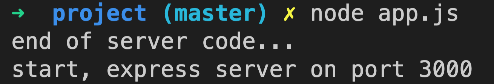

# section 1. nodeJS + Express 웹서버 설정

## 1. NPM Project 시작하기

### 간단한 개념

- npm - node pacakge manager이다. javascript library를 쉽게 공유하기 위해서 만들어졌다.
  <<<<<<< HEAD
- # express - 웹 및 모바일 애플리케이션을 위한 일련의 강력한 기능을 제공하는 간결하고 유연한 Node.js 웹 애플리케이션 프레임워크이다.
  > > > > > > > aacafb161796d288688f8955727f0a336a4efaf8

### Project

- package.json 생성

```bash
cd [project folder]
npm init
```

- [express 설치](https://expressjs.com/ko/starter/installing.html)

```bash
yarn add express --dev
```

## 2. Express 기반 웹서버 구동

### Project

- app.js 생성

```javascript
const express = require("express");
const app = express();

app.listen(3000, () => {
  console.log("start, express server on port 3000");
});

console.log("end of server code...");
```

- node 실행과 종료방법

  1. 실행 방법

  ```bash
  node [file name]
  ```

  예를 들어, 위에 만든 app.js를 실행하려면, 터미널에 node app.js를 입력하면 된다.
  
  코드 실행을 보면 callback함수는 비동기로 동작하는것을 알 수 있다.

  2. 종료 방법

  ```bash
  서버가 켜진 상태에서, CTRL + C 를 동시에 누르기
  ```

- 파일은 항상 수정이 일어 날 수 있기 때문에, 자동으로 파일의 변화를 감지해서, node를 종료하고 다시 시작해주는 도구가 있다 - nodemon

  - nodemon 설치 방법

  ```bash
  yarn add nodemon --dev
  ```

  - nodemon 실행과 종료방법

    1. 실행 방법

    ```bash
    nodemon [file name]
    ```

    2. 종료방법 - node사용법이랑 동일하다.
