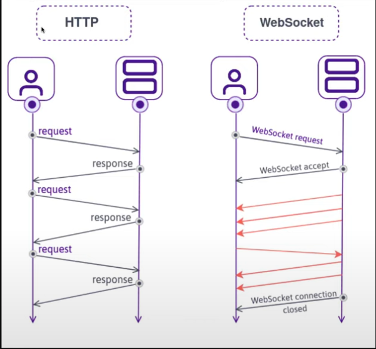

# NOMADCODERS
[zoom 클론코딩](https://nomadcoders.co/noom)

Zoom Clone using NODEJS, WebRTC and Websockets

## 1. CHAT WITH WEBSOCKETS

### 1.1 HTTP vs WebSockets

* HTTP
  * 유저 request를 보내면 서버가 response를 보냄
  * stateless - 백엔드는 유저를 기억하지 못함. response를 보낸 후 유저를 잊어버림.

* WebSockets
  * http와는 전혀 다른 프로토콜
  * 브라우저가 서버로 websocket request를 보내면 서버가 요청을 받거나 거절함. 서버가 받아들이면 연결되서 계속 유저를 기억할 수 있음. 브라우저나 서버가 서로에게 어느때나 메세지를 보낼 수 있음.
  * 양방향 통신

### 1.2 Websockets in NodeJS
* [ws](https://www.npmjs.com/package/ws)
  * websocket의 core
  * 설치
  ```
  yarn add ws
  ```

### 1.3 WebSocket Events
* [MDN WebSocket](https://developer.mozilla.org/ko/docs/Web/API/WebSocket)

## 2. SOCKETIO

### 2.1 SocketIO vs WebSockets
* SocketIO
  * 웹소켓을 이용해서 실시간, 양방향, 이벤트 기반 통신을 제공하는 프레임워크
  * 웹소켓이 이용이 불가능해도 SocketIO가 다른 방법(http long-polling)을 이용


### 2.2 Installing SocketIO
* 설치
```
yarn add socket.io
```

### 2.3 SocketIO is Amazing
* string뿐만 아니라 object 전송 가능
* emit에서 여러개의 인자를 보낼 수 있다

### 2.4 Recap
* SocketIO는 서버가 종료되면 재연결을 시도함
* 끝날 때 실행되는 함수를 인자로 보내고 싶으면, 함수를 마지막 인자에 넣어야 한다. 이 함수는 백엔드가 아닌 프론트엔드에서 실행 시키는 코드이다. 보안적으로 안전해야 하기 때문이다.


### 2.5 Rooms
* [socket](https://socket.io/docs/v4/server-api/#socket)
  * socket.rooms - 내가 속한 모든 rooms
  * socket.join - room에 참가하는 기능

### 2.6 Room Messages
* [socket.to](https://socket.io/docs/v4/server-api/#sockettoroom) - 메세지 보내기

### 2.7 Room Notifications
* disconnectiong event로 유저가 떠났다는걸 알려주기

### 2.8 Nicknames
* nickname 추가

### 2.9 Room Count part One
* [Adapter](https://socket.io/docs/v4/glossary/#adapter) - 다른 서버들 사이에 실시간 애플리케이션 동기화
  * 규모 크면 모든 클라이언트가 같은 서버에 connection되지 않기 때문에, Adapter가 DB를 이용하여 서버간 통신을 한다.
* room ID를 socket ID에서 찾을 수 있다면, private room이며, 그게아니면 public room이다

### 2.10 Room Count part Two
* 새로운 방 생성 모두(연결된 모든 소켓)에게 노티 구현

### 2.11 User Count
* 방안에 있는 사람수 세기

### 2.12 Admin Panel
* 백엔드를 위한 [Admin UI](https://socket.io/docs/v4/admin-ui/)
* 설치
  ```
  yarn add @socket.io/admin-ui
  ```
* 온라인 데모
  * https://admin.socket.io 접속 후, 서버 연동

## 3. VIDEO CALL

### 3.1 User Video
* [MediaDevices.getUserMedia()](https://developer.mozilla.org/ko/docs/Web/API/MediaDevices/getUserMedia)

### 3.2 Call Controls
* 유저 카메라 목록 생성
  * [MediaDevices.enumerateDevices()](https://developer.mozilla.org/ko/docs/Web/API/MediaDevices/enumerateDevices)