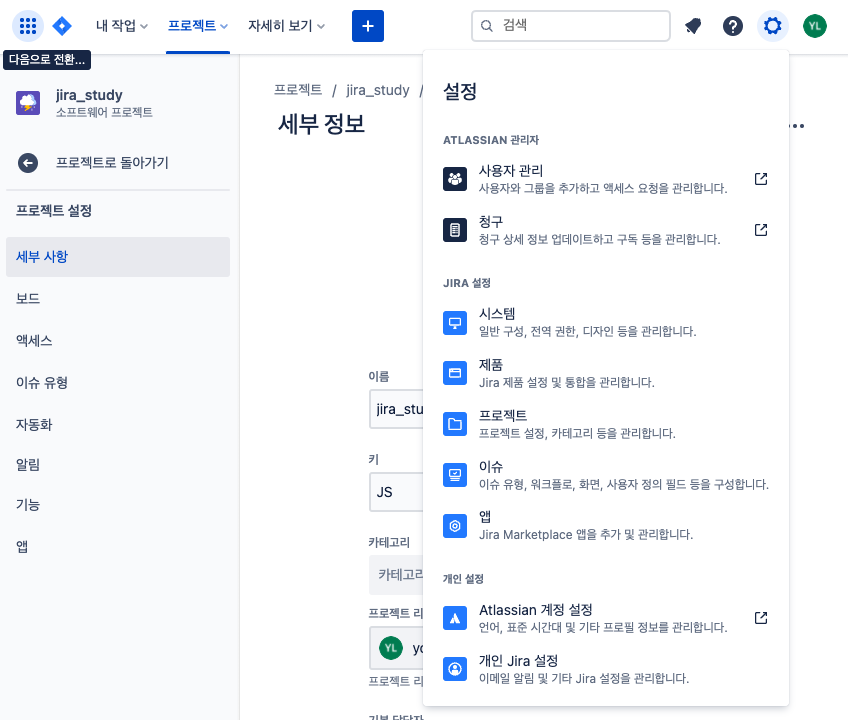
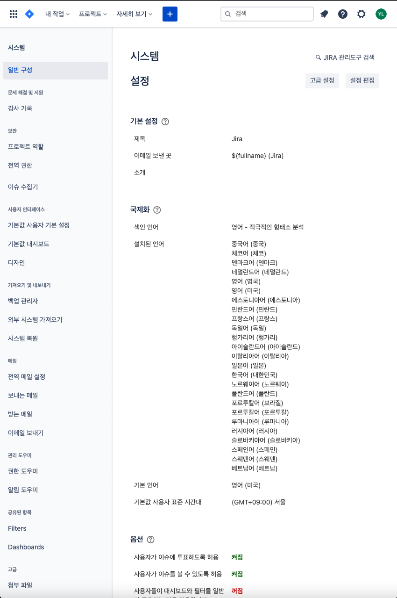
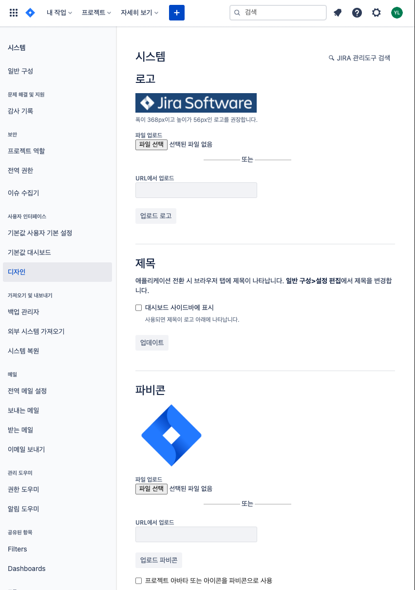
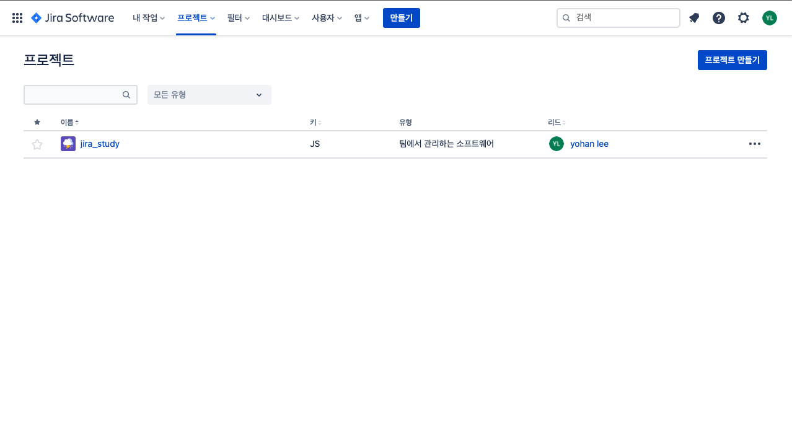
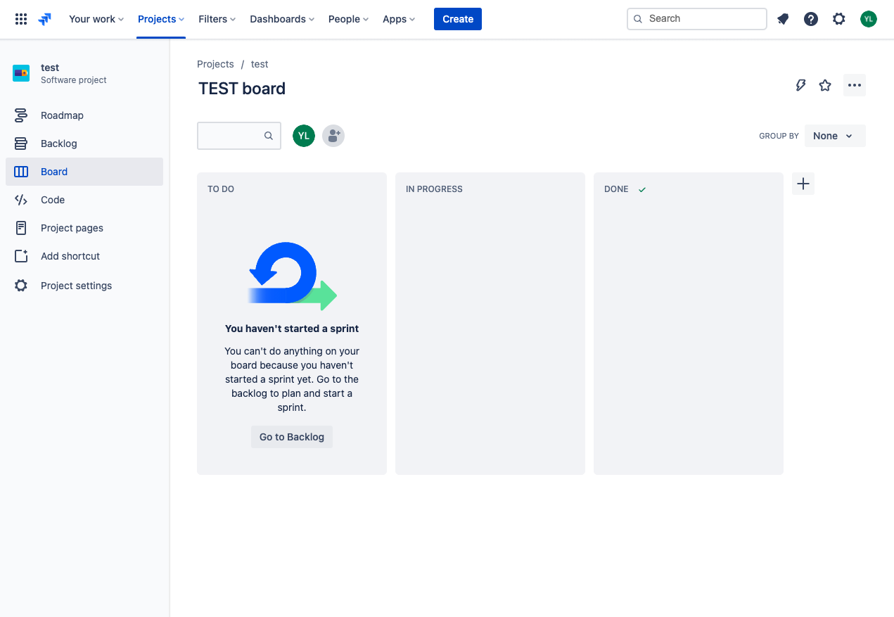

## 1. JIRA Cloud 가입 및 초기 설정하기
* [Atlassian](https://www.atlassian.com/ko) 가입 및 로그인
* 무료평가판 시작하기
  * 사이트이름 - 잘 입력하기
  * 팀원 초대
  * 프로젝트 만들기
    * 이름
    * key - 프로젝트 키

## 2. JIRA Project 만들기
### 2.1 중요한 설정
1. 설정 - 시스템이동
  
2. 일반구성 - 애플리케이션 제목 및 국제화 언어 설정
  
3. 사용자 인터페이스에 디자인 - 로고 및 url 등록
  

### 2.2 JIRA의 구조
* Project Category - 여러 프로젝트가 포함될 수 있다
  * 프로젝트의 논리적인 묶음
    * 결제 인프라
    * 호텔 예약 서비스

* Project - 이슈의 묶음이며, 팀이 실제 생산하는 단위 목적물을 위한 투두리스트. 수행하려는 업무에 따라 칸반, 스크럼으로 나눠질 수 있다.
  * 호텔 예약 웹
  * 호텔 예약 iOS 앱
  * 호텔 예약 안드로이드 앱

* Issue - 모든 이슈는 단일 프로젝트에 포함. Epic, Story, Task, SubTask, Bug등이 될 수 있다.
  * 업무 단위
    * 특정 브라우저에서 화면 깨짐 수정
    * 검색 속도 개선
    * 사용자 매뉴얼 작성

* Field
  * 이슈의 구성 요소
    * Summary
    * Priority
    * Issue Type
    * Label

### 2.3 프로젝트 생성
1. 프로젝트 만들기 클릭
  

2. 프로젝트 타입 설정
* Next-gen Project - JIRA 관리자가 없고 민첩하고 빠르게 시작해야 하는 소규모 팀에게 추천
  * 사용자가 설정할 게 별로 없고 사용이 쉬우므로 Jira에 경험이 없어도 빠르게 사용 가능
  * 심플하고 쉬운 로드맵 기능 제공
  * 4가지의 리포트 제공
  * 프로젝트 설정이 공유 안됨. 프로젝트마다 개별로 설정 필요
  * 고급 퍼미션 관리 기능과 워크 플로우 에디터 부재

* Classic Project - 별도의 워크플로우가 있거나 전문 JIRA 관리자가 있을 경우 추천
  * 다양한 옵션이 제공되며 관리자가 설정 가능한 부분이 많고 강력한 기능 제공
  * 비즈니스 템플릿과 20가지 이상의 다양한 리포트 제공
  * 프로젝트간 설정 공유. 관리자가 프로젝트 템플릿을 만들고 재활용 가능
  * 워크 플로우 에디터 제공

3. 프로젝트 템플릿 설정
  * 칸반
  * 스크럼
  * 버그 트래킹

**소프트웨어가 업데이트되서 강의랑 프로젝트 타입이 다른 것 같다. team-managed가 next-gen이고,  company-managed가 classic이다 **

### 2.4 프로젝트 보드
* 프로젝트에서 발생하는 업무를 시각화 해주는 도구
* JIRA 보드는 해야 할 작업을 의미하는 포스트잇을 붙여 놓은 전통적인 화이트보드로 생각할 수 있음
* 보드를 통해 현재 상태를 공유하고 쉽게 추적 가능
* 프로젝트 보드에서 이슈를 쉽게 등록할 수 있고 작업의 우선순위를 부여하고 관리 가능
* 우선 순위, 마감 기한등 다양한 필터를 통해 중요한 작업을 숙지하고 집중 가능

## 3. 프로젝트 보드로 업무 시각화하기
### 3.1 프로젝트 보드

* 지라의 보드는 예전에 포스트잇을 붙인 화이트보드를 소프트웨어로 옮긴것
* 모든 관계자들이 프로젝트 상황을 투명하게 확인 가능
* 보드의 각 컬럼은 이슈를 완료하기 위한 워크플로우를 나타냄. 각 이슈의 status를 나타냄.
* 보드는 프로젝트의 워크플로우를 시각화함
* team-managed
  * 한개의 보드만 생성됨
  * 설정에서 report를 활성화한다면, 여러 개의 report를 시각화하여 볼 수 있다.
* company-managed
  * 여러 개의 보드 생성 가능
  * 별도로 report 기능을 켜주지 않아도 되며, team-managed보다 더 많은 report를 사용할 수 있다
* Roadmap
  * 프로젝트의 큰 흐름을 한 눈에 볼 수 있는 시각화를 제공하는 기능
  * 가장 큰 이슈인 Epic을 기준으로 작성하면, 유연하게 프로젝트 진행이 가능하다
