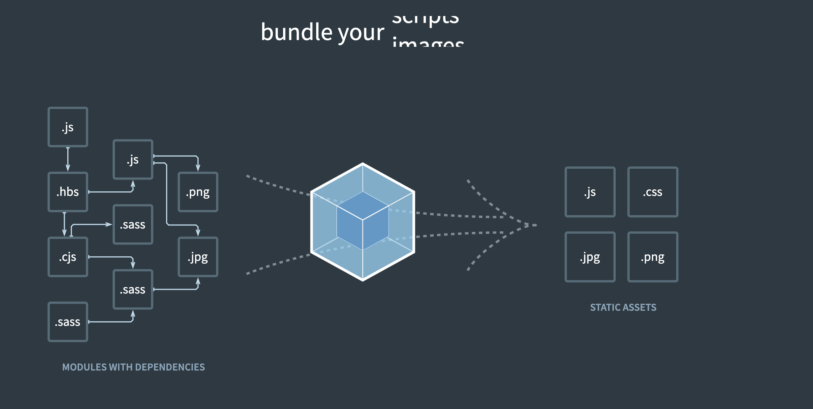
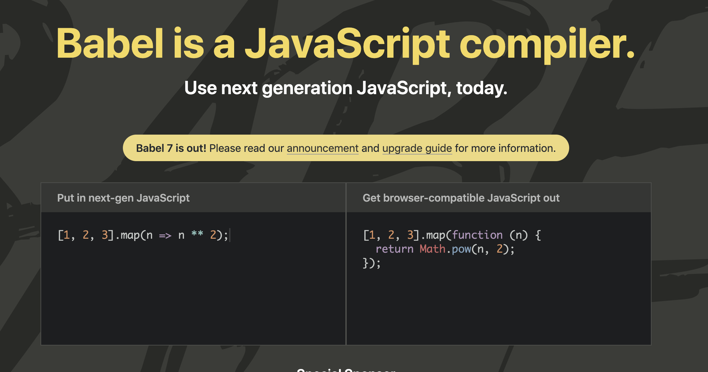
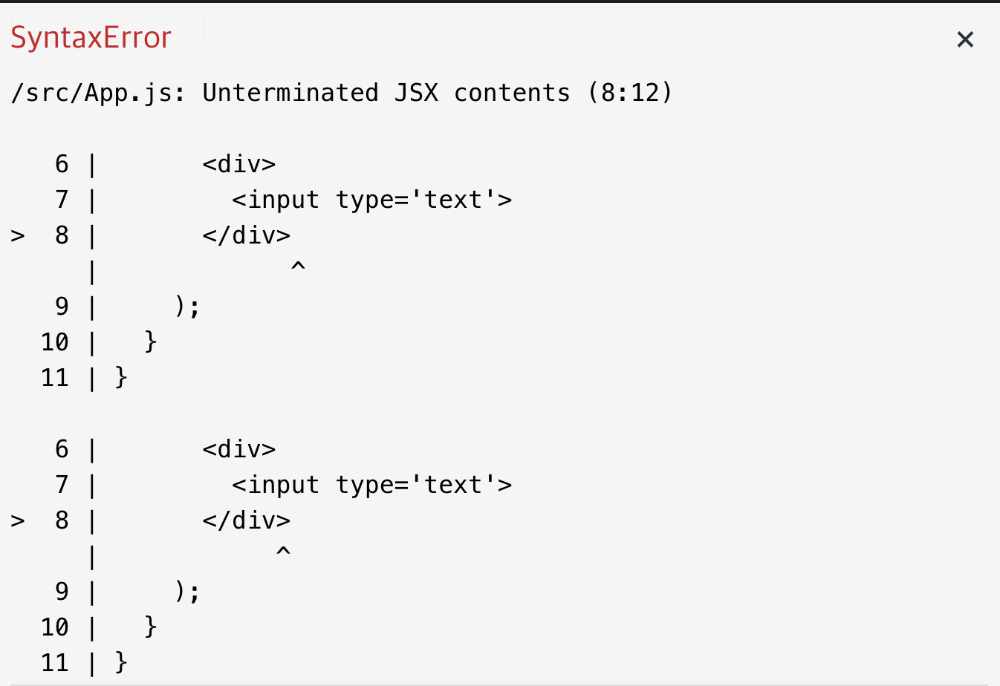
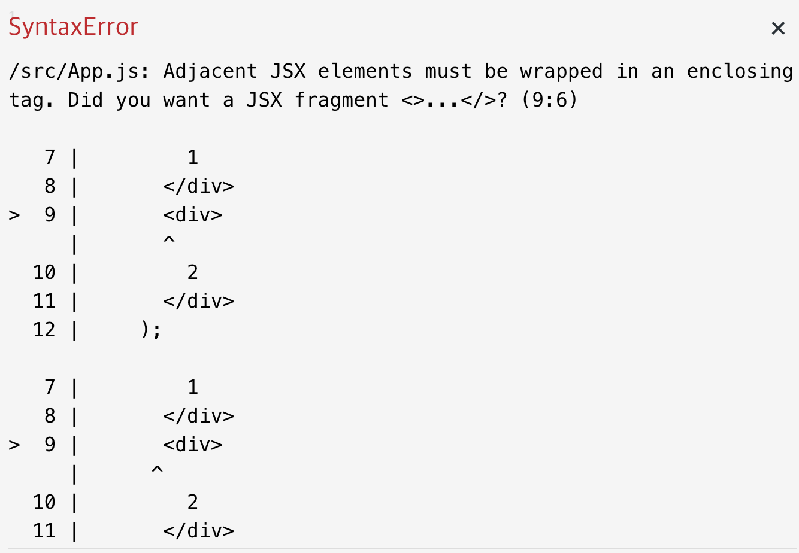
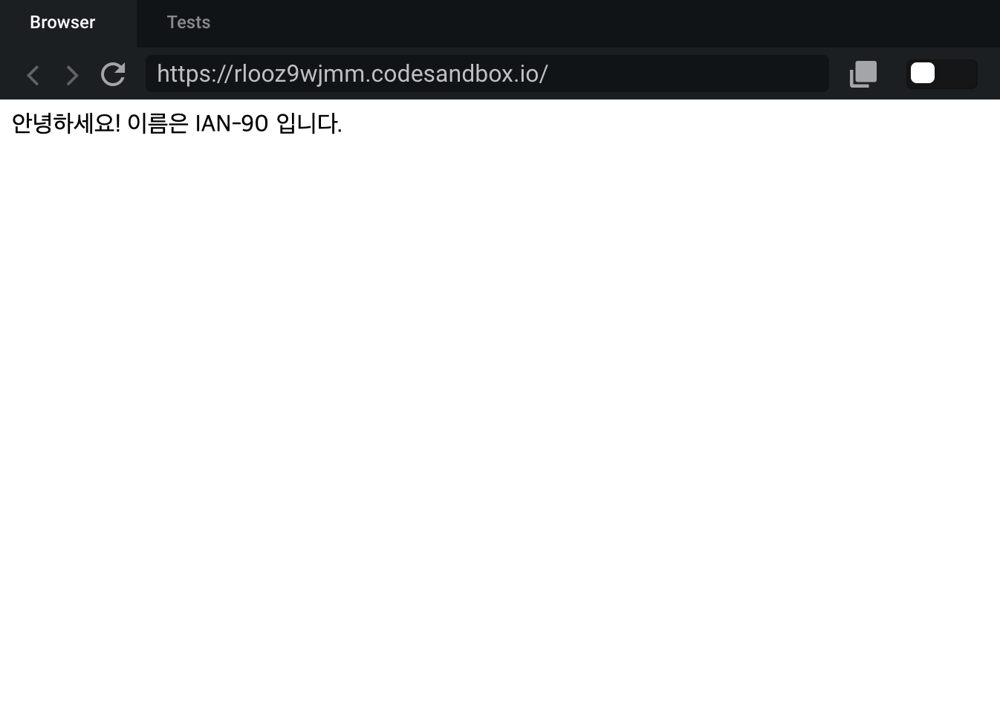
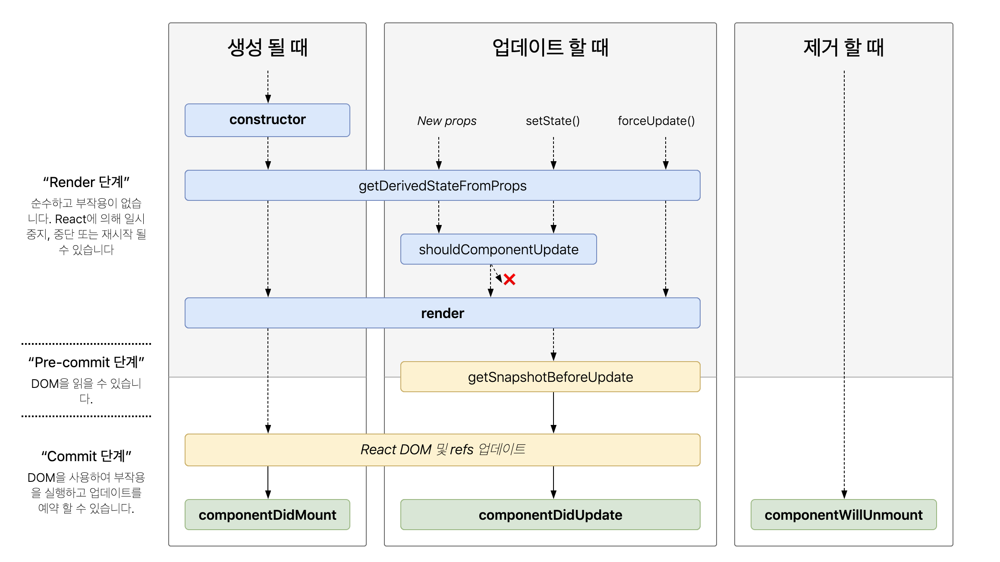

# 누구든지 하는 리액트 : 초심자를 위한 React 핵심 강의
  * [벨로퍼트 리액트 강좌](https://www.inflearn.com/course/react-velopert/)
  * 저는 개인적으로 강의에서 설명해주는 ES6문법은 따로 요약하지 않습니다.

## 1. 리액트는 무엇인가 ?
  * 프론트엔드 라이브러리란 무엇인가?
    * 프로젝트 규모가 커져서 다양한 유저인터페이스와 인터랙션을 제공하기 위해 기능개발에 집중 할 수 있도록 도와주는 도구
    * 프론트엔드 프레임워크 or 라이브러리 삼대장 - Angular, React, Vue
      * Angular - 프레임워크, 타입스크리트 기본
      * React - 컴포넌트에 집중되어있는 라이브러리, 프레임워크가 아님. 뷰만 신경쓰는 라이브러리고 나머진 써드파티       라이브러리 의존
      * Vue - 입문자가 사용하기 쉬움. 리액트와는 달리 공식적으로 라이브러리들이 포함되어 있음.

  * 리액트의 Virtual DOM
    * 리액트개발 - 변화가 없이 데이터가 바뀌면 뷰를 날리고 새로운 뷰를 만들어버리기. 성능적으로 문제가 있어서 Virtual DOM 제작
    * 변화가 일어나면 Virtual DOM에 렌더링 하여 기존의 DOM과 비교해서 바뀐부분만 찾아서 뷰를 바꾸어줌
    * [React and the Virtual DOM](https://youtube.be/muc2ZF0QIO4)

  * 리액트를 특별하게 만드는 점
    * 어마어마한 생태계
    * FACEBOOK, Airbnb, BBC, eBay, ... 등등 사용하는곳이 많다.

## 2. 리액트 프로젝트 시작하기
  * 본격적인 리액트 코드 작성하기
    * Webpack - 의존하는 파일들을 합쳐서 하나 또는 여러개의 파일로 만들어줌
    
    * Babel - 브라우저에서 최신문법을 다 지원하지 않기 때문에, 브라우저가 이해 할 수 있도록 코드를 기존 문법으로 번역해줌. 
    

## 3. JSX
  * JSX 기본문법 알아보기
    * JSX란 ? React에서 사용하는 HTML과 비슷한 자바스크립트 문법
    * 문법
      * 꼭 닫혀야 하는 태그 - 태그를 닫지 않으면 에러가 난다.

      ```javascript
      import React, { Component } from 'react'

      class App extends Component {
        render() {
          return (
            <div>
              <input type='text' >
            </div>
          )
        }
      }
      ```

      

      * 두개 이상의 엘리먼트는 무조건 하나의 엘리먼트로 감싸져 있어야 한다. 감싸져있지 않으면 에러가 난다.
      
      ```javascript
      import React, { Component } from 'react'
      
      class App extends Component {
        render() {
          return (
            <div>1</div>
            <div>2</div>
          )
        }
      }
      ```
      
      

      * JSX 안에 자바스크립트 값 사용하기 - 중괄호 안에 자바스크립트 값(변수, 메소드 등)을 써준다.
      
      ```javascript
      import React, { Component } from 'react'
      
      class App extends Component {
        render() {
          const name = 'IAN-90'
          return (
            <div>Hi {name}</div>
          )
        }
      }
      ```

      * 조건부 렌더링 - 중괄호 안에 if문은 쓰지 못하므로 삼항연산자를 쓴다. if문을 선언하고 싶다면, 함수를 선언 후 즉시실행함수(IIFE)를 사용해주면 된다.

      ```javascript
      import React, { Component } from 'react'
      
      class App extends Component {
        render() {
          return (
            <div>
              {
                1 + 1 === 3 ?
                '틀리다'
                :
                '맞다'
              }
            </div>
          )
        }
      }
      ```

      * 스타일링하기
        * 스타일객체의 key는 카멜케이스로, value는 스트링으로 써야 한다. 
        * class대신 className으로 적어야 한다. 단, class를 써도 작동은 한다.
        
        ```javascript
        import React, { Component } from 'react'
        
        class App extends Component {
          const style = {
            backgroundColor: 'black',
            padding:  '16px',
            color: 'white',
            fontSize: '36px'
          }
          render() {
            return (
              <div style={style} className='App'>
                안녕하세요
              </div>
            )
          }
        }
        ```

      * 주석 작성하기
        * javascript 주석으로 쓰면 주석이 렌더링 된다.
          * 주석이 안먹히는 예
          ```javascript
          import React, { Component } from 'react'
          
          class App extends Component {
            render() {
              return (
                <div>
                  // 안녕하세요
                </div>
              )
            }
          }
          ```

          

        * {/* 주석내용 */}으로 주석을 처리해야 한다.
          
          ```javascript
          import React, { Component } from 'react'
          
          class App extends Component {
            render() {
              return (
                <div>
                  {/* <h1>안녕하세요</h1> */}
                  주석처리 성공
                </div>
              )
            }
          }
          ```
          
          

## 4. Props와 State 
  * Props를 사용하는 방법
    * 부모컴포넌트가 자식컴포넌트한테 값을 전달 할 때 사용하는 것.
    * 파일구조 - App.js > MyName.js
      * App.js
        ```javascript
        import React, { Component } from 'react'
        import MyName from './MyName'
         
         class App extends Component {
           render() {
             return (
               <div>
                 <MyName name={'IAN-90'} />
               </div>
             )
           }
         }
        ```

      * MyName.js
        ```javascript
        import React, { Component } from 'react'
         
        class MyName extends Component {
          render() {
            return (
              <div>
                <span>안녕하세요! 이름은 {this.props.name} 입니다.</span>
              </div>
            )
          }
        }

        export default MyName;
        ```
       * 렌더링 화면
        

    * props가 없을때는 ? 에러가 나기 때문에 기본 props를 설정해준다
      * static defaultProps를 이용하는 경우(조금 더 최신문법)
      ```javascript
      import React, { Component } from 'react'
        
      class MyName extends Component {
        static defaultProps = {
          name: '기본이름'
        }

        render() {
          return (
            <div>
              <span>안녕하세요! 이름은 {this.props.name} 입니다.</span>
            </div>
          )
        }
      }

      export default MyName;
      ```

      * ClassName.defaultProps를 이용하는 경우
      ```javascript
      import React, { Component } from 'react'
        
      class MyName extends Component {

        render() {
          return (
            <div>
              <span>안녕하세요! 이름은 {this.props.name} 입니다.</span>
            </div>
          )
        }
      }

      MyName.defaultProps = {
        name: '기본이름'
      }

      export default MyName;
      ```

    * 컴포넌트를 만드는 또다른 방법 - 함수형 컴포넌트
      * 별 다른 기능없이 props를 받아서 보여주는 경우 사용.
      * 작성방법 (위의 MyName.js를 예시로 작성)
      ```javascript
      import React from 'react'
        
      const MyName = ({ name }) => {
        return (
          <div>
            <span>안녕하세요! 이름은 {name} 입니다.</span>
          </div>
        )
      }

      export default MyName;
      ```
      * 기본 props설정은 ClassName.defaultProps를 이용해야함.

  * State를 사용하는 방법
    * 컴포넌트 자신이 들고 있다.
    * state값을 변화 시킬 땐 내장함수인 setState를 이용해야한다.
    * state값이 변할때 마다 컴포넌트는 리렌더링 된다.
    * 파일구조 - App.js > Counter.js
      * App.js
      ```javascript
      import React, { Component } from 'react'
      import Counter from './Counter'

      class App extends Component {

        render() {
          return (
            <div>
              <Counter />
            </div>
          )
        }
      }
      
      export defaut App;
      ```      
      * Counter.js
      ```javascript
      import React, { Component } from 'react'

      class Counter extends Component {
        state = {
          number: 0
        }

        handleIncrease = () => {
          this.setState({
            number: this.state.number + 1
          })
        }

        handleDecrease = () => {
          this.setState({
            number: this.state.number - 1
          })
        }

        render() {
          return (
            <div>
              <h1>카운터</h1>
              <div>값: {this.state.number}</div>
              <button onClick={this.handleIncrease}>+</button>
              <button onClick={this.handleDecrease}>-</button>
            </div>
          )
        }
      }
      
      export default Counter;
      ```
    * state 선언 방법
      * 위의 코드 처럼 state = { key: value }로 선언해준다.
      * 또다른 방식은 constructor 내부에서 this.state = { key: value } 선언해준다.
      ```javascript
      import React, { Component } from 'react'

      class Counter extends Component {
        constructor(props) {
          super(props);
          this.state = {
            number: 0
          }
        }

        handleIncrease = () => {
          this.setState({
            number: this.state.number + 1
          })
        }

        handleDecrease = () => {
          this.setState({
            number: this.state.number - 1
          })
        }

        render() {
          return (
            <div>
              <h1>카운터</h1>
              <div>값: {this.state.number}</div>
              <button onClick={this.handleIncrease}>+</button>
              <button onClick={this.handleDecrease}>-</button>
            </div>
          )
        }
      }
      
      export defaut Counter;
      ```
    * 리액트에서 메소드 정의 방법
      * ES5 - functionName () {} (위 코드의 메소드를 예시로 들음)
      ```javascript
      handleIncrease() {
        this.setState({
          number: this.state.number + 1
        })
      }
      ```
      * ES6 - functionName = () => {}
      ```javascript
      handleIncrease = () => {
        this.setState({
          number: this.state.number + 1
        })
      }
      ```
      * 둘 중 ES6 문법인 arrow function을 사용하는 방법이 더 좋다.
        * 이유는 ? ES5 메소드 정의법을 이용하면 this가 무엇인지 모르게 된다.
        ```javascript
        import React, { Component } from 'react'

        class Counter extends Component {
          constructor(props) {
            super(props);
            this.state = {
              number: 0
            }
          }

          handleIncrease () {
            console.log(this)
            this.setState({
              number: this.state.number + 1
            })
          }

          handleDecrease () {
            this.setState({
              number: this.state.number - 1
            })
          }

          render() {
            return (
              <div>
                <h1>카운터</h1>
                <div>값: {this.state.number}</div>
                <button onClick={this.handleIncrease}>+</button>
                <button onClick={this.handleDecrease}>-</button>
              </div>
            )
          }
        }
        
        export defaut Counter;
        ```
        * 위 코드에서 onClick 이벤트를 실행 할 때 console.log에 찍히는 this는 undefined가 뜬다.
      * 해결 방법
        * ES5문법을 쓰고 싶을 때 - bind를 통해 this를 지정해준다.
        ```javascript
        import React, { Component } from 'react'

        class Counter extends Component {
          constructor(props) {
            super(props);
            this.state = {
              number: 0
            }
            this.handleIncrease = this.handleIncrease.bind(this);
            this.handleDecrease = this.handleDecrease.bind(this);
          }

          handleIncrease () {
            this.setState({
              number: this.state.number + 1
            })
          }

          handleDecrease () {
            this.setState({
              number: this.state.number - 1
            })
          }

          render() {
            return (
              <div>
                ...
              </div>
            )
          }
        }
        
        export defaut Counter;
        ```
        * ES6 문법인 arrow function으로 정의해주면 간편하게 해결된다.

## 5. LifeCycle API
  * LifeCycle API 소개 및 사용법
  
    * Mounting - 컴포넌트가 브라우저 상에 나타날 때
      * constructor - 생성자 함수, 컴포넌트가 생성될 때 가장 먼저 실행되는 함수. state 초기 설정이나 컴포넌트가 만들어 질 때 미리 해야하는 작업을 해준다.
      * render - 어떤 돔을 만들게 될 지 브라우저상에 그려줍니다.
      * componentDidMount - 렌더 후에 호출 됩니다. 외부 Chart 라이브러리를 사용 할 때, 네트워크 요청 할 때 사용. 컴포넌트가 나타나고 나서 어떠한 작업을 하고 싶을 때 사용.
      ```javascript
      import React, { Component } from 'react'
      import MyComponent from './MyComponent'

      class App extends Component {
        constructor(props) {
          super(props);
          this.state = {
            counter: 1
          }
          console.log('constructor')
        }

        componentDidMount = () => {
          console.log('componentDidMount')
        }

        handleClick = () => {
          this.setState({
            counter: this.state.counter + 1
          })
        }

        render() {
          return (
            <div>
              {this.state.counter < 10 && <MyComponent value={this.state.counter} />}
              <button onClick={this.handleClick}>Click Me!</button>
            </div>
          )
        }
      }

      export default App
      ```

    * Updating - 컴포넌트가 업데이트 될 때(props나 state가 변할 때)
      * shouldComponentUpdate - 부모 컴포넌트가 렌더링되면 자식 컴포넌트들도 렌더링이 발생하기 때문에, Virtual DOM에 그리는 성능을 최적화 하기 위해서 사용한다.
      * getSnapshotBeforeUpdate - 브라우저 상에 렌더링 하기 바로 직전에 호출되는 함수. 렌더링 후 업데이트 하기 전에 해당 DOM의 크기를 사전에 가져오고 싶을 때 사용.
      * componentDidUpdate - 컴포넌트가 업데이트 되었을 때 실행되는 함수. 기존 props나 state와 업데이트 이후가 변했을 때 실행 되는 함수. 

      ```javascript
      import React, { Component } from 'react'

      class MyComponent extends Component {
        constructor(props) {
          super(props);
          this.state = {
            value: 0
          } 
        }

        static getDerivedStateFromProps = (nextProps, prevState) => {
          if (preState.value !== nextProps.value) {
            return {
              value: nextProps.value
            }
          }
          return null
        }

        shouldComponentUpdate = (nextProps, nextState) => {
          if (nextProps.value === 10) return false;
          return true
        }

        componentDidUpdate = (prevProps, prevState) => {
          if (this.props.value !== prevProps.value) {
            console.log('value 값이 바뀌었다!', this.props.value)
          }
        }

        componentWillUnmount = () => {
          console.log('Good Bye')
        }

        render() {
          return (
            <div>
              <p>props: {this.props.value}</p>
              <p>state: {this.state.value}</p>
            </div>
          )
        }
      }

      export default MyComponent
      ```

    * Unmounting - 컴포넌트가 브라우저 상에서 사라질 때
      * componentWillUnmount - componentDidMount의 설정한 EventListner를 없앨수 있다.

## 6. 리액트 작업환경 직접 설정하기
  * 필요한 도구 설치하기
    * [nodejs 설치](https://nodejs.org/ko/download/)
      * 설치확인
      ```bash
      node -v
      ```
    * [yarn 설치](https://yarnpkg.com/en/docs/install#mac-stable)
      * 설치확인
      ```bash
      yarn -v
      ```
    * [에디터 - VSCode](https://code.visualstudio.com/)

  * Create react app 사용하기
    * create react app은 페이스북에서 만든 프로젝트가 환경설정이 기본으로 되어있는 보일러 플레이트
    * 프로젝트 생성 방법 - 터미널에 프로젝트 네임을 적용해서 코드를 입력하면 폴더들이 생성된다
    ```bash
    npx create-react-app project_name
    ```
    * 프로젝트 커스텀하기 - 터미널에서 yarn eject후 필요한 설정 커스텀하기
    ```bash
    yarn eject
    ```