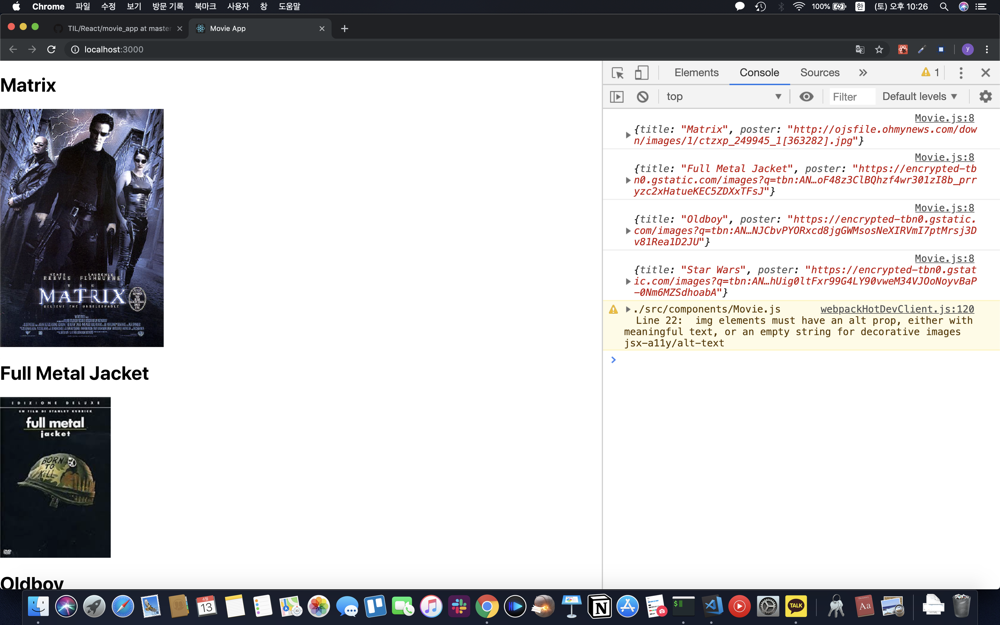
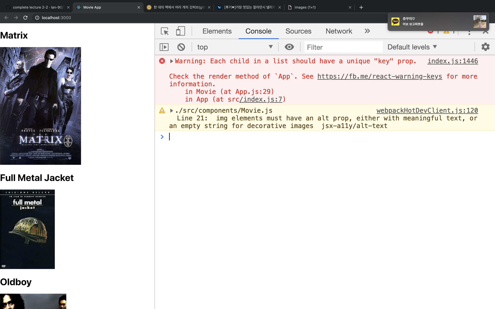
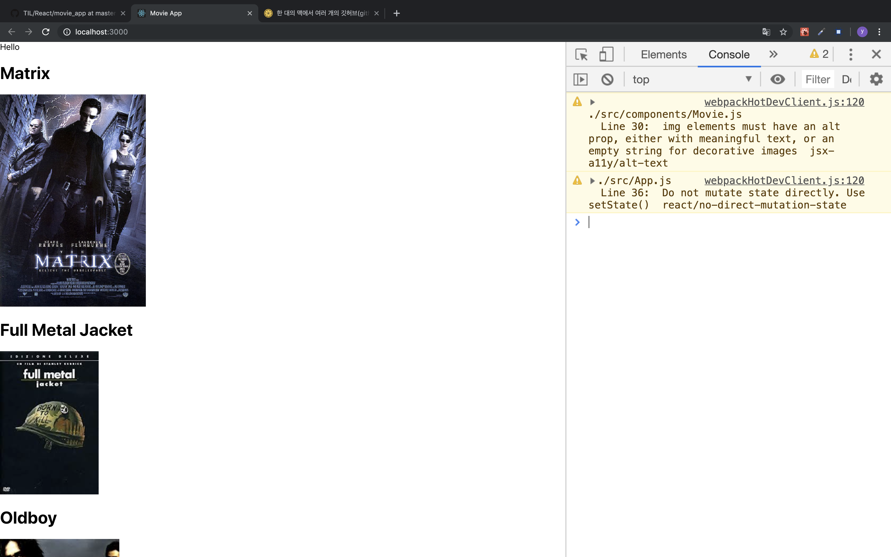

# NOMAD CODERS

* [REACTJS로 웹서비스 만들기](https://academy.nomadcoders.co/p/reactjs-fundamentals)

## 1. 시작하기

* 자바스크립트기반
```javascript
<ul>
  {restaurants.map((restaurant) => {
    return (
      <li>
        <span>{{restaurant.name}}</span>
        <span>{{restaurant.location}}</span>
      </li>
    )
  })}
</ul>
```

* Composition
  * 요소벌, 컴포넌트별 작업구조.

* 단방향 데이터플로우
  * 데이터가 변하면 UI도 업데이트됨.

* 설치
```bash
npx create-react-app 폴더명
```

## 2. Component 그리고 Props

* Component
  * JSX문법(React로 작성하는 HTML문법)을 사용 
  * 모든 Component는 render function을 가짐. (render - 출력)
  * Javascript 문법은 {} 안에 사용해야함

* Dataflow with Props
  * 컴포넌트 구조 - App > Movie > MoviePoster
  * Props - 부모가 자식에게 정보를 주는것
    * App.js
    ```javascript
    const movieTitles = [
      'Matrix',
      'Full Metal Jacket',
      'Oldboy',
      'Star Wars'
    ]

    const movieImages = [
      'http://ojsfile.ohmynews.com/down/images/1/ctzxp_249945_1[363282].jpg',
      'https://encrypted-tbn0.gstatic.com/images?q=tbn:ANd9GcQoF48z3ClBQhzf4wr301zI8b_prryzc2xHatueKEC5ZDXxTFsJ',
      'https://encrypted-tbn0.gstatic.com/images?q=tbn:ANd9GcTNJCbvPYORxcd8jgGWMsosNeXIRVmI7ptMrsj3Dv81Rea1D2JU',
      'https://encrypted-tbn0.gstatic.com/images?q=tbn:ANd9GcQDhhUig0ltFxr99G4LY90vweM34VJOoNoyvBaP-0Nm6MZSdhoabA'  
    ]

    class App extends Component {
      render() {
        return (
          <div className="App">
            <Movie title={movieTitles[0]} poster={movieImages[0]} />
            <Movie title={movieTitles[1]} poster={movieImages[1]} />
            <Movie title={movieTitles[2]} poster={movieImages[2]} />
            <Movie title={movieTitles[3]} poster={movieImages[3]} />
          </div>
        );
      }
    }
    ```
    * Movie.js
    ```javascript
      class Movie extends Component {
        render() {
          console.log(this.props)
          return (
            <div>
              <h1>{this.props.title}</h1>  
              <MoviePoster poster={this.props.poster} />
            </div>
          );
        }
      }      
    ```
    * 개발자 도구로 보기
    

* Lists with map
  * 많은 정보를 복사,붙여넣기하기엔 비효율적임. 그래서 javascript method인 [Array.map](https://developer.mozilla.org/ko/docs/Web/JavaScript/Reference/Global_Objects/Array/map)을 이용할것임 

  * App.js Refactoring
  ```javascript
  const movies = [
    {
      title: 'Matrix',
      poster: 'http://ojsfile.ohmynews.com/down/images/1/ctzxp_249945_1[363282].jpg',
    },
    {
      title: 'Full Metal Jacket',
      poster: 'https://encrypted-tbn0.gstatic.com/images?q=tbn:ANd9GcQoF48z3ClBQhzf4wr301zI8b_prryzc2xHatueKEC5ZDXxTFsJ'
    },
    {
      title: 'Oldboy',
      poster: 'https://encrypted-tbn0.gstatic.com/images?q=tbn:ANd9GcTNJCbvPYORxcd8jgGWMsosNeXIRVmI7ptMrsj3Dv81Rea1D2JU'
    },
    {
      title: 'Star Wars',
      poster: 'https://encrypted-tbn0.gstatic.com/images?q=tbn:ANd9GcQDhhUig0ltFxr99G4LY90vweM34VJOoNoyvBaP-0Nm6MZSdhoab'
    }
  ]

  class App extends Component {
    render() {
      return (
        <div className="App">
          {movies.map(movie => {
            return <Movie title={movie.title} poster={movie.poster} />
          })}
        </div>
      );
    }
  }
  ```

  * key - Array의 자식 컴포넌트들은 key값을 가져야 한다. key는 고유해야함.
    * key error
    
    * App.js Refactoring
    ```javascript
    {movies.map((movie, idx) => {
      return <Movie title={movie.title} poster={movie.poster} key={idx} />
    })}
    ```
    컴포넌트에 고유한 key값을 props로 내려주면 error가 사라진다.

* Validating Props with PropTypes
  * propTypes를 이용하여 부모컴포넌트에서 받는 데이터 정보를 확인 할 수 있다.

## 3. 컴포넌트 Lifecycle
  * Lifecycle Events on React
    * [React 공식문서 Lifecycle diagram](http://projects.wojtekmaj.pl/react-lifecycle-methods-diagram/) - 최신판
    * Lifecycle - 컴포넌트는 여러 기능들을 정해진 순서대로 실행
    * Render: componentWillMount() => render() => componentDidMount()
    * Update: componentWillReceiveProps() => shouldComponentUpdate() => componentWillUpdate() => render() => componenetDidUpdate()
    * 조금 오래된 강의라 최신버전은 Lifecycle이 업데이트 되어서 위에 공식문서가 더 정확합니다. 이것은 강의 내용 요약때문에 써놓은 것입니다.

## 4. State
  * Thinking in React Component State
    * state는 리액트 안에 있는 오브젝트.
    * state가 바뀔 때 마다 컴포넌트가 리렌더됨.
    * state를 만드는 방법 - 컴포넌트안에 state = {} 작성 후, 원하는 key, value를 적어주면 된다.
    ```javascript
    class App extends Component {
      state = {
        greeting : 'Hello'
      }
      render() {
        return (
          <div>
            ...생략
          </div>
        )
      }
    }
    ```
    * state를 변경하는 방법 - this.setState()를 이용해야 한다. 절대로 this.state.key = value를 해서는 안된다. 예를 들어
    위 코드에서 componentDidMount() 안에 this.state.greeting = 'something'을 작성하면 에러가 난다.
      * state error
      
      
      * setState() 사용
      ```javascript
      class App extends Component {
        state = {
          greeting : 'Hello'
        }

        componentDidMount = () => {
          setTimeout(() => {
            this.setState({
              greeting: 'Hello again!'
            })
          }, 5000)
        }
        render() {
          return (
            <div>
              {this.state.greeting}
              ...생략
            </div>
          )
        }
      }
      ```
      5초 후, state가 변경되므로 Hello가 Hello again!으로 바뀌고 컴포넌트가 리렌더링된다.
      
  * Practicing this.setState()
    * [setState 연습](https://github.com/Ian-90/TIL/commit/ec9cecbe5049dd3eb222e75d8ae401a654ad3954#diff-c5c30be4a164ee75953a2917bc3b2811)

    * [setTimeout()](https://developer.mozilla.org/ko/docs/Web/API/WindowTimers/setTimeout) - 지정된 시간이 만료된 후 콜백함수를 실행

    * [Spread Operator](https://developer.mozilla.org/ko/docs/Web/JavaScript/Reference/Operators/Spread_operator)

  * Loading States
    * [Loading 만들기](https://github.com/Ian-90/TIL/commit/7f5b4f234f0eb6ca8d852d253d0bb9cf11cccc74)
    * [conditional ternary operator](https://developer.mozilla.org/ko/docs/Web/JavaScript/Reference/Operators/Conditional_Operator)

## 5. Stateless Functional Components
  * Smart vs Dumb Component
    * state가 있는 컴포넌트 - class 컴포넌트, render() 있음, Lifecycle 있음
    * state가 없는 컴포넌트 - functional 컴포넌트, render() 없음, Lifecycle 없음
    * functional 컴포넌트 작성법 - javascript 함수 작성하듯이 하면 됨. 단, 부모로부터 받은 props들은 this를 사용하지 않는다.
    ```javascript
    const MoviePoster = (props) => {
      return (
        
      )
    }
    ```
    * functional 컴포넌트 propTypes 사용법
    ```javascript
    MoviePoster.propTypes = {
      poster: PropTypes.string.isRequired
    }
    ```
## 6. AJAX
  * Ajax in React
    * Ajax(Asynchronous JavaScript and XML) - url을 자바스크립트로 비동기적 방법으로 불러옴
    * 사용하는 이유 - 무언가를 불러 올 때 마다 페이지를 새로고침 하고싶지 않음.
    * 강의에서는 GET 방식만 사용할 것임.
  
  * Promises
    * [Fetch API 개념](https://developer.mozilla.org/ko/docs/Web/API/Fetch_API)
    * [Fetch API 사용법](https://developer.mozilla.org/ko/docs/Web/API/Fetch_API/Fetch%EC%9D%98_%EC%82%AC%EC%9A%A9%EB%B2%95)
    * [Promise](https://developer.mozilla.org/ko/docs/Web/JavaScript/Reference/Global_Objects/Promise)