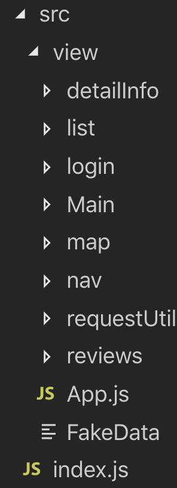

# NOMAD CODERS

* [Nomflix](https://academy.nomadcoders.co/p/react-for-beginners) - Learning React and ES6 by building a Movie Discovery App.

## Screens
- [ ] Home
- [ ] TV Shows
- [ ] Search
- [ ] Detail

## API Verbs
- [ ] Now playing
- [ ] Upcoming(Movie)
- [ ] Top Rated(TV, Movie)
- [ ] Popular(TV, Movie)
- [ ] Airing Today(TV)

## 1. Fundamentals

* 1-1 Arrow Functions

  * ES5 function 작성법 - function funcName(인자) { code }

  ```javascript
  function sayHello(name) {
    return "Hello " + name;
  }

  const ian = sayHello("Ian");
  console.log(ian); // "Hello Ian"이 출력됨.
  ```

  * ES6 [arrow function](https://developer.mozilla.org/en-US/docs/Web/JavaScript/Reference/Functions/Arrow_functions) 작성법 - const funcName = (인자) => { code }

    * 중괄호{}가 없으면 return 생략가능, 있으면 return을 써줘야 함.

    ```javascript
    <!-- 중괄호가 없을 때 -->
    const sayHello = name => "Hello " + name; //중괄호가 없으면 return을 생략 할 수 있다.

    <!-- 중괄호가 있을 때 -->
    const sayHello = name => {return "Hello " + name;} // 중괄호가 있으면 return을 써줘야 한다.
    ```

    * 인자가 1개면 소괄호() 생략 가능, 인자가 2개이상이면 소괄호() 써줘야함

    ```javascript
    <!-- 인자가 1개 일 때 -->
    const sayHello = name => "Hello " + name; // 인자가 1개면 () 생략가능

    <!-- 인자가 2개 이상 일 때 -->
    const sayHello = (name, mark) => {return "Hello " + name + mark;} //인자가 2개이상이면 인자를 ()로 감싸줘야한다.
    ```

  * 1-2 Template Literals

    * ES5 문자 + 변수 작성법 - 'text' + 변수

    ```javascript
    function sayHello(name) {
      return "Hello " + name;
    }
    ```

    * ES6 [template literals](https://developer.mozilla.org/en-US/docs/Web/JavaScript/Reference/Template_literals) - `(back-tick)으로 열고 닫는다. 변수는 \${변수}로 사용한다.

    ```javascript
    function sayHello(name) {
      return `Hello ${name}`;
    }
    ```

  * 1-3 Object Destructuring

    * ES5 - const 변수명 = 담을객체.속성명 or 담을객체[속성명]

    ```javascript
    const human = {
      name: 'Ian',
      lastName: 'John',
      nationality: 'Wish I was Korean'
    }
    const name = human.name;
    const lastName = human,lastName;
    console.log(name, lastName) // "Ian John"이 출력
    ```

    * ES6 - [Object Destructuring](https://developer.mozilla.org/ko/docs/Web/JavaScript/Reference/Operators/Destructuring_assignment) - 객체의 속성을 해체하여 그 값을 변수에 담는 방법
      cosnt { 속성명 } = 객체

    ```javascript
    const human = {
      name: "Ian",
      lastName: "John",
      nationality: "Wish I was Korean"
    };
    const { name, lastName } = human;

    console.log(name, lastName); // "Ian John"이 출력
    ```

    기존 코드와 비교하면, 상당히 간편해진다는걸 알 수 있다.

    * 다른 이름을 쓰고 싶을 때 - const { 속성명: 변경할 속성명 } = 객체

    ```javascript
    const human = {
      name: "Ian",
      lastName: "John",
      nationality: "Wish I was Korean"
    };
    //ES5
    const difName = human.nationality;

    //ES6
    const { nationality: difName } = human;
    console.log(difName); // "Wish I was Korean"이 동일하게 출력됨
    ```

    코드가 많아 질수록 ES6가 간결한걸 알 수 있다.

    * 객체가 중첩됬을 때

    ```javascript
    const human = {
      name: "Ian",
      lastName: "John",
      nationality: "Wish I was Korean",
      favFood: {
        breakfast: "hamberger",
        lunch: "pizza",
        dinner: "chicken"
      }
    };
    //ES5
    const breakfast = human.favFood.breakfast;
    const lunch = human.favFood.lunch;
    const dinner = human.favFood.dinner;

    //ES6
    const {
      favFood: { breakfast, lunch, dinner }
    } = human;
    console.log(breakfast, lunch, dinner); // "hamberger, pizza, chicken"이 동일하게 출력됨
    ```

  * 1-4 Spread Operator

    * [spread operator](https://developer.mozilla.org/en-US/docs/Web/JavaScript/Reference/Operators/Spread_syntax) - 배열이라 객체를 unpack하고 싶을 때 사용하면 유용하다.

    ```javascript
    const days = ["Mon", "Tue", "Wed"];
    const otherDays = ["Thu", "Fri", "Sat"];

    const allDays = [days, otherDays];
    console.log(allDays); // [["Mon","Tue","Wed"],["Thu","Fri","Sat"]] 출력

    const allDays2 = [...days, ...otherDays, "Sun"];
    console.log(allDays2); // ["Mon","Tue","Wed","Thu","Fri","Sat","Sun"] 출력

    const ob = {
      first: "hi",
      second: "hello"
    };

    const ab = {
      third: "bye bye"
    };

    const two = { ob, ab };
    console.log(two); // {{first: "hi", second: "hello"}, {third: "bye bye"}} 출력

    const two2 = { ...ob, ...ab };
    console.log(two2); // {first: "hi", second: "hello", third: "bye bye"}
    ```

  * 1-5 Classes

    * ES5

    ```javascript
    function Human(name, lastName) {
      this.name = name;
      this.lastName = lastName;
    }
    const ian = new Human("Ian", "John");
    console.log(ian); // Human {name: "Ian", lastName: "John", constructor: Object} 출력

    function Baby() {
      Human.apply(this, arguments);
    }

    Baby.prototype = Object.create(Baby.prototype);
    Baby.prototype.constructor = Baby;
    Baby.prototype.cry = function() {
      console.log("Waaaaaaaa");
    };
    Baby.prototype.sayName = function() {
      console.log(`My name is ${this.name}`);
    };
    const myBaby = new Baby("mini", "me");
    console.log(myBaby);
    console.log(myBaby.cry(), myBaby.sayname());
    ```

    * [ES6 Classes](https://developer.mozilla.org/en-US/docs/Web/JavaScript/Reference/Classes)

    ```javascript
    class Human {
      constructor(name, lastName) {
        this.name = name;
        this.lastName = lastName;
      }
    }

    const ian = new Human("Ian", "John");
    console.log(ian); // Human {name: "Ian", lastName: "John", constructor: Object} 출력

    class Baby extends Human {
      cry() {
        console.log("Waaaaaaaa");
      }

      sayName() {
        console.log(`My name is ${this.name}`);
      }
    }

    const myBaby = new Baby("mini", "me");
    console.log(myBaby);
    console.log(myBaby.cry(), myBaby.sayname());
    ```

  * 1-6 [Array.map](https://developer.mozilla.org/en-US/docs/Web/JavaScript/Reference/Global_Objects/Array/map)

  ```javascript
  const days = ["Mon", "Tue", "Wed", " Thu", "Fri"];
  const addSmile = day => `☺️ ${day}`;
  const smilingDays = days.map(addSmile);

  console.log(similingDays);
  ```

  * 1-7 [Array.filter](https://developer.mozilla.org/en-US/docs/Web/JavaScript/Reference/Global_Objects/Array/filter)

  ```javascript
  const numbers = [1, 2, 5, 6, 11, 17, 24, 67];

  const biggerThan15 = numbers.filter(n => n > 15);

  console.log(biggerThan15); // [17, 24, 67]
  ```

  * 1-8 .forEach..includes .push

    * [Array.forEach](https://developer.mozilla.org/en-US/docs/Web/JavaScript/Reference/Global_Objects/Array/forEach) - 배열의 각각의 아이템에 대하여 어떤 시행을 한다.

    ```javascript
    let posts = ["Hi", "Hello", "Bye"];

    posts.forEach(post => console.log(post));
    ```

    * [Array.push](https://developer.mozilla.org/en-US/docs/Web/JavaScript/Reference/Global_Objects/Array/push) - 새로운 아이템을 배열에 추가하는 역할을 한다.
    ```javascript
    let posts = ["Hi", "Hello", "Bye"];
    posts.push("new")
    console.log(posts) // ["Hi", "Hello", "Bye", "new"]
    ```

    * [Array.includes](https://developer.mozilla.org/en-US/docs/Web/JavaScript/Reference/Global_Objects/Array/includes) - 배열 안에 지정한 아이템이 포함되어있는지 확인해준다.
    ```javascript
    let greetings = ["Hi", "Howdy", "Suup"];
    if(!greetings.includes("Hello")) {
      greetings.push("Hello")
    }

    console.log(greetings) // ["Hi", "Howdy", "Suup", "Hello"]
    ```
## 2. Project Setup
  * 2-1. Setting Up the Project - CRA(create react app)을 이용해서 프로젝트를 생성한다.
    * Project Setup
    ```bash
    npx create-react-app filename
    ```
    예를 들어, npx create-react-app newFolder로 명령어를 입력하면 newFolder라는 프로젝트가 생성된다.
    npx를 사용하는 이유는 최신버전의 리액트를 사용하기 위해서 이다.

    * .env - 상대경로를 절대경로로 지정해준다. package.json과 같은 폴더위치에 생성해준다.
      * 사용법
      ```javascript
      NODE_PATH = src // src 폴더를 보게됨.
      ```

      * 예시 - 이러한 폴더 구조가 있다.
      
      ```javascript
      // index.js 에서 App.js를 렌더링하려면?

      // 기존 상대경로
      import App from './view/App'

      // .env를 이용한 절대경로
      import App from 'view/App'
      ```
      경로가 복잡해질수록 경로가 깔끔해진다.
    
    * 2-2. [React Router](https://reacttraining.com/react-router/web/guides/quick-start/installation) - 리액트에서 가장 많이 사용하는 라우터
      * 라우팅 - 다른 주소에 따라 다른 뷰를 보여주는것
      
      * 설치
      ```bash
      cd [project folder] // 프로젝트 폴더로 이동한다
      yarn add react-router-dom
      ```
      * 사용법
      ```javascript
      import React from "react";
      import { BrowserRouter as Router, Route, Link } from "react-router-dom";

      function App() {
        return (
          <Router>
            <div>
              <Route exact path="/" exact component={Home} />
              <Route path="/about" component={About} />
              <Route path="/about/new" render={() => <h2>new</h2>} />
            </div>
          </Router>
        );
      }

      function Home() {
        return <h2>Home</h2>;
      }

      function About() {
        return <h2>About</h2>;
      }

      export default App;     
      ```
        1. react-router-dom을 import - 필요한 라우터들 사용
        
        2. Router 컴포넌트로 감싸고 내부에 Route 컴포넌트를 넣는다. 하지만, Router 컴포넌트는 단, 1개의 children 컴포넌트만 가져야 한다. 
        ```html 
        <Router>
          {Route 코드 작성}
        </Router>
        ```
        
        3. <Route> 작성법 - <Route path={뷰를 보여줄 주소} (exact) component={주소에 렌더링할 컴포넌트}> - exact가 있으면 정확히 렌더링할 주소와 일치하는 컴포넌트만 렌더링, exact가 없으면 같은 주소명을 가진 컴포넌트 모두를 렌더링. 위 코드에서 주소가 /about/new로 접속하면, /about주소에 컴포넌트와 /about/new의 컴포넌트가 둘다 렌더링 된다.

## 3. Styles
  * 3-1. CSS in React part One
    * 방법 1 - index.js에 style.css를 import 
    * 방법 2 - 컴포넌트별로 폴더를 만들어서 css를 import

  * 3-2. CSS in React part Two
    * 방법 3 - CRA로 만든 프로젝트라면 컴포넌트이름.module.css를 사용 - javascript 객체처럼 사용 할 수 있다.
    ```javascript
    import React from 'react'
    import styles from './Header.module.css' //동일 폴더 안에 Header.module.css파일이 있다고 가정하고 import

    export default () => (
    <header>
      <ul className={styles.navList}>
        <li>
          hello
        </li>
      </ul>
    </header>
    )
    ```

  * 3-3. CSS in React part Three
    * 방법 4 - [styled components](https://academy.nomadcoders.co/p/styled-components-like-a-boss)를 사용하자. 

## 4. Networking
  * 4-1. Introduction to The Movie DB API
    * [API KEY](https://www.themoviedb.org) 생성
      1. 회원가입
      2. settings
      3. API Create
      4. v3 c dopy