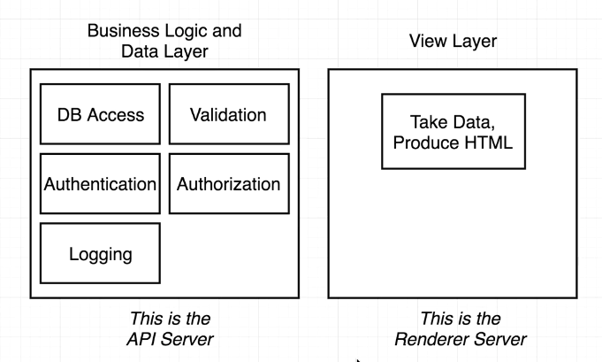

## 1. Server Architecture Approach
* 아키텍쳐
  * `API Server => Rendering Server => Users Browser`
    
    * API Server - 어플리케이션 로직(비즈니스 로직)과 인증을 다룬다
    * Rendering Server - 실제로 우리가 구현하는 부분. 어플리케이션을 렌더링하고, 사용자에게 서비스를 제공하는 곳
    * 왜 서버가 두개일까?
      * 렌더링 서버가 분리 되어 있기 때문에, 앵귤러나 다른 프레임워크로도 바꿀 수 있다.
      * 렌더링 서버를 API서버와 합치면 많은 작업이 시작된며, 코드를 변경할 때 사이드 이펙트가 크다.
      * 분리됨으로써 API서버가 확장성이 좋다

* 서버사이드 렌더링은 결국 느린 렌더링에 대응하는 것이다.

## 2. Bolierplate Setup
* package.json 설정 및 폴더 구조 추가

## 3. Express Setup
* src/index.js 작성

## 4. The RenderToString Function
* client/component/Home.js 작성
* index.js에 관련 로직 추가
* render - React 엘리먼트를 container DOM에 렌더링하고 컴포넌트에 대한 참조를 반환합니다(무상태 컴포넌트는 null을 반환합니다). React 엘리먼트가 이전에 container 내부에 렌더링 되었다면 해당 엘리먼트는 업데이트하고 최신의 React 엘리먼트를 반영하는 데 필요한 DOM만 변경합니다.
* renderToString - React 엘리먼트의 초기 HTML을 렌더링합니다. React는 HTML 문자열을 반환합니다. 빠른 페이지 로드를 위해 초기 요청 시에 서버에서 HTML을 생성하여 마크업을 보내거나, 검색 엔진 최적화를 위해 검색 엔진이 페이지를 크롤링할 수 있도록 하는데 사용할 수 있습니다.

## 5. JSX on the Server
* webpack.server.js 작성

## 6. Server Side Webpack
* package.json에 빌드 scripts 추가
