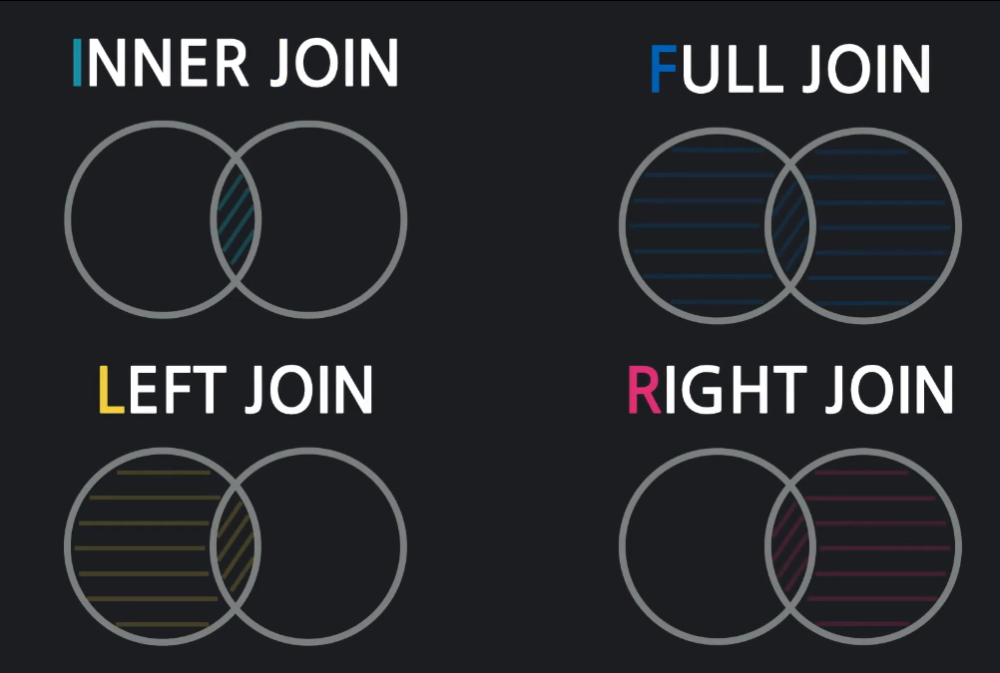

## 1. 테이블 조인
### 1.1 테이블 조인이란?

* 각각의 테이블로 나누어진 데이터를 함께 보여주려고 할 때, JOIN을 사용
* INNTER JOIN
* OUTER JOIN
  * LEFT JOIN - 두 테이블의 연관된 데이터를 가져오는 것
  * RIGHT JOIN
  * FULL JOIN
* ex. 인스타그램 댓글과 닉네임
 ```sql
 SELECT *
 FROM comments
 JOIN users ON
   users.id = comments.user_id; -- JOIN 조건을 기준으로 데이터를 연결
 ```

## 2. INNER 조인
### 2.1 준비
* 기존 테이블 삭제
  ```sql
  DROP TABLE likes;
  DROP TABLE settings;
  DROP TABLE comments;
  DROP TABLE photos;
  DROP TABLE users;
  ```

* 테이블 재생성
  ```sql
  -- users 테이블
  CREATE TABLE users (
    id       SERIAL       PRIMARY KEY,
    nickname VARCHAR(50),
    email    VARCHAR(100)
  );
  -- photos 테이블
  CREATE TABLE photos (
    id       SERIAL        PRIMARY KEY,
    filename VARCHAR(255),
    user_id  INTEGER       REFERENCES users(id)
  );
  -- comments 테이블
  CREATE TABLE comments (
    id       SERIAL         PRIMARY KEY,
    body     VARCHAR(1000),
    user_id  INTEGER        REFERENCES users(id),
    photo_id INTEGER        REFERENCES photos(id)
  );
  -- settings 테이블
  CREATE TABLE settings (
    id            SERIAL       PRIMARY KEY,
    private       BOOLEAN,
    adding_photos VARCHAR(15),
    user_id       INTEGER      UNIQUE REFERENCES users(id)
  );
  -- likes 테이블 생성(사용자와 사진을 다대다 연결)
  CREATE TABLE likes (
    id       SERIAL  PRIMARY KEY,
    user_id  INTEGER REFERENCES users(id),
    photo_id INTEGER REFERENCES photos(id)
  );
  ```

* 레코드 재등록
  ```sql
  -- users 레코드
  INSERT INTO
    users(nickname, email)
  VALUES
    ('cloudstudying_kr', 'mail@cloudstudying.kr'),
    ('hongpark_cs',      'sehongpark@cloudstudying.kr'),
    ('haesamq',          'haesamq@naver.com')
  ;
  -- photos 레코드
  INSERT INTO
    photos(filename, user_id)
  VALUES
    ('cat-on-road.jpg',           1),
    ('sunset-over-the-ocean.jpg', 1),
    ('andromeda-galaxy.jpg',      1),
    ('white-tiger.jpg',           2),
    ('nero-the-black-cat.jpg',    2),
    ('deleted-image.jpg',         NULL),
    ('blocked-image.jpg',         NULL)
  ;
  -- comments 레코드
  INSERT INTO
    comments(body, user_id, photo_id)
  VALUES
    ('meow',             1, 1),
    ('nyaong',           2, 1),
    ('냐옹',              3, 1),
    ('sunset',           1, 2),
    ('falling slowly',   2, 2),
    ('Andromeda galaxy', 1, 3),
    ('mysteriouse..!',   3, 3),
    ('wow..!',           3, NULL),
    ('oh..!',            3, NULL)
  ;
  -- settings 레코드
  INSERT INTO
    settings(private, adding_photos, user_id)
  VALUES
    (FALSE, 'MANUAL', 1),
    (FALSE, 'AUTO',   2),
    (TRUE,  'AUTO',   3)
  ;
  -- likes 레코드
  INSERT INTO
    likes(user_id, photo_id)
  VALUES
    (1,    1),
    (2,    1),
    (1,    2),
    (2,    2),
    (3,    2),
    (1,    3),
    (3,    3),
    (NULL, 6),
    (NULL, 7)
  ;
  ```

### 2.2 특정 사진에 달린 댓글내용과 작성자는?
* 사진#1에 달린 모든 댓글내용과 작성자의 닉네임을 조회
  ```sql
  SELECT
    comments.body,
    users.nickname
  FROM comments
  JOIN users ON
    users.id = comments.user_id
  WHERE
    comments.photo_id = 1;
  ```

### 2.3 특정 사진의 파일명과 게시자 닉네임은?
* 사진#5에 파일명과 사진 게사지 닉네임을 조회
  ```sql
  SELECT
    photos.filename,
    users.nickname
  FROM photos
  JOIN users ON
    users.id = photos.user_id
  WHERE
    photos.id = 5;
  ```

### 2.4 특정 사진을 좋아요한 사용자 닉네임과 사진 파일명은?
* 사진#2를 좋아요한 사용자 닉네임과 사진 파일명 조회
  ```sql
  SELECT
    users.nickname,
    photos.filename
  FROM likes
  JOIN users ON
    users.id = likes.user_id
  JOIN photos ON
    photos.id = likes.photo_id
  WHERE
    photos.id = 2;
  ```

## 3. LEFT 조인
### 3.1 LEFT 조인이란?
* INNER JOIN의 결과(두 테이블의 공통 데이터)와 나머지 좌측 테이블의 모든 데이터를 가져오는 것
* 연관된 데이터가 없으면 NULL로 채워진다

### 3.2 모든 사진에 게시자 정보 붙이기
* 모든 사진의 파일명을 조회하고, 게시자가 있다면 닉네임도 함께 가져오기
  ```sql
  SELECT
    photos.filename,
    users.nickname
  FROM photos -- left table
  LEFT JOIN users ON
    users.id = photos.user_id
  ```

### 3.3 모든 댓글에 사진 정보 붙이기
* 모든 댓글의 내용을 조회하고, 댓글이 달린 사진의 파일명도 함께 가져오기
  ```sql
  SELECT
    comments.body,
    photos.filename
  FROM comments
  LEFT JOIN photos ON
    photos.id = comments.photo_id
  ```

## 4. RIGHT 조인과 FULL 조인
* RIGHT JOIN
  * INNER JOIN의 결과(두 테이블의 공통 데이터)와 나머지 우측 테이블의 모든 데이터를 가져오는 것
  * 연관된 데이터가 없으면 NULL로 채워진다

* FULL JOIN
  * INNER JOIN의 결과(두 테이블의 공통 데이터)와 나머지 좌,우측 테이블의 모든 데이터를 가져오는 것

* Quiz - INNER JOIN, LEFT JOIN, RIGHT JOIN, FULL JOIN
  * books
    | id | model | author_id |
    |:--:|:-----:|:---------:|
    | 1 | Roemo and Juliet | 1 |
    | 2 | Pride and Prejudice | 2 |
    | 3 | The old man and the Sea | 3 |
    | 4 | Mein Kampf | NULL |

  * authors
    | id | name |
    |:--:|:-----:|
    | 1 | William Shakespeare |
    | 2 | Jane Austen |
    | 3 | Ernest Miller Hemingway |
    | 4 | Friedrich Wilhelm Nietzsche |

  * INNER JOIN
    ```sql
    SELECT *
    FROM books
    JOIN authors ON
      authors.id = books.author_id
    ```

  * LEFT JOIN
    ```sql
    SELECT *
    FROM books
    LEFT JOIN authors ON
      authors.id = books.author_id
    ```
  
  * RIGHT JOIN
    ```sql
    SELECT *
    FROM books
    RIGHT JOIN authors ON
      authors.id = books.author_id
    ```

  * FULL JOIN
    ```sql
    SELECT *
    FROM books
    FULL JOIN authors ON
      authors.id = books.author_id
    ```
