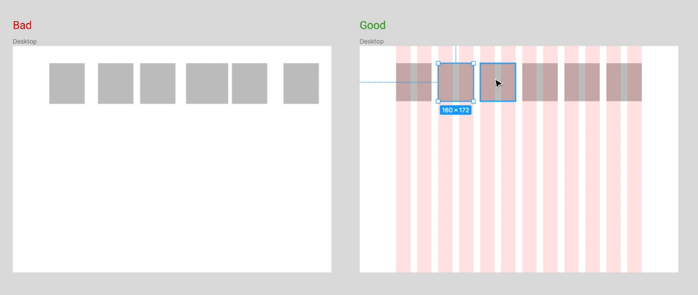
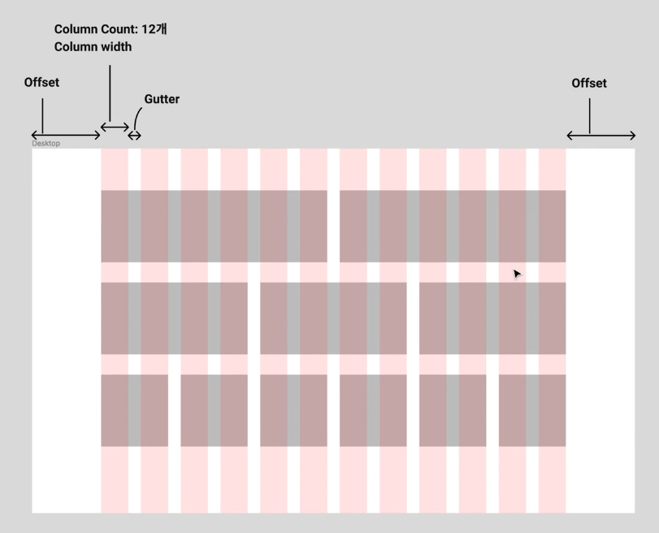

## 1. 그리드 이해하기
* 사용 이유
  1. 정돈된 디자인
    
    
  
  2. Responsive 디자인
  3. 개발자와의 원활한 커뮤니케이션

## 2. 그리드 만들기
* 용어

  
  1. Max Width - 보여지는 브라우저, 디바이스의 가로 전체 화면
  2. Container - Contents를 담기는 영역
    * 에어비앤비 - 1600px
    * 마켓컬리 - 980px
  3. Column Count - 화면 Column의 개수
  4. Column Width - 하나의 Column의 넓이
  5. Gutter - Column과 Column 사이의 간격
  6. Offset - 컨테이너 바깥부분의 해당하는 영역

* 그리드를 토글하는 단축키 - ctrl + g
* exercise/serction_10-2.fig - 실습 파일

## 3. 그리드를 활용해서 오브젝트 배치해보기
* exercise/serction_10-3.fig - 실습 파일
* 정보의 중요도에 따라 계층을 나눠야 한다

## 4. 그리드를 활용한 반응형 UI디자인 만들어보기
* exercise/serction_10-4.fig - 실습 파일
* 모바일디자인에서 중요하지 않은데 영역을 많이차지하여서 길이가 길어진다면, indicator를 만들어 준다.