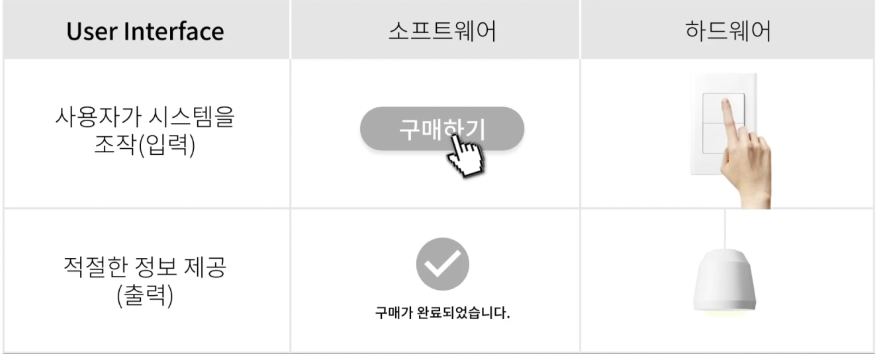

## 1. UX/UI 시작하기

1. UX Role(현재 우리의 삶과 UX 디자인의 역할)
  * 기술의 발전으로 **인간중심(People-Centric)서비스**들이 빠르게 현실화 되고 있음
  * UX의 역할
    * 기술이 일상에 정착하기까지 기술과 사용자 간 거리를 좁히는 것
    * 사용자 중심이 되는 관점에서 어떤 제품이나 서비스 등을 직,간접적으로 느끼는 반응과 행동, 기억, 감정 등 매끄러운 경험을 고려해 더빠르게 원하는 길로 이끄는 것

2. UX History(UX가 탄생한 배경과 도널드 노먼)
  * 사용자 경험의 시초 테일러리즘(Taylorlism) - 기존의 비효율적 생산 방식 -> 표준 작업방식으로 효율서으 노동 생산성 증진
  * 인간을 고려한 도요타의 생산 방식(ToyotaWay) - 적시생산방식(고객이 필요로 하는 제품을 필요로 할 때 필요한 양 만큼)과 자동화(불량품 양산 방지를 위해 이상을 자동적으로 감시하는 메커니즘) 도입
  * HCI/UX 연구의 근간 인지과학(Cognitive Science) - AI연구가 시작되며 만들어진 융합 학문
  * 제록스(Xerox)와 HCI - 최초의 GUI와 마우스 컴퓨터로 표현된 비트맵 그래픽 기술
  * UX의 창시자, 인지과학의 대부 도널드 노먼 - 

3. UX Define(인간 중심 디자인 기반의 UX)
* 사용자 경험 - 최종 사용자가 기업, 서비스, 기업의 제품과 상호작용하면서 얻는 모든 측면의 경험(닐슨 노먼 그룹)
* UX을 충촉시키는 3가지 조건
  1. 사용자의 정확한 요구 사항을 만족시킬 것(Satisfaction)
  2. 사용하게 되는 과정에 단순하고 즐거움이 있어 사람들이 가지고 싶고 사용하고 싶게 할 것(Simplicity)
  3. 사용자가 직접 필요하다고 말하는 것 이상을 제공해야 하며 이를 위해 여러 분야 서비스를 매끄럽게 통합할 것(Elegance)

## 2. UI 디자인과 Interaction 디자인 법칙 (1)

1. UI Design(사용자와 기술의 접점)
  * 정의

    
    * 사용자와 기술이 만나는 인터페이스이자 접점
    * 사용자가 시스템을 입력하면 출력 장치를 통한 정보 제공이 이뤄지는 디자인

  * 역할
    * 보편성 - 다양한 사용자가 사용할 수 있도록 디자인 한다
    * 사용성 - 사용자가 제품을 효율적으로 사용하도록 돕는다

2. Interaction Design(시스템과 사용자의 상호작용)
  * 일광성을 유지
    * 시각적 일관성
    * 기능적 일관성

  * 보편적인 사용성을 추구
    * 유저의 다양성을 고려한 디자인
  
  * 유용한 피드백을 제공
    * 단번에 원하는 목적을 달성하도록

  * 종료 상황을 알리는 대화 상자를 설계
    * 순차적 단계를 통해 혼동 방지

  * 오류를 처리할 수 있는 간단한 방법을 제공
    * 오류는 가능한 한 일어나지 않도록 예방

  * 처리한 동작을 쉽게 되돌릴 수 있어야 한다
    * 번복이 쉬운 디자인
  
  * 사용자가 현장 장악감과 위치감에 대한 권한을 갖게 하라
    * 필요한 정보는 높은 접근성으로 제공

  * 사용자가 기억보다는 인식할 수 있게 해야 한다
    * 회상보다는 인식

## 3. UI 디자인과 Interaction 디자인 법칙 (2)

* 7가지 Interaction 법칙
  1. 힉의 법칙
    * 선택한 정보가 많아져도 결정하는 시간이 비례하게 길어지지 않는다.
    * 인지 부하 줄이기(ex. 음식점 메뉴판 추천 표시)

  2. 피츠의 법칙
    * 목표와 크기에 따른 위치 설계
    * 인간의 행동에 대해 속도와 정확성의 관계를 설명하는 법칙
    * 목표물의 크기가 작을수록 목표에 도달하는데 속도와 정확도가 떨어지므로 적당한 크기의 버튼을 제공해야 함

  3. 마법의 숫자 7
    * 적은 정보로 쉬운 판단을 유도해야 함
    * 7±2의 기억용량
  
  4. 복잡성 보존의 법칙
    * 복잡함의 총량이 정해져있으므로, 공급자가 복잡함을 짊어진다
    * 사용자가 느끼는 편리함과 엔지니어와 디자이너의 공수는 비례한다
  
  5. 포타요케의 법칙
    * 실수를 막아 사용에 강제성을 주거나 유효 여부를 바로 알려준다(ex. 폼)
  
  6. 피드백과 피드포워드
    * 동작 후 알려주는 피드백(ex. 아이폰 비밀번호 틀렸을 때 전체창이 흔들림)
    * 동작 전 알려주는 피드포워드(ex. airbnb 둘러보기)
  
  7. 어포던스
    * 사용자 행동 유도성
    * 제품을 보는 것 만으로 어떻게 사용해야 하는지 본증적인 직관으로 알게 한다

## 4. 4차 산업 혁명과 UX
* 4차 산업 혁명 - 서비스로의 제품 구독 시대(Product as a Service)
* UX - 인간 중심으로 고민하는 UX 디자인의 관점이 중요해짐
  * 기존 - 눈에 보이는 것의 문제점을 찾아 불편함 해소
  * 현재 - 가치 있는 경험과 서비스를 만들어내는 창조적 역할
