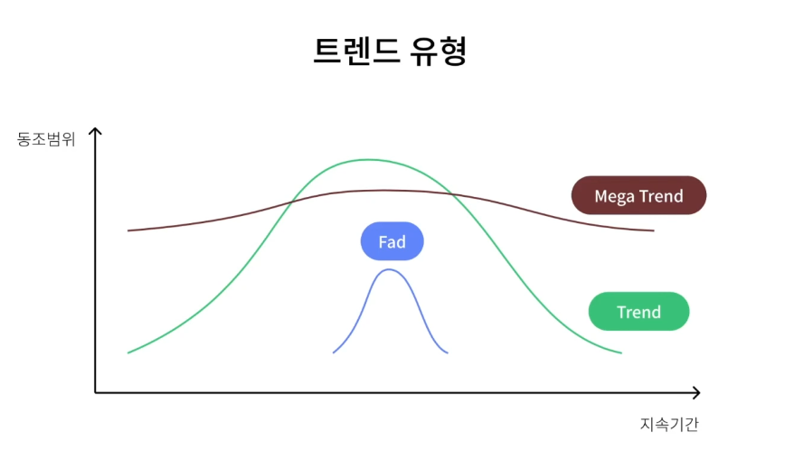

## 1. UX 환경 분석
* Trend - 새롭게 인간의 삶에 영향을 미치는 경항이나 추세
  * `트렌드 읽기 -> 사람이해 -> 제품 서비스 -> 마켓 이해`
  * 이론적으로 더욱 논리적이고 설득력 있는 제안 가능
* 트렌드 유형

  

  1. Fad(유행) - 6개월에서 1년. 단기간 나타났다가 사라지는 단기적 추세로 지속되는 변화
  2. Trend - 1 ~ 5년. 시장이 변화하는 일반적인 방향으로 인구통계학적 변화, 대중의 가치관이나 태도, 생활 양식 또는 기술 등의 변화
  3. Mega Trend - 10년 이상 지속. 현대 사회에서 진행 중인 거대한 동향

  * 기술 수용 주기 모델
    * 혁신수용자(innovators) - 기술 자체에 관심이 많아 가격에 구애 받지 않고 새로운 기술이나 제품이 시장에 등장하면 실험
    * 선각수용자(early adopters) - 기술의 가치를 알고 다른 사람들 보다 앞서 나가려는 성향이 강한 사람들
    * 전기다수수용자(early majority) - 실용주의자들. 시장의 1/3을 차지
    * 후기다수수용자(late majority) - 새로운 것에 의심이 많아 가격에 민감한 사람들
    * 지각수용자(laggards) - 신기술이나 새로운 제품에 의심이 많아 배척하는 성향

  * 신제품이 시장에서 성장하지 못하고 정체되는 이론 - 캐즘(Chasm)
    * 신기술이나 특정 제품이 나왔을 때, 시장이 성장하지 못하고 정체 되는 것
    * 사람들의 심리적인 이유 그리고 문화적인 이유도 존재

  * 트렌드를 숙지해 확실성이 바탕이 된 타당성 제시하기
    * DIKW pyramid 모델 활용
      * 수집 -> 분류 -> 분석 -> 검증 - 가치 상승

## 2. 2021 UX 트렌드
1. NUI(Natural User Interface) - 학습이 필요없는 비접촉 상호작용
  * 음성 인식
  * 생체 인식
  * 제스처 인식

2. UX writing - 마이크로 카피
  * 사용자들이 서비나 제품을 사용할 떄 접하게 되는 단어와 문구를 설계하는 일
  * **커뮤니케이션을 원활하게 하는데에 목적**
  * 브랜드 전체에 끼치는 영향까지 통합적으로 고려해 설계

3. All in One - 슈퍼앱
  * 다양한 서비스를 결합해 사용자의 니즈를 한가지 앱으로 해결해 줄 수 있는 앱
  * 상호작용성, 접근성, 서비스 완결성으로 높은 지지

4. 개인화된 콘텐츠 - 인공지능 기반
  * 최적화된 개별 콘텐츠와 추천이 가능
  * 서비스와의 유대 관계를 유지할 수 있음

5. 새로운 온라인 UX
  * 팬데믹으로 인한 새로운 온라인 UX

6. 맞춤형 디자인 - 경쟁사와의 차별화 포인트

7. 디자인시스템 - 협업으로 제품을 효율적이고 빠르게
  * 제품을 효율적이고 빠르게 업데이트
  * 재사용 가능한 코드
  * 일관성 있는 시각적 스타일 및 컴포넌트 라이브러리를 제공
  * 더욱 원활한 커뮤니케이션을 진행할 수 있도록 도움

8. 온보딩 경험 설계하기
  * **제품에 대한 안내를 제공**하고, 초기 환경 설정을 설정하거나, **인터페이스에서 중요한 UI 엘리먼트를 소개**
  * 온보딩 경험은 이탈률을 감소

## 3. 2021 UI 트렌드
1. 3D로 몰입 경험 강화
  * 3D UI가 대중화 될 수 있는 기회점
  * 3D는 명확한 기능적 목적을 제공

2. 뉴모피즘 - 더나은 어포던스를 위해
  * 텍스처를 만지게 싶게 만드는 물리적 특성과 사실적인 질감 스타일
  * 사용자와 더욱 원활한 상호 작용이 가능
  * 전체적인 디자인 톤앤매너에 균형과 조화를 이룰 수 있어야 함

3. 부드럽고 편안한 디자인 - 그림자, 둥근 모서리, 레이어 활용
  * 사용자에게 부드럽고 편안한 느낌을 줄 수 있음
  * 사용자의 눈을 더욱 편안하게 해줄 것

4. 새로운 일러스트레이션 - 사용자외의 상호 연결성 높이기
  * 심플한 디자인 스타일이 획일화 됨에 따라 기업별 브랜드의 차별화를 위해 일러스트와 모션을 적극적으로 사용하는 경우가 늘고 있음
  * 서술형 일러스트레이션 - 스타일에 더 집중하여 정보 전달 측면에서 더욱 기능적인 형태의 일러스트레이션
  * 애니메이션 모션 - 정적 그래픽보다 인터페이스 프로세스를 훨씬 더 잘 드러냄. 명확하고 유익한 정보 유지가능

5. 완벽함에서 독특한 디자인 - 개성을 부여한 차별성
  * 레트로 디자인 - 과거 디자인에서 참조하거나 받은 영감을 새로운 디자인 기능과 통합해 작업물에 활력을 불어넣음
  * 굵은 타이포그래피 - 주요 요소를 강조, 강력한 시각적 계층 구조를 구축하고 방문자를 후킹
  * 대담한 색상 - 밝은 색상으로 대담하고 서로 잘 어울리지 않는 다양한 색상 실험. 시선을 사로 잡을 수 있음
  * 불완전한 비대칭 레이아웃 - 창의적인 비대칭 레이아웃이 트렌드로 자리 잡을 것

6. 다크모드 - 어두운 테마의 활성화
  * 매끄럽고 정교
  * 가독성과 기능을 향상시킴
  * 화면 피로를 줄여 눈이 편안함
  * 배터리 수명을 절약함
  * 텍스트나 데이터가 많은 앱이나 사이트에서는 사용하는것을 지양

7. 마이크로 인터렉션 - 사용자 중심의 상호작용
  * SNS의 좋아요와 같은 기능
  * 상호 작용을 강화하고 사용자의 참여를 유지 할 수 있는 피드백을 제공

8. 초현실적인 제품 랜딩 페이지 - 디지털 제품의 모바일 및 웹 사이트
    * 더욱 디테일하고 현실감있는 제품 사진을 선호
    * 명확한 정보 전달 개념이 사라져서는 안됨

## 4. AI와 UX의 상호 보완
1. AI와 UX의 상관관계
* 데이터가 자동차 연료, 인사이트는 목적지
* 중요한 것은 사용자를 우선시하는 경험 제공
* 사람에 대해 더 많이 이해할수록 AI 제품을 더 좋게 만들 것이다

2. AI 제품을 설계하는 원칙
* 사용자 요구 + 성공 정의 - 제품을 사용자 요구에 맞추는 것은 성공적인 AI 제품의 첫번째 단계
* 데이터 수집 + 평가 - 예측을 수행하기 위해 기계학습모델을 가르쳐야 한다
* 멘탈 모델 - 사용자가 변화에 대응하고, 시스템을 이해할 수 있도록 지원해야 한다
* 설명가능성 + 신뢰 - 예측과 추천 결과를 사용자와 공유하는 것은 신뢰를 쌓기 위한 필수이다
* 피드백 + 제어 - 사용자가 AI 제품에 피드백을 많이 줄수록 AI의 성능과 사용자 경험을 크게 향상 시킬 수 있다
* 오류 + 우아한 실패 - 사용자가 디자이너가 예측할 수 없었던 방식으로 제품과 상호작용한다
