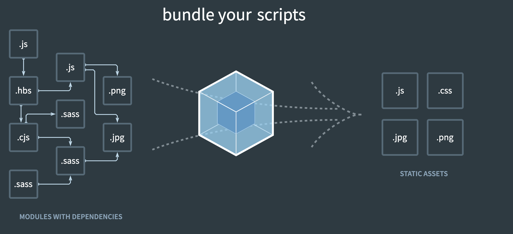

# [생활코딩 Webpack 강의](https://www.youtube.com/playlist?list=PLuHgQVnccGMChcT9IKopFDoAIoTA-03DA)



## 1. webpack

* 번들러 - 여러 파일을 하나로 묶어주는 도구
* 비슷한 도구 - browserify, parcel, rollup

## 2. 웹팩이전의 세계와 모듈의 개념

* 웹팩없이 웹사이트를 만든다면 ?
```javascript
// hello.js
var word = 'Hello'

// wordl.js
var word = 'World'
```

```html
<html>
  <head>
    <script src="./src/hello.js"></script>
    <script src="./src/word.js"></script>
  </head>
  <body>
    <h1>Hello, Webpack</h1>
    <div id="root"></div>
    <script>
      document.querySelector('#root').innerHTML = word; // 결과는 World가 나옴
    </script>
  </body>
</html>
```

* 수백개의 파일들이 많다면, 변수 이름이 충돌 할 수 도 있다. 이것을 극복하기 위해 나온것이 모듈개념

```javascript
// hello.js
var word = 'Hello'
export default word

// wordl.js
var word = 'World'
export default word
```

```html
<script type="module">
  import helloWord from './src/hello.js'
  import worldWord from './src/world.js'

  document.querySelector('#root').innerHTML = `${helloWord} ${worldWord}`
</script>
```

* import,export는 최신브라우저에서만 동작
* 수많은 파일을 다운로드 받는다고 하면, 로딩이 길어진다.
* 그러므로 webpack같은 번들러가 필요하다.